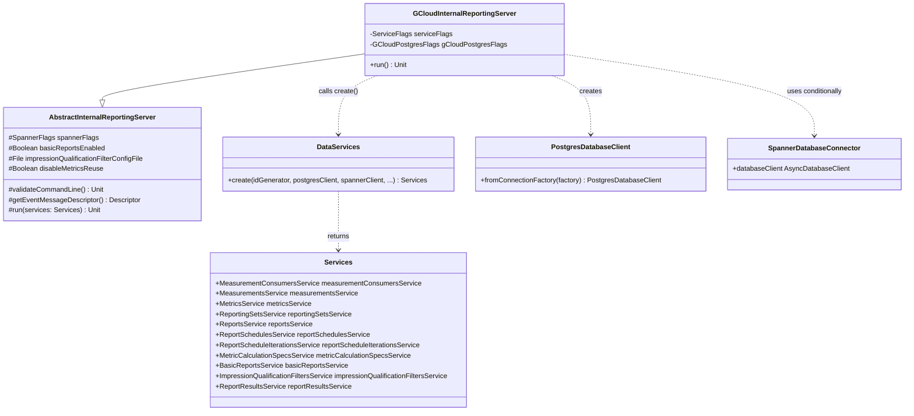

# org.wfanet.measurement.reporting.deploy.v2.gcloud.server

## Overview
This package provides a Google Cloud-specific implementation of the Internal Reporting Server for the Cross-Media Measurement system. It bootstraps the internal reporting data-layer services using Google Cloud Postgres for relational storage and optionally Google Cloud Spanner for basic reports functionality. The server runs as a single blocking gRPC server process.

## Components

### GCloudInternalReportingServer
Command-line application that extends AbstractInternalReportingServer to launch internal reporting services using Google Cloud infrastructure (Postgres and Spanner).

| Method | Parameters | Returns | Description |
|--------|------------|---------|-------------|
| run | - | `Unit` | Initializes database clients and launches reporting services |
| main | `args: Array<String>` | `Unit` | Entry point for command-line execution |

**Annotations:**
- `@CommandLine.Command` - Defines CLI metadata and help options

**Command-Line Mixins:**
- `ServiceFlags` - Common service configuration (executor threads, ports)
- `GCloudPostgresFlags` - Google Cloud Postgres connection parameters

**Inherited Properties from AbstractInternalReportingServer:**
- `spannerFlags` - Spanner database configuration
- `basicReportsEnabled` - Feature flag for basic reports functionality
- `impressionQualificationFilterConfigFile` - Configuration for impression filtering
- `disableMetricsReuse` - Flag to disable metrics reuse optimization

## Key Functionality

### Database Client Initialization
The server creates two database clients depending on configuration:
1. **PostgresDatabaseClient** - Always created for core reporting data storage
2. **SpannerDatabaseClient** - Conditionally created when `basicReportsEnabled` is true

### Service Composition
Delegates to `DataServices.create()` to instantiate all internal reporting services:
- MeasurementConsumersService
- MeasurementsService
- MetricsService
- ReportingSetsService
- ReportsService
- ReportSchedulesService
- ReportScheduleIterationsService
- MetricCalculationSpecsService
- BasicReportsService (conditional)
- ImpressionQualificationFiltersService (conditional)
- ReportResultsService (conditional)

### Configuration Modes

#### Standard Mode (basicReportsEnabled = false)
- Uses only Postgres for all data storage
- No Spanner connection required
- No impression qualification filtering

#### Basic Reports Mode (basicReportsEnabled = true)
- Uses Postgres for core entities
- Uses Spanner for BasicReports and ReportResults
- Requires impression qualification filter configuration
- Requires event message descriptor configuration

## Dependencies

- `org.wfanet.measurement.reporting.deploy.v2.common.server` - Provides AbstractInternalReportingServer base class
- `org.wfanet.measurement.reporting.deploy.v2.common.service` - Provides DataServices factory
- `org.wfanet.measurement.common.db.r2dbc.postgres` - Postgres R2DBC client
- `org.wfanet.measurement.gcloud.postgres` - Google Cloud Postgres connection factories
- `org.wfanet.measurement.gcloud.spanner` - Google Cloud Spanner connector
- `org.wfanet.measurement.config.reporting` - ImpressionQualificationFilterConfig proto
- `org.wfanet.measurement.reporting.service.internal` - ImpressionQualificationFilterMapping
- `org.wfanet.measurement.common` - RandomIdGenerator, command-line utilities
- `picocli` - Command-line parsing framework
- `kotlinx.coroutines` - Coroutine support for async operations

## Usage Example

```kotlin
// Run the server from command line
fun main(args: Array<String>) {
  commandLineMain(GCloudInternalReportingServer(), args)
}

// Example command-line invocation (basic mode disabled):
// java -jar server.jar \
//   --port=8080 \
//   --postgres-host=localhost \
//   --postgres-port=5432 \
//   --postgres-database=reporting \
//   --disable-metrics-reuse=false

// Example with basic reports enabled:
// java -jar server.jar \
//   --port=8080 \
//   --postgres-host=localhost \
//   --postgres-port=5432 \
//   --postgres-database=reporting \
//   --basic-reports-enabled=true \
//   --spanner-project=my-project \
//   --spanner-instance=my-instance \
//   --spanner-database=reporting \
//   --impression-qualification-filter-config-file=config.textproto \
//   --event-message-descriptor-set=descriptors.pb \
//   --event-message-type-url=type.googleapis.com/my.Event \
//   --disable-metrics-reuse=false
```

## Class Diagram



## Design Notes

### Cloud-Specific Implementation
GCloudInternalReportingServer is specifically designed for Google Cloud Platform deployments. It differs from the generic InternalReportingServer by:
- Using `GCloudPostgresFlags` instead of generic `PostgresFlags`
- Building connection factory via `PostgresConnectionFactories.buildConnectionFactory()`
- Optimized for GCP-managed database services

### Coroutine Execution Model
The server uses a dedicated coroutine dispatcher from `serviceFlags.executor.asCoroutineDispatcher()`, allowing control over threading and parallelism through command-line configuration.

### Validation Strategy
Command-line validation is inherited from AbstractInternalReportingServer and ensures:
- All Spanner flags are provided when basicReportsEnabled is true
- Impression qualification filter config exists when required
- Event message descriptors are provided when required

This validation occurs before any database connections are established, failing fast on misconfiguration.
