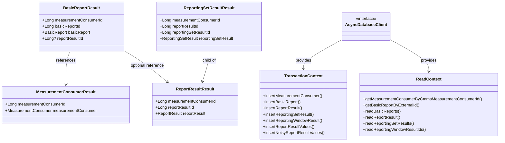

# org.wfanet.measurement.reporting.deploy.v2.gcloud.spanner.db

## Overview

This package provides Google Cloud Spanner database access layer for the reporting system. It implements CRUD operations for measurement consumers, basic reports, report results, and hierarchical reporting data structures including reporting sets, windows, and result values. The package serves as the persistence layer for the reporting service's data model.

## Components

### MeasurementConsumers.kt

Data access functions for managing measurement consumer entities in Spanner.

| Method | Parameters | Returns | Description |
|--------|------------|---------|-------------|
| getMeasurementConsumerByCmmsMeasurementConsumerId | `cmmsMeasurementConsumerId: String` | `suspend MeasurementConsumerResult` | Reads MeasurementConsumer by CMMS ID or throws exception |
| insertMeasurementConsumer | `measurementConsumerId: Long, measurementConsumer: MeasurementConsumer` | `Unit` | Buffers insert mutation for MeasurementConsumers table |
| measurementConsumerExists | `measurementConsumerId: Long` | `suspend Boolean` | Checks if MeasurementConsumer exists by ID |

### BasicReports.kt

Comprehensive database operations for basic report lifecycle management including creation, state transitions, and queries.

| Method | Parameters | Returns | Description |
|--------|------------|---------|-------------|
| getBasicReportByRequestId | `measurementConsumerId: Long, createRequestId: String` | `suspend BasicReportResult?` | Retrieves BasicReport by request ID |
| getBasicReportByExternalId | `cmmsMeasurementConsumerId: String, externalBasicReportId: String` | `suspend BasicReportResult` | Retrieves BasicReport by external ID or throws exception |
| readBasicReports | `filter: ListBasicReportsRequest.Filter, limit: Int?, pageToken: ListBasicReportsPageToken?` | `Flow<BasicReportResult>` | Streams BasicReports ordered by create time |
| insertBasicReport | `basicReportId: Long, measurementConsumerId: Long, basicReport: BasicReport, state: BasicReport.State, requestId: String?` | `Unit` | Buffers insert mutation for BasicReports table |
| setExternalReportId | `measurementConsumerId: Long, basicReportId: Long, externalReportId: String` | `Unit` | Updates ExternalReportId and sets state to REPORT_CREATED |
| setBasicReportStateToFailed | `measurementConsumerId: Long, basicReportId: Long` | `Unit` | Updates BasicReport state to FAILED |
| setBasicReportStateToUnprocessedResultsReady | `measurementConsumerId: Long, basicReportId: Long, reportResultId: Long` | `Unit` | Updates BasicReport state to UNPROCESSED_RESULTS_READY |
| setBasicReportStateToSucceeded | `measurementConsumerId: Long, basicReportId: Long` | `Unit` | Updates BasicReport state to SUCCEEDED |
| basicReportExists | `measurementConsumerId: Long, basicReportId: Long` | `suspend Boolean` | Checks if BasicReport exists by ID |

### ReportResults.kt

Database operations for report result entities including creation, validation, and retrieval with timezone handling.

| Method | Parameters | Returns | Description |
|--------|------------|---------|-------------|
| reportResultExists | `measurementConsumerId: Long, reportResultId: Long` | `suspend Boolean` | Checks if ReportResult exists by internal ID |
| reportResultExistsWithExternalId | `measurementConsumerId: Long, externalReportResultId: Long` | `suspend Boolean` | Checks if ReportResult exists by external ID |
| insertReportResult | `measurementConsumerId: Long, reportResultId: Long, externalReportResultId: Long, reportStart: DateTime` | `Unit` | Buffers insert mutation for ReportResults table |
| readReportResult | `cmmsMeasurementConsumerId: String, externalReportResultId: Long` | `suspend ReportResultResult` | Reads ReportResult by external identifiers or throws exception |

### ReportingSetResults.kt

Complex query and mutation operations for reporting set results with support for hierarchical result structures and filtering.

| Method | Parameters | Returns | Description |
|--------|------------|---------|-------------|
| reportingSetResultExists | `measurementConsumerId: Long, reportResultId: Long, reportingSetResultId: Long` | `suspend Boolean` | Checks if ReportingSetResult exists by internal IDs |
| reportingSetResultExistsByExternalId | `measurementConsumerId: Long, reportResultId: Long, externalReportingSetResultId: Long` | `suspend Boolean` | Checks if ReportingSetResult exists by external ID |
| readReportingSetResultIds | `measurementConsumerId: Long, reportResultId: Long, externalReportingSetResultIds: Iterable<Long>` | `suspend Map<Long, Long>` | Maps external ReportingSetResult IDs to internal IDs |
| insertReportingSetResult | `measurementConsumerId: Long, reportResultId: Long, reportingSetResultId: Long, externalReportingSetResultId: Long, dimension: ReportingSetResult.Dimension, impressionQualificationFilterId: Long?, metricFrequencySpecFingerprint: Long, groupingDimensionFingerprint: Long, filterFingerprint: Long?, populationSize: Long` | `Unit` | Buffers insert mutation for ReportingSetResults table |
| readUnprocessedReportingSetResults | `impressionQualificationFilterMapping: ImpressionQualificationFilterMapping, groupingDimensions: GroupingDimensions, measurementConsumerId: Long, reportResultId: Long` | `Flow<ReportingSetResultResult>` | Streams unprocessed ReportingSetResults with noisy values |
| readFullReportingSetResults | `impressionQualificationFilterMapping: ImpressionQualificationFilterMapping, groupingDimensions: GroupingDimensions, measurementConsumerId: Long, reportResultId: Long` | `Flow<ReportingSetResultResult>` | Streams complete ReportingSetResults with processed and unprocessed values |

### ReportingWindowResults.kt

Database operations for reporting window results including date-based window management and ID mapping.

| Method | Parameters | Returns | Description |
|--------|------------|---------|-------------|
| reportingWindowResultExists | `measurementConsumerId: Long, reportResultId: Long, reportingSetResultId: Long, reportingWindowResultId: Long` | `suspend Boolean` | Checks if ReportingWindowResult exists |
| readReportingWindowResultIds | `measurementConsumerId: Long, reportResultId: Long, reportingSetResultId: Long, reportingWindows: Iterable<ReportingSetResult.ReportingWindow>` | `suspend Map<ReportingSetResult.ReportingWindow, Long>` | Maps ReportingWindow definitions to internal IDs |
| insertReportingWindowResult | `measurementConsumerId: Long, reportResultId: Long, reportingSetResultId: Long, reportingWindowResultId: Long, nonCumulativeStartDate: LocalDate?, endDate: LocalDate` | `Unit` | Buffers insert mutation for ReportingWindowResults table |

### ReportResultValues.kt

Persistence operations for processed report result values at the reporting window level.

| Method | Parameters | Returns | Description |
|--------|------------|---------|-------------|
| insertReportResultValues | `measurementConsumerId: Long, reportResultId: Long, reportingSetResultId: Long, reportingWindowResultId: Long, values: ReportingSetResult.ReportingWindowResult.ReportResultValues` | `Unit` | Buffers insert mutation for ReportResultValues table |

### NoisyReportResultValues.kt

Persistence operations for unprocessed (noisy) report result values at the reporting window level.

| Method | Parameters | Returns | Description |
|--------|------------|---------|-------------|
| insertNoisyReportResultValues | `measurementConsumerId: Long, reportResultId: Long, reportingSetResultId: Long, reportingWindowResultId: Long, values: ReportingSetResult.ReportingWindowResult.NoisyReportResultValues` | `Unit` | Buffers insert mutation for NoisyReportResultValues table |

## Data Structures

### MeasurementConsumerResult

| Property | Type | Description |
|----------|------|-------------|
| measurementConsumerId | `Long` | Internal Spanner ID for the measurement consumer |
| measurementConsumer | `MeasurementConsumer` | Protobuf message containing consumer details |

### BasicReportResult

| Property | Type | Description |
|----------|------|-------------|
| measurementConsumerId | `Long` | Internal Spanner ID for the measurement consumer |
| basicReportId | `Long` | Internal Spanner ID for the basic report |
| basicReport | `BasicReport` | Protobuf message containing report details and state |
| reportResultId | `Long?` | Internal ID of associated ReportResult if available |

### ReportResultResult

| Property | Type | Description |
|----------|------|-------------|
| measurementConsumerId | `Long` | Internal Spanner ID for the measurement consumer |
| reportResultId | `Long` | Internal Spanner ID for the report result |
| reportResult | `ReportResult` | Protobuf message containing result metadata and timing |

### ReportingSetResultResult

| Property | Type | Description |
|----------|------|-------------|
| measurementConsumerId | `Long` | Internal Spanner ID for the measurement consumer |
| reportResultId | `Long` | Internal Spanner ID for the parent report result |
| reportingSetResultId | `Long` | Internal Spanner ID for the reporting set result |
| reportingSetResult | `ReportingSetResult` | Protobuf containing dimensions, windows, and metric values |

### ReportingSetResults (Object)

| Property | Type | Description |
|----------|------|-------------|
| CUSTOM_IMPRESSION_QUALIFICATION_FILTER_ID | `Long` | Sentinel value (-1) indicating custom filter usage |

## Dependencies

- `com.google.cloud.spanner` - Google Cloud Spanner client library for database operations
- `org.wfanet.measurement.gcloud.spanner` - Internal wrapper extensions for async Spanner operations
- `org.wfanet.measurement.internal.reporting.v2` - Protobuf message definitions for reporting entities
- `org.wfanet.measurement.reporting.service.internal` - Service layer exceptions and mapping utilities
- `org.wfanet.measurement.common` - Common utilities for datetime and protobuf conversions
- `org.wfanet.measurement.gcloud.common` - GCloud-specific conversion utilities
- `kotlinx.coroutines.flow` - Kotlin coroutines Flow for streaming query results
- `com.google.type.DateTime` - Google common types for datetime representation
- `java.time` - Java time API for date and timezone handling

## Usage Example

```kotlin
// Read a measurement consumer
val consumerResult = databaseClient.readOnlyTransaction().use { txn ->
  txn.getMeasurementConsumerByCmmsMeasurementConsumerId("cmms-consumer-123")
}

// Create a new basic report
databaseClient.readWriteTransaction().run { txn ->
  val measurementConsumerId = 12345L
  val basicReportId = 67890L

  txn.insertBasicReport(
    basicReportId = basicReportId,
    measurementConsumerId = measurementConsumerId,
    basicReport = basicReport {
      externalBasicReportId = "external-123"
      externalCampaignGroupId = "campaign-456"
      details = basicReportDetails { /* ... */ }
    },
    state = BasicReport.State.PENDING,
    requestId = "request-uuid"
  )
}

// Stream reporting set results
val results = databaseClient.singleUse().use { txn ->
  txn.readFullReportingSetResults(
    impressionQualificationFilterMapping = filterMapping,
    groupingDimensions = dimensions,
    measurementConsumerId = 12345L,
    reportResultId = 54321L
  ).toList()
}
```

## Class Diagram


