# org.wfanet.measurement.reporting.deploy.v2.gcloud.spanner

## Overview

This package provides Google Cloud Spanner-based implementations for the reporting service in the Cross-Media Measurement system. It implements gRPC service interfaces for managing report results, basic reports, and their associated data structures using Spanner as the persistence layer. The package handles report lifecycle management, result storage, and transformation of processed reporting data into consumable result groups.

## Components

### SpannerReportResultsService

Spanner implementation of the ReportResults gRPC service handling report result lifecycle and data storage.

| Method | Parameters | Returns | Description |
|--------|------------|---------|-------------|
| createReportResult | `request: CreateReportResultRequest` | `ReportResult` | Creates a new report result with generated IDs |
| getReportResult | `request: GetReportResultRequest` | `ReportResult` | Retrieves an existing report result by external ID |
| batchCreateReportingSetResults | `request: BatchCreateReportingSetResultsRequest` | `BatchCreateReportingSetResultsResponse` | Creates multiple reporting set results within a report |
| listReportingSetResults | `request: ListReportingSetResultsRequest` | `ListReportingSetResultsResponse` | Lists reporting set results with optional view filters |
| addProcessedResultValues | `request: AddProcessedResultValuesRequest` | `Empty` | Adds denoised/processed result values to existing reporting windows |

**Key Dependencies:**
- `AsyncDatabaseClient` - Spanner async database operations
- `ImpressionQualificationFilterMapping` - Maps impression qualification filters
- `IdGenerator` - Generates unique internal IDs

### SpannerBasicReportsService

Spanner implementation of the BasicReports gRPC service managing basic report entities and their processing workflow.

| Method | Parameters | Returns | Description |
|--------|------------|---------|-------------|
| getBasicReport | `request: GetBasicReportRequest` | `BasicReport` | Retrieves a basic report with optional results |
| listBasicReports | `request: ListBasicReportsRequest` | `ListBasicReportsResponse` | Lists basic reports with pagination support |
| createBasicReport | `request: CreateBasicReportRequest` | `BasicReport` | Creates a new basic report with idempotency support |
| setExternalReportId | `request: SetExternalReportIdRequest` | `BasicReport` | Associates external report ID and transitions state |
| failBasicReport | `request: FailBasicReportRequest` | `BasicReport` | Marks a basic report as failed |
| insertBasicReport | `request: InsertBasicReportRequest` | `BasicReport` | Inserts a completed basic report directly |

**Key Dependencies:**
- `AsyncDatabaseClient` - Spanner async database operations
- `DatabaseClient` - Postgres client for ReportingSet lookups
- `ImpressionQualificationFilterMapping` - Filter configuration mapping
- `IdGenerator` - ID generation for new entities

### BasicReportProcessedResultsTransformation

Object providing transformation logic to convert ReportingSetResults into ResultGroups for BasicReports.

| Method | Parameters | Returns | Description |
|--------|------------|---------|-------------|
| buildResultGroups | `basicReport: BasicReport, reportingSetResults: Iterable<ReportingSetResult>, primitiveInfoByDataProviderId: Map<String, PrimitiveInfo>, compositeReportingSetIdBySetExpression: Map<ReportingSet.SetExpression, String>` | `List<ResultGroup>` | Builds result groups from reporting set results |

**Supporting Data Classes:**
- `PrimitiveInfo` - Contains event group keys and external reporting set ID

## Database Access Layer (db package)

### MeasurementConsumers

Database operations for MeasurementConsumers table.

| Function | Parameters | Returns | Description |
|----------|------------|---------|-------------|
| getMeasurementConsumerByCmmsMeasurementConsumerId | `cmmsMeasurementConsumerId: String` | `MeasurementConsumerResult` | Reads measurement consumer by CMMS ID |
| insertMeasurementConsumer | `measurementConsumerId: Long, measurementConsumer: MeasurementConsumer` | `Unit` | Buffers insert mutation for measurement consumer |
| measurementConsumerExists | `measurementConsumerId: Long` | `Boolean` | Checks if measurement consumer exists |

### ReportResults

Database operations for ReportResults table storing report metadata.

| Function | Parameters | Returns | Description |
|----------|------------|---------|-------------|
| readReportResult | `cmmsMeasurementConsumerId: String, externalReportResultId: Long` | `ReportResultResult` | Reads report result with timezone handling |
| insertReportResult | `measurementConsumerId: Long, reportResultId: Long, externalReportResultId: Long, reportStart: DateTime` | `Unit` | Inserts new report result with timestamp |
| reportResultExists | `measurementConsumerId: Long, reportResultId: Long` | `Boolean` | Checks existence by internal ID |
| reportResultExistsWithExternalId | `measurementConsumerId: Long, externalReportResultId: Long` | `Boolean` | Checks existence by external ID |

### BasicReports

Database operations for BasicReports table managing basic report lifecycle.

| Function | Parameters | Returns | Description |
|----------|------------|---------|-------------|
| getBasicReportByExternalId | `cmmsMeasurementConsumerId: String, externalBasicReportId: String` | `BasicReportResult` | Retrieves basic report by external identifiers |
| getBasicReportByRequestId | `measurementConsumerId: Long, createRequestId: String` | `BasicReportResult?` | Retrieves basic report by request ID for idempotency |
| readBasicReports | `filter: ListBasicReportsRequest.Filter, limit: Int?, pageToken: ListBasicReportsPageToken?` | `Flow<BasicReportResult>` | Streams basic reports with filtering and pagination |
| insertBasicReport | `basicReportId: Long, measurementConsumerId: Long, basicReport: BasicReport, state: BasicReport.State, requestId: String?` | `Unit` | Inserts new basic report |
| setExternalReportId | `measurementConsumerId: Long, basicReportId: Long, externalReportId: String` | `Unit` | Updates external report ID and state |
| setBasicReportStateToUnprocessedResultsReady | `measurementConsumerId: Long, basicReportId: Long, reportResultId: Long` | `Unit` | Transitions state to unprocessed results ready |
| setBasicReportStateToSucceeded | `measurementConsumerId: Long, basicReportId: Long` | `Unit` | Transitions state to succeeded |
| setBasicReportStateToFailed | `measurementConsumerId: Long, basicReportId: Long` | `Unit` | Transitions state to failed |

### ReportingSetResults

Database operations for ReportingSetResults table storing dimensional result aggregations.

| Function | Parameters | Returns | Description |
|----------|------------|---------|-------------|
| insertReportingSetResult | `measurementConsumerId: Long, reportResultId: Long, reportingSetResultId: Long, externalReportingSetResultId: Long, dimension: ReportingSetResult.Dimension, impressionQualificationFilterId: Long?, metricFrequencySpecFingerprint: Long, groupingDimensionFingerprint: Long, filterFingerprint: Long?, populationSize: Long` | `Unit` | Inserts reporting set result with dimensional metadata |
| readReportingSetResultIds | `measurementConsumerId: Long, reportResultId: Long, externalReportingSetResultIds: Iterable<Long>` | `Map<Long, Long>` | Maps external IDs to internal IDs |
| readUnprocessedReportingSetResults | `impressionQualificationFilterMapping: ImpressionQualificationFilterMapping, groupingDimensions: GroupingDimensions, measurementConsumerId: Long, reportResultId: Long` | `Flow<ReportingSetResultResult>` | Streams unprocessed results with noisy values |
| readFullReportingSetResults | `impressionQualificationFilterMapping: ImpressionQualificationFilterMapping, groupingDimensions: GroupingDimensions, measurementConsumerId: Long, reportResultId: Long` | `Flow<ReportingSetResultResult>` | Streams complete results including processed values |

### ReportingWindowResults

Database operations for ReportingWindowResults table managing temporal windows.

| Function | Parameters | Returns | Description |
|----------|------------|---------|-------------|
| insertReportingWindowResult | `measurementConsumerId: Long, reportResultId: Long, reportingSetResultId: Long, reportingWindowResultId: Long, nonCumulativeStartDate: LocalDate?, endDate: LocalDate` | `Unit` | Inserts reporting window with date range |
| readReportingWindowResultIds | `measurementConsumerId: Long, reportResultId: Long, reportingSetResultId: Long, reportingWindows: Iterable<ReportingSetResult.ReportingWindow>` | `Map<ReportingSetResult.ReportingWindow, Long>` | Maps reporting windows to internal IDs |
| reportingWindowResultExists | `measurementConsumerId: Long, reportResultId: Long, reportingSetResultId: Long, reportingWindowResultId: Long` | `Boolean` | Checks window result existence |

### NoisyReportResultValues

Database operations for NoisyReportResultValues table storing unprocessed metric values.

| Function | Parameters | Returns | Description |
|----------|------------|---------|-------------|
| insertNoisyReportResultValues | `measurementConsumerId: Long, reportResultId: Long, reportingSetResultId: Long, reportingWindowResultId: Long, values: ReportingSetResult.ReportingWindowResult.NoisyReportResultValues` | `Unit` | Inserts noisy cumulative and non-cumulative results |

### ReportResultValues

Database operations for ReportResultValues table storing processed metric values.

| Function | Parameters | Returns | Description |
|----------|------------|---------|-------------|
| insertReportResultValues | `measurementConsumerId: Long, reportResultId: Long, reportingSetResultId: Long, reportingWindowResultId: Long, values: ReportingSetResult.ReportingWindowResult.ReportResultValues` | `Unit` | Inserts processed cumulative and non-cumulative results |

## Testing Utilities

### Schemata (testing package)

Object providing access to Spanner schema resources for testing.

| Property | Type | Description |
|----------|------|-------------|
| REPORTING_CHANGELOG_PATH | `Path` | Path to Spanner schema changelog YAML file |

## Data Structures

### MeasurementConsumerResult
| Property | Type | Description |
|----------|------|-------------|
| measurementConsumerId | `Long` | Internal database ID |
| measurementConsumer | `MeasurementConsumer` | Protobuf message |

### ReportResultResult
| Property | Type | Description |
|----------|------|-------------|
| measurementConsumerId | `Long` | Internal measurement consumer ID |
| reportResultId | `Long` | Internal report result ID |
| reportResult | `ReportResult` | Protobuf message with external IDs |

### BasicReportResult
| Property | Type | Description |
|----------|------|-------------|
| measurementConsumerId | `Long` | Internal measurement consumer ID |
| basicReportId | `Long` | Internal basic report ID |
| basicReport | `BasicReport` | Protobuf message |
| reportResultId | `Long?` | Associated report result ID (nullable) |

### ReportingSetResultResult
| Property | Type | Description |
|----------|------|-------------|
| measurementConsumerId | `Long` | Internal measurement consumer ID |
| reportResultId | `Long` | Internal report result ID |
| reportingSetResultId | `Long` | Internal reporting set result ID |
| reportingSetResult | `ReportingSetResult` | Protobuf message with dimensional data |

## Dependencies

- `org.wfanet.measurement.gcloud.spanner` - Google Cloud Spanner async client wrappers and utilities
- `org.wfanet.measurement.common` - Common utilities for ID generation and conversions
- `org.wfanet.measurement.internal.reporting.v2` - Internal protobuf message definitions
- `org.wfanet.measurement.reporting.service.internal` - Service layer exceptions and utilities
- `org.wfanet.measurement.reporting.deploy.v2.postgres.readers` - Postgres readers for ReportingSet data
- `org.wfanet.measurement.common.db.r2dbc` - R2DBC database client for Postgres operations
- `com.google.cloud.spanner` - Google Cloud Spanner SDK
- `io.grpc` - gRPC framework for service implementations
- `kotlinx.coroutines.flow` - Kotlin coroutine Flow API for streaming

## Usage Example

```kotlin
// Initialize services
val spannerClient = AsyncDatabaseClient(...)
val postgresClient = DatabaseClient(...)
val filterMapping = ImpressionQualificationFilterMapping(...)

val reportResultsService = SpannerReportResultsService(
  spannerClient = spannerClient,
  impressionQualificationFilterMapping = filterMapping,
  idGenerator = RandomIdGenerator()
)

val basicReportsService = SpannerBasicReportsService(
  spannerClient = spannerClient,
  postgresClient = postgresClient,
  impressionQualificationFilterMapping = filterMapping
)

// Create a report result
val createRequest = createReportResultRequest {
  cmmsMeasurementConsumerId = "mc-123"
  reportResult = reportResult {
    reportStart = dateTime {
      year = 2025
      month = 1
      day = 1
      hours = 0
      timeZone = timeZone { id = "America/New_York" }
    }
  }
}
val reportResult = reportResultsService.createReportResult(createRequest)

// Create reporting set results
val batchRequest = batchCreateReportingSetResultsRequest {
  cmmsMeasurementConsumerId = "mc-123"
  externalReportResultId = reportResult.externalReportResultId
  requests += createReportingSetResultRequest {
    reportingSetResult = reportingSetResult {
      dimension = dimension {
        externalReportingSetId = "rs-456"
        vennDiagramRegionType = VennDiagramRegionType.ALL
        metricFrequencySpec = metricFrequencySpec { daily = Daily.getDefaultInstance() }
      }
      populationSize = 1000000
    }
  }
}
val batchResponse = reportResultsService.batchCreateReportingSetResults(batchRequest)
```

## Class Diagram

```mermaid
classDiagram
    class SpannerReportResultsService {
        +createReportResult(request) ReportResult
        +getReportResult(request) ReportResult
        +batchCreateReportingSetResults(request) BatchCreateReportingSetResultsResponse
        +listReportingSetResults(request) ListReportingSetResultsResponse
        +addProcessedResultValues(request) Empty
    }

    class SpannerBasicReportsService {
        +getBasicReport(request) BasicReport
        +listBasicReports(request) ListBasicReportsResponse
        +createBasicReport(request) BasicReport
        +setExternalReportId(request) BasicReport
        +failBasicReport(request) BasicReport
        +insertBasicReport(request) BasicReport
    }

    class BasicReportProcessedResultsTransformation {
        +buildResultGroups(basicReport, reportingSetResults, primitiveInfoByDataProviderId, compositeReportingSetIdBySetExpression) List~ResultGroup~
    }

    class ReportResults {
        +readReportResult(cmmsMeasurementConsumerId, externalReportResultId) ReportResultResult
        +insertReportResult(...) void
    }

    class BasicReports {
        +getBasicReportByExternalId(cmmsMeasurementConsumerId, externalBasicReportId) BasicReportResult
        +readBasicReports(filter, limit, pageToken) Flow~BasicReportResult~
        +insertBasicReport(...) void
    }

    class ReportingSetResults {
        +insertReportingSetResult(...) void
        +readFullReportingSetResults(...) Flow~ReportingSetResultResult~
    }

    class ReportingWindowResults {
        +insertReportingWindowResult(...) void
        +readReportingWindowResultIds(...) Map
    }

    class NoisyReportResultValues {
        +insertNoisyReportResultValues(...) void
    }

    class ReportResultValues {
        +insertReportResultValues(...) void
    }

    SpannerReportResultsService --> ReportResults
    SpannerReportResultsService --> ReportingSetResults
    SpannerReportResultsService --> ReportingWindowResults
    SpannerReportResultsService --> NoisyReportResultValues
    SpannerReportResultsService --> ReportResultValues
    SpannerBasicReportsService --> BasicReports
    SpannerBasicReportsService --> ReportingSetResults
    SpannerBasicReportsService --> BasicReportProcessedResultsTransformation
```


