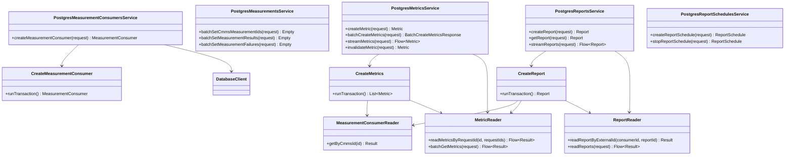

# org.wfanet.measurement.reporting.deploy.v2.postgres

## Overview

PostgreSQL-based deployment implementation for the Reporting v2 service layer. Provides gRPC service implementations and database operations for managing measurement consumers, metrics, reports, report schedules, reporting sets, and metric calculation specifications using R2DBC reactive database access patterns.

## Components

### PostgresMeasurementConsumersService

gRPC service implementation for managing measurement consumer entities in PostgreSQL.

| Method | Parameters | Returns | Description |
|--------|------------|---------|-------------|
| createMeasurementConsumer | `request: MeasurementConsumer` | `MeasurementConsumer` | Creates new measurement consumer entity |

### PostgresMeasurementsService

Manages batch operations for measurement lifecycle including CMMS measurement ID assignment and result/failure updates.

| Method | Parameters | Returns | Description |
|--------|------------|---------|-------------|
| batchSetCmmsMeasurementIds | `request: BatchSetCmmsMeasurementIdsRequest` | `Empty` | Assigns CMMS measurement IDs in batch |
| batchSetMeasurementResults | `request: BatchSetMeasurementResultsRequest` | `Empty` | Updates measurement results in batch |
| batchSetMeasurementFailures | `request: BatchSetMeasurementFailuresRequest` | `Empty` | Records measurement failures in batch |

### PostgresMetricCalculationSpecsService

Manages metric calculation specifications defining how metrics are computed.

| Method | Parameters | Returns | Description |
|--------|------------|---------|-------------|
| createMetricCalculationSpec | `request: CreateMetricCalculationSpecRequest` | `MetricCalculationSpec` | Creates metric calculation specification |
| getMetricCalculationSpec | `request: GetMetricCalculationSpecRequest` | `MetricCalculationSpec` | Retrieves specification by external ID |
| listMetricCalculationSpecs | `request: ListMetricCalculationSpecsRequest` | `ListMetricCalculationSpecsResponse` | Lists specifications with pagination |
| batchGetMetricCalculationSpecs | `request: BatchGetMetricCalculationSpecsRequest` | `BatchGetMetricCalculationSpecsResponse` | Retrieves multiple specifications |

### PostgresMetricsService

Manages metric lifecycle including creation, retrieval, streaming, and invalidation.

| Method | Parameters | Returns | Description |
|--------|------------|---------|-------------|
| createMetric | `request: CreateMetricRequest` | `Metric` | Creates single metric entity |
| batchCreateMetrics | `request: BatchCreateMetricsRequest` | `BatchCreateMetricsResponse` | Creates up to 1000 metrics |
| batchGetMetrics | `request: BatchGetMetricsRequest` | `BatchGetMetricsResponse` | Retrieves multiple metrics by ID |
| streamMetrics | `request: StreamMetricsRequest` | `Flow<Metric>` | Streams metrics matching filter criteria |
| invalidateMetric | `request: InvalidateMetricRequest` | `Metric` | Marks metric as invalid |

### PostgresReportScheduleIterationsService

Manages individual iterations of scheduled report generation.

| Method | Parameters | Returns | Description |
|--------|------------|---------|-------------|
| createReportScheduleIteration | `request: ReportScheduleIteration` | `ReportScheduleIteration` | Creates iteration for report schedule |
| getReportScheduleIteration | `request: GetReportScheduleIterationRequest` | `ReportScheduleIteration` | Retrieves iteration by external ID |
| listReportScheduleIterations | `request: ListReportScheduleIterationsRequest` | `ListReportScheduleIterationsResponse` | Lists iterations with filtering |
| setReportScheduleIterationState | `request: SetReportScheduleIterationStateRequest` | `ReportScheduleIteration` | Updates iteration state |

### PostgresReportSchedulesService

Manages recurring report schedules and their lifecycle.

| Method | Parameters | Returns | Description |
|--------|------------|---------|-------------|
| createReportSchedule | `request: CreateReportScheduleRequest` | `ReportSchedule` | Creates new report schedule |
| getReportSchedule | `request: GetReportScheduleRequest` | `ReportSchedule` | Retrieves schedule by external ID |
| listReportSchedules | `request: ListReportSchedulesRequest` | `ListReportSchedulesResponse` | Lists schedules with state filtering |
| stopReportSchedule | `request: StopReportScheduleRequest` | `ReportSchedule` | Stops active report schedule |

### PostgresReportingSetsService

Manages reporting sets representing collections of event groups for measurement.

| Method | Parameters | Returns | Description |
|--------|------------|---------|-------------|
| createReportingSet | `request: CreateReportingSetRequest` | `ReportingSet` | Creates primitive or composite reporting set |
| batchGetReportingSets | `request: BatchGetReportingSetsRequest` | `BatchGetReportingSetsResponse` | Retrieves up to 1000 reporting sets |
| streamReportingSets | `request: StreamReportingSetsRequest` | `Flow<ReportingSet>` | Streams reporting sets by consumer |

### PostgresReportsService

Manages report entities combining metrics and reporting sets over time intervals.

| Method | Parameters | Returns | Description |
|--------|------------|---------|-------------|
| createReport | `request: CreateReportRequest` | `Report` | Creates report with metric reuse support |
| getReport | `request: GetReportRequest` | `Report` | Retrieves report by external ID |
| streamReports | `request: StreamReportsRequest` | `Flow<Report>` | Streams reports with pagination |

## Readers

### EventGroupReader

Queries event group entities by CMMS identifiers.

| Method | Parameters | Returns | Description |
|--------|------------|---------|-------------|
| getByCmmsEventGroupKey | `cmmsEventGroupKeys: Collection<CmmsEventGroupKey>` | `Flow<Result>` | Retrieves event groups by composite key |

### MeasurementConsumerReader

Queries measurement consumer entities by CMMS ID.

| Method | Parameters | Returns | Description |
|--------|------------|---------|-------------|
| getByCmmsId | `cmmsMeasurementConsumerId: String` | `Result?` | Retrieves consumer by external ID |

### MetricCalculationSpecReader

Queries metric calculation specifications with filtering and batch support.

| Method | Parameters | Returns | Description |
|--------|------------|---------|-------------|
| readMetricCalculationSpecByExternalId | `cmmsMeasurementConsumerId: String, externalMetricCalculationSpecId: String` | `Result?` | Retrieves specification by external ID |
| readMetricCalculationSpecs | `request: ListMetricCalculationSpecsRequest` | `List<Result>` | Lists specifications with pagination |
| batchReadByExternalIds | `cmmsMeasurementConsumerId: String, externalMetricCalculationSpecIds: Collection<String>` | `List<Result>` | Batch retrieval by external IDs |

### MeasurementReader

Queries measurement entities by various criteria.

### MetricReader

Queries metric entities including reporting metrics and request-based lookups.

### ReportReader

Queries report entities with complex joins across metric calculation specs and reporting sets.

| Method | Parameters | Returns | Description |
|--------|------------|---------|-------------|
| readReportByRequestId | `measurementConsumerId: InternalId, createReportRequestId: String` | `Result?` | Retrieves report by request ID |
| readReportByExternalId | `cmmsMeasurementConsumerId: String, externalReportId: String` | `Result?` | Retrieves report by external ID |
| readReports | `request: StreamReportsRequest` | `Flow<Result>` | Streams reports with pagination |

### ReportScheduleIterationReader

Queries report schedule iteration entities.

### ReportScheduleReader

Queries report schedule entities with state filtering.

### ReportingSetReader

Queries reporting set entities including batch operations.

## Writers

### CreateMeasurementConsumer

Inserts measurement consumer into database.

| Method | Parameters | Returns | Description |
|--------|------------|---------|-------------|
| execute | `client: DatabaseClient, idGenerator: IdGenerator` | `MeasurementConsumer` | Executes transactional insert |

**Exceptions**: `MeasurementConsumerAlreadyExistsException`

### CreateMetricCalculationSpec

Inserts metric calculation specification.

**Exceptions**: `MetricCalculationSpecAlreadyExistsException`, `MeasurementConsumerNotFoundException`

### CreateMetrics

Inserts metrics with weighted measurements and primitive reporting set bases.

| Method | Parameters | Returns | Description |
|--------|------------|---------|-------------|
| execute | `client: DatabaseClient, idGenerator: IdGenerator` | `List<Metric>` | Creates metrics with complex measurements |

**Exceptions**: `ReportingSetNotFoundException`, `MeasurementConsumerNotFoundException`, `MetricAlreadyExistsException`

### CreateReport

Inserts report with metric reuse optimization and schedule integration.

| Method | Parameters | Returns | Description |
|--------|------------|---------|-------------|
| execute | `client: DatabaseClient, idGenerator: IdGenerator` | `Report` | Creates report reusing existing metrics |

**Exceptions**: `ReportingSetNotFoundException`, `MetricCalculationSpecNotFoundException`, `ReportScheduleNotFoundException`, `ReportAlreadyExistsException`

### CreateReportSchedule

Inserts report schedule with validation of dependencies.

**Exceptions**: `ReportingSetNotFoundException`, `MetricCalculationSpecNotFoundException`, `ReportScheduleAlreadyExistsException`

### CreateReportScheduleIteration

Inserts report schedule iteration.

**Exceptions**: `ReportScheduleNotFoundException`

### CreateReportingSet

Inserts primitive or composite reporting set.

**Exceptions**: `ReportingSetNotFoundException`, `ReportingSetAlreadyExistsException`, `CampaignGroupInvalidException`

### InvalidateMetric

Updates metric state to INVALID.

**Exceptions**: `MetricNotFoundException`, `InvalidMetricStateTransitionException`

### SetCmmsMeasurementIds

Assigns CMMS measurement IDs to existing measurements.

**Exceptions**: `MeasurementConsumerNotFoundException`, `MeasurementNotFoundException`

### SetMeasurementFailures

Records failure states for measurements.

**Exceptions**: `MeasurementConsumerNotFoundException`, `MeasurementNotFoundException`

### SetMeasurementResults

Updates measurements with computation results.

**Exceptions**: `MeasurementConsumerNotFoundException`, `MeasurementNotFoundException`

### SetReportScheduleIterationState

Updates report schedule iteration state.

**Exceptions**: `ReportScheduleIterationNotFoundException`, `ReportScheduleIterationStateInvalidException`

### StopReportSchedule

Transitions active report schedule to stopped state.

**Exceptions**: `ReportScheduleNotFoundException`, `ReportScheduleStateInvalidException`

## Data Structures

### EventGroupReader.Result

| Property | Type | Description |
|----------|------|-------------|
| cmmsDataProviderId | `String` | External data provider identifier |
| cmmsEventGroupId | `String` | External event group identifier |
| measurementConsumerId | `InternalId` | Internal measurement consumer ID |
| eventGroupId | `InternalId` | Internal event group ID |

### MeasurementConsumerReader.Result

| Property | Type | Description |
|----------|------|-------------|
| measurementConsumerId | `InternalId` | Internal ID |
| cmmsMeasurementConsumerId | `String` | External CMMS ID |

### MetricCalculationSpecReader.Result

| Property | Type | Description |
|----------|------|-------------|
| measurementConsumerId | `InternalId` | Internal measurement consumer ID |
| metricCalculationSpecId | `InternalId` | Internal specification ID |
| metricCalculationSpec | `MetricCalculationSpec` | Protobuf specification entity |

### ReportReader.Result

| Property | Type | Description |
|----------|------|-------------|
| measurementConsumerId | `InternalId` | Internal measurement consumer ID |
| reportId | `InternalId` | Internal report ID |
| createReportRequestId | `String` | Idempotency request ID |
| report | `Report` | Protobuf report entity |

## Dependencies

- `org.wfanet.measurement.common.db.r2dbc` - Reactive database client and transaction management
- `org.wfanet.measurement.common.identity` - Internal ID generation
- `org.wfanet.measurement.internal.reporting.v2` - Protobuf message definitions
- `org.wfanet.measurement.reporting.service.internal` - Exception definitions
- `io.grpc` - gRPC service implementations
- `kotlinx.coroutines.flow` - Reactive stream processing
- `io.r2dbc` - R2DBC database drivers

## Usage Example

```kotlin
// Initialize service dependencies
val idGenerator = InternalIdGenerator()
val databaseClient = createPostgresDatabaseClient(connectionConfig)

// Create measurement consumer
val measurementConsumersService = PostgresMeasurementConsumersService(
    idGenerator = idGenerator,
    client = databaseClient
)
val consumer = measurementConsumer {
    cmmsMeasurementConsumerId = "consumers/12345"
}
val createdConsumer = measurementConsumersService.createMeasurementConsumer(consumer)

// Create metrics
val metricsService = PostgresMetricsService(
    idGenerator = idGenerator,
    client = databaseClient
)
val metricRequest = createMetricRequest {
    externalMetricId = "metrics/67890"
    metric = metric {
        cmmsMeasurementConsumerId = "consumers/12345"
        externalReportingSetId = "reporting-sets/abc"
        timeInterval = interval {
            startTime = timestamp { seconds = 1640000000 }
            endTime = timestamp { seconds = 1640086400 }
        }
        metricSpec = metricSpec {
            reach = reachParams { /* ... */ }
        }
        weightedMeasurements += weightedMeasurement { /* ... */ }
    }
}
val createdMetric = metricsService.createMetric(metricRequest)

// Create report with metric reuse
val reportsService = PostgresReportsService(
    idGenerator = idGenerator,
    client = databaseClient,
    disableMetricsReuse = false
)
val reportRequest = createReportRequest {
    externalReportId = "reports/xyz"
    report = report {
        cmmsMeasurementConsumerId = "consumers/12345"
        reportingMetricEntries.put("reporting-sets/abc", reportingMetricCalculationSpec {
            metricCalculationSpecReportingMetrics += metricCalculationSpecReportingMetrics {
                externalMetricCalculationSpecId = "metric-calc-specs/123"
                reportingMetrics += reportingMetric { /* ... */ }
            }
        })
        details = reportDetails {
            timeIntervals = timeIntervals {
                timeIntervals += interval { /* ... */ }
            }
        }
    }
}
val createdReport = reportsService.createReport(reportRequest)
```

## Class Diagram


