# org.wfanet.measurement.reporting.deploy.v2.postgres.readers

## Overview
This package provides PostgreSQL-based reader classes for the reporting service v2 deployment. Each reader encapsulates database query logic for retrieving specific domain entities and their relationships from the reporting database using R2DBC reactive database access. Readers construct complex SQL queries with joins and return domain-specific protobuf messages wrapped in result objects.

## Components

### ReportScheduleReader
Reads ReportSchedule entities with their latest iteration information from the database.

| Method | Parameters | Returns | Description |
|--------|------------|---------|-------------|
| translate | `row: ResultRow` | `Result` | Transforms database row into Result object |
| readReportScheduleByRequestId | `measurementConsumerId: InternalId, createReportScheduleRequestId: String` | `Result?` | Retrieves report schedule by request ID |
| readReportScheduleByExternalId | `cmmsMeasurementConsumerId: String, externalReportScheduleId: String` | `Result?` | Retrieves report schedule by external ID |
| readReportSchedules | `request: ListReportSchedulesRequest` | `List<Result>` | Lists report schedules with pagination |
| readReportSchedulesByState | `request: ListReportSchedulesRequest` | `List<Result>` | Lists report schedules filtered by state |

### MetricCalculationSpecReader
Reads MetricCalculationSpec entities including campaign group associations.

| Method | Parameters | Returns | Description |
|--------|------------|---------|-------------|
| translate | `row: ResultRow` | `Result` | Transforms database row into Result object |
| readMetricCalculationSpecByExternalId | `cmmsMeasurementConsumerId: String, externalMetricCalculationSpecId: String` | `Result?` | Retrieves metric calculation spec by external ID |
| readMetricCalculationSpecs | `request: ListMetricCalculationSpecsRequest` | `List<Result>` | Lists metric calculation specs with optional campaign group filter |
| batchReadByExternalIds | `cmmsMeasurementConsumerId: String, externalMetricCalculationSpecIds: Collection<String>` | `List<Result>` | Batch retrieves multiple metric calculation specs |

### ReportScheduleIterationReader
Reads ReportScheduleIteration entities including associated reports.

| Method | Parameters | Returns | Description |
|--------|------------|---------|-------------|
| translate | `row: ResultRow` | `Result` | Transforms database row into Result object |
| readReportScheduleIterationByExternalId | `cmmsMeasurementConsumerId: String, externalReportScheduleId: String, externalReportScheduleIterationId: String` | `Result?` | Retrieves specific iteration by external IDs |
| readReportScheduleIterations | `request: ListReportScheduleIterationsRequest` | `List<Result>` | Lists iterations filtered by report event time |

### MeasurementConsumerReader
Reads MeasurementConsumer ID mappings between CMMS and internal IDs.

| Method | Parameters | Returns | Description |
|--------|------------|---------|-------------|
| getByCmmsId | `cmmsMeasurementConsumerId: String` | `Result?` | Retrieves measurement consumer by CMMS ID |

### MeasurementReader
Reads Measurement entities with time intervals and state information.

| Method | Parameters | Returns | Description |
|--------|------------|---------|-------------|
| readMeasurementsByCmmsId | `measurementConsumerId: InternalId, cmmsMeasurementIds: Collection<String>` | `Flow<Result>` | Retrieves measurements by CMMS measurement IDs |

### MetricReader
Reads Metric entities with complex relationships to measurements, reporting sets, and metric specifications.

| Method | Parameters | Returns | Description |
|--------|------------|---------|-------------|
| readMetricsByRequestId | `measurementConsumerId: InternalId, createMetricRequestIds: Collection<String>` | `Flow<Result>` | Retrieves metrics by create request IDs |
| readMetricsByCmmsMeasurementId | `measurementConsumerId: InternalId, cmmsMeasurementIds: Collection<String>` | `Flow<Result>` | Retrieves metrics associated with CMMS measurement IDs |
| readReportingMetricsByReportingMetricKey | `measurementConsumerId: InternalId, reportingMetricKeys: Collection<ReportingMetricKey>` | `Flow<ReportingMetric>` | Retrieves reporting metrics by composite key |
| batchGetMetrics | `request: BatchGetMetricsRequest` | `Flow<Result>` | Batch retrieves metrics by external metric IDs |
| readMetrics | `request: StreamMetricsRequest` | `Flow<Result>` | Streams metrics with pagination support |

### ReportingSetReader
Reads ReportingSet entities including primitive event groups, set expressions, and weighted subset unions.

| Method | Parameters | Returns | Description |
|--------|------------|---------|-------------|
| batchGetReportingSets | `request: BatchGetReportingSetsRequest` | `Flow<Result>` | Batch retrieves reporting sets by external IDs |
| readReportingSets | `request: StreamReportingSetsRequest` | `Flow<Result>` | Streams reporting sets with optional campaign group filter |
| readIds | `measurementConsumerId: InternalId, externalReportingSetIds: Collection<String>` | `Flow<ReportingSetIds>` | Retrieves only ID mappings for reporting sets |
| readCampaignGroup | `measurementConsumerId: InternalId, externalReportingSetId: String` | `ReportingSetIds?` | Validates and retrieves campaign group reporting set |

### EventGroupReader
Reads EventGroup ID mappings between CMMS data provider/event group IDs and internal IDs.

| Method | Parameters | Returns | Description |
|--------|------------|---------|-------------|
| getByCmmsEventGroupKey | `cmmsEventGroupKeys: Collection<CmmsEventGroupKey>` | `Flow<Result>` | Retrieves event groups by CMMS keys |

### ReportReader
Reads Report entities including metric calculation specs and reporting metrics.

| Method | Parameters | Returns | Description |
|--------|------------|---------|-------------|
| readReportByRequestId | `measurementConsumerId: InternalId, createReportRequestId: String` | `Result?` | Retrieves report by create request ID |
| readReportByExternalId | `cmmsMeasurementConsumerId: String, externalReportId: String` | `Result?` | Retrieves report by external ID |
| readReports | `request: StreamReportsRequest` | `Flow<Result>` | Streams reports ordered by creation time |

## Data Structures

### ReportScheduleReader.Result
| Property | Type | Description |
|----------|------|-------------|
| measurementConsumerId | `InternalId` | Internal measurement consumer identifier |
| reportScheduleId | `InternalId` | Internal report schedule identifier |
| createReportScheduleRequestId | `String?` | Request ID used to create schedule |
| reportSchedule | `ReportSchedule` | Complete report schedule protobuf |

### MetricCalculationSpecReader.Result
| Property | Type | Description |
|----------|------|-------------|
| measurementConsumerId | `InternalId` | Internal measurement consumer identifier |
| metricCalculationSpecId | `InternalId` | Internal metric calculation spec identifier |
| metricCalculationSpec | `MetricCalculationSpec` | Complete metric calculation spec protobuf |

### ReportScheduleIterationReader.Result
| Property | Type | Description |
|----------|------|-------------|
| measurementConsumerId | `InternalId` | Internal measurement consumer identifier |
| reportScheduleId | `InternalId` | Internal report schedule identifier |
| reportScheduleIterationId | `InternalId` | Internal iteration identifier |
| reportScheduleIteration | `ReportScheduleIteration` | Complete iteration protobuf |

### MeasurementConsumerReader.Result
| Property | Type | Description |
|----------|------|-------------|
| measurementConsumerId | `InternalId` | Internal measurement consumer identifier |
| cmmsMeasurementConsumerId | `String` | CMMS external identifier |

### MeasurementReader.Result
| Property | Type | Description |
|----------|------|-------------|
| measurementConsumerId | `InternalId` | Internal measurement consumer identifier |
| measurementId | `InternalId` | Internal measurement identifier |
| measurement | `Measurement` | Complete measurement protobuf |

### MetricReader.Result
| Property | Type | Description |
|----------|------|-------------|
| measurementConsumerId | `InternalId` | Internal measurement consumer identifier |
| metricId | `InternalId` | Internal metric identifier |
| createMetricRequestId | `String` | Request ID used to create metric |
| metric | `Metric` | Complete metric protobuf with measurements |

### MetricReader.ReportingMetricKey
| Property | Type | Description |
|----------|------|-------------|
| reportingSetId | `InternalId` | Internal reporting set identifier |
| metricCalculationSpecId | `InternalId` | Internal metric calculation spec identifier |
| timeInterval | `Interval` | Time range for the metric |

### MetricReader.ReportingMetric
| Property | Type | Description |
|----------|------|-------------|
| reportingMetricKey | `ReportingMetricKey` | Composite key identifying the metric |
| metricId | `InternalId` | Internal metric identifier |
| createMetricRequestId | `String` | Request ID used to create metric |
| externalMetricId | `String` | CMMS external metric identifier |
| metricSpec | `MetricSpec` | Metric specification details |
| metricDetails | `Metric.Details` | Metric computation details |
| createTime | `Instant` | Creation timestamp |
| state | `Metric.State` | Current metric state |

### ReportingSetReader.Result
| Property | Type | Description |
|----------|------|-------------|
| measurementConsumerId | `InternalId` | Internal measurement consumer identifier |
| reportingSetId | `InternalId` | Internal reporting set identifier |
| reportingSet | `ReportingSet` | Complete reporting set with expressions |

### ReportingSetReader.ReportingSetIds
| Property | Type | Description |
|----------|------|-------------|
| measurementConsumerId | `InternalId` | Internal measurement consumer identifier |
| reportingSetId | `InternalId` | Internal reporting set identifier |
| externalReportingSetId | `String` | CMMS external identifier |

### EventGroupReader.Result
| Property | Type | Description |
|----------|------|-------------|
| cmmsDataProviderId | `String` | CMMS data provider identifier |
| cmmsEventGroupId | `String` | CMMS event group identifier |
| measurementConsumerId | `InternalId` | Internal measurement consumer identifier |
| eventGroupId | `InternalId` | Internal event group identifier |

### EventGroupReader.CmmsEventGroupKey
| Property | Type | Description |
|----------|------|-------------|
| cmmsDataProviderId | `String` | CMMS data provider identifier |
| cmmsEventGroupId | `String` | CMMS event group identifier |

### ReportReader.Result
| Property | Type | Description |
|----------|------|-------------|
| measurementConsumerId | `InternalId` | Internal measurement consumer identifier |
| reportId | `InternalId` | Internal report identifier |
| createReportRequestId | `String` | Request ID used to create report |
| report | `Report` | Complete report with metrics and calculations |

## Dependencies
- `org.wfanet.measurement.common.db.r2dbc` - R2DBC reactive database access framework with bound statements and result row mapping
- `org.wfanet.measurement.common.identity` - Internal ID type management for database entity identifiers
- `org.wfanet.measurement.internal.reporting.v2` - Protobuf message definitions for reporting domain models
- `org.wfanet.measurement.reporting.service.internal` - Exception types for reporting service error handling
- `kotlinx.coroutines.flow` - Reactive stream processing for database query results
- `com.google.protobuf` - Protocol buffer message serialization and parsing
- `com.google.type` - Common Google type definitions like Interval and Timestamp
- `io.r2dbc.postgresql` - PostgreSQL-specific R2DBC types like Interval codec

## Usage Example
```kotlin
// Read a report schedule by external ID
val reader = ReportScheduleReader(readContext)
val result = reader.readReportScheduleByExternalId(
    cmmsMeasurementConsumerId = "measurement-consumer-123",
    externalReportScheduleId = "schedule-456"
)

result?.let {
    val scheduleProto = it.reportSchedule
    println("Next report: ${scheduleProto.nextReportCreationTime}")
}

// Stream metrics with pagination
val metricReader = MetricReader(readContext)
val request = streamMetricsRequest {
    filter = StreamMetricsRequestKt.filter {
        cmmsMeasurementConsumerId = "measurement-consumer-123"
        externalMetricIdAfter = ""
    }
    limit = 50
}

metricReader.readMetrics(request).collect { result ->
    println("Metric: ${result.metric.externalMetricId}")
}
```

## Class Diagram

```mermaid
classDiagram
    class ReportScheduleReader {
        +readReportScheduleByRequestId(InternalId, String) Result?
        +readReportScheduleByExternalId(String, String) Result?
        +readReportSchedules(ListReportSchedulesRequest) List~Result~
    }
    class MetricCalculationSpecReader {
        +readMetricCalculationSpecByExternalId(String, String) Result?
        +batchReadByExternalIds(String, Collection~String~) List~Result~
    }
    class MetricReader {
        +readMetricsByRequestId(InternalId, Collection~String~) Flow~Result~
        +batchGetMetrics(BatchGetMetricsRequest) Flow~Result~
    }
    class ReportingSetReader {
        +batchGetReportingSets(BatchGetReportingSetsRequest) Flow~Result~
        +readReportingSets(StreamReportingSetsRequest) Flow~Result~
    }
    class ReportReader {
        +readReportByRequestId(InternalId, String) Result?
        +readReportByExternalId(String, String) Result?
        +readReports(StreamReportsRequest) Flow~Result~
    }
    class MeasurementReader {
        +readMeasurementsByCmmsId(InternalId, Collection~String~) Flow~Result~
    }

    ReportScheduleReader --> ReadContext
    MetricCalculationSpecReader --> ReadContext
    MetricReader --> ReadContext
    ReportingSetReader --> ReadContext
    ReportReader --> ReadContext
    MeasurementReader --> ReadContext
```

