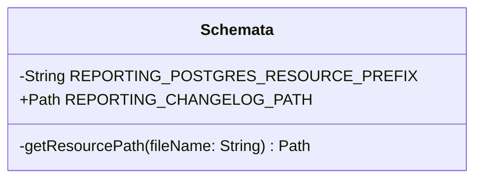

# org.wfanet.measurement.reporting.deploy.v2.postgres.testing

## Overview
This package provides testing utilities for Postgres database schema management in the reporting service deployment. It centralizes access to database changelog files used for test environment initialization and schema migration validation.

## Components

### Schemata
Singleton object that provides access to reporting service Postgres database schema resources.

| Method | Parameters | Returns | Description |
|--------|------------|---------|-------------|
| getResourcePath | `fileName: String` | `Path` | Resolves resource path for file in reporting/postgres directory |

| Property | Type | Description |
|----------|------|-------------|
| REPORTING_CHANGELOG_PATH | `Path` | Path to the Liquibase changelog file (changelog-v2.yaml) |

## Data Structures

### Constants
| Constant | Type | Value | Description |
|----------|------|-------|-------------|
| REPORTING_POSTGRES_RESOURCE_PREFIX | `String` | "reporting/postgres" | Base resource path for Postgres schema files |

## Dependencies
- `java.nio.file.Path` - File system path representation
- `org.wfanet.measurement.common.getJarResourcePath` - Utility for loading JAR resources

## Usage Example
```kotlin
import org.wfanet.measurement.reporting.deploy.v2.postgres.testing.Schemata

// Access the reporting database changelog path
val changelogPath = Schemata.REPORTING_CHANGELOG_PATH

// Use with Liquibase or schema initialization
initializeDatabase(changelogPath)
```

## Class Diagram

