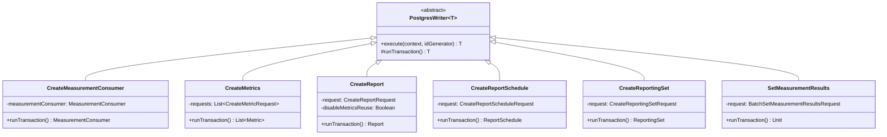

# org.wfanet.measurement.reporting.deploy.v2.postgres.writers

## Overview
PostgreSQL writer implementations for the reporting service v2 persistence layer. Each class extends `PostgresWriter` to perform transactional database operations for creating and updating reporting entities including measurement consumers, metrics, reports, report schedules, and reporting sets.

## Components

### CreateMeasurementConsumer
Inserts a MeasurementConsumer record into the database.

| Method | Parameters | Returns | Description |
|--------|------------|---------|-------------|
| runTransaction | - | `MeasurementConsumer` | Generates internal ID and inserts consumer record |

**Exceptions:**
- `MeasurementConsumerAlreadyExistsException` - thrown on duplicate entry

### CreateMetricCalculationSpec
Inserts a MetricCalculationSpec with associated reporting set and model line.

| Method | Parameters | Returns | Description |
|--------|------------|---------|-------------|
| runTransaction | - | `MetricCalculationSpec` | Creates spec with external ID and optional campaign group |

**Exceptions:**
- `MetricCalculationSpecAlreadyExistsException` - spec already exists
- `MeasurementConsumerNotFoundException` - consumer not found

### CreateReportScheduleIteration
Inserts a ReportScheduleIteration and updates parent schedule.

| Method | Parameters | Returns | Description |
|--------|------------|---------|-------------|
| runTransaction | - | `ReportScheduleIteration` | Creates iteration with WAITING_FOR_DATA_AVAILABILITY state |

**Exceptions:**
- `ReportScheduleNotFoundException` - parent schedule not found

### InvalidateMetric
Updates a Metric state to INVALID when requested.

| Method | Parameters | Returns | Description |
|--------|------------|---------|-------------|
| runTransaction | - | `Metric` | Transitions metric to INVALID state with validation |

**Exceptions:**
- `MetricNotFoundException` - metric not found
- `InvalidMetricStateTransitionException` - transition from FAILED not allowed

### SetReportScheduleIterationState
Updates iteration state and increments attempt counter.

| Method | Parameters | Returns | Description |
|--------|------------|---------|-------------|
| runTransaction | - | `ReportScheduleIteration` | Updates state and numAttempts, validates terminal states |

**Exceptions:**
- `ReportScheduleIterationNotFoundException` - iteration not found
- `ReportScheduleIterationStateInvalidException` - invalid state transition from REPORT_CREATED

### StopReportSchedule
Transitions a ReportSchedule from ACTIVE to STOPPED.

| Method | Parameters | Returns | Description |
|--------|------------|---------|-------------|
| runTransaction | - | `ReportSchedule` | Sets state to STOPPED with timestamp update |

**Exceptions:**
- `ReportScheduleNotFoundException` - schedule not found
- `ReportScheduleStateInvalidException` - current state is not ACTIVE

### SetCmmsMeasurementIds
Batch updates CMMS measurement IDs for pending measurements.

| Method | Parameters | Returns | Description |
|--------|------------|---------|-------------|
| runTransaction | - | `Unit` | Maps request IDs to CMMS IDs and sets state to PENDING |

**Exceptions:**
- `MeasurementConsumerNotFoundException` - consumer not found
- `MeasurementNotFoundException` - one or more measurements not found

### SetMeasurementFailures
Records failure details for measurements and cascades to metrics.

| Method | Parameters | Returns | Description |
|--------|------------|---------|-------------|
| runTransaction | - | `Unit` | Updates measurements to FAILED and cascades to associated metrics |

**Exceptions:**
- `MeasurementConsumerNotFoundException` - consumer not found
- `MeasurementNotFoundException` - measurement not found

### SetMeasurementResults
Records measurement results and updates metric states.

| Method | Parameters | Returns | Description |
|--------|------------|---------|-------------|
| runTransaction | - | `Unit` | Updates measurements to SUCCEEDED and metrics when all complete |

**Exceptions:**
- `MeasurementConsumerNotFoundException` - consumer not found
- `MeasurementNotFoundException` - measurement not found

### CreateMetrics
Batch inserts metrics with measurements and reporting set relationships.

| Method | Parameters | Returns | Description |
|--------|------------|---------|-------------|
| runTransaction | - | `List<Metric>` | Creates metrics with weighted measurements and primitive bases |
| createWeightedMeasurementsInsertData | `metricId: InternalId, weightedMeasurements: Collection, reportingSetMap: Map` | `WeightedMeasurementsAndInsertData` | Generates insert data for weighted measurements |
| createPrimitiveReportingSetBasesInsertData | `measurementId: InternalId, primitiveReportingSetBases: Collection, reportingSetMap: Map` | `PrimitiveReportingSetBasesInsertData` | Creates insert data for primitive reporting set bases |

**Exceptions:**
- `ReportingSetNotFoundException` - reporting set not found
- `MeasurementConsumerNotFoundException` - consumer not found
- `MetricNotFoundException` - metric not found
- `MetricAlreadyExistsException` - metric already exists

### CreateReport
Inserts a Report with metric calculation spec associations.

| Method | Parameters | Returns | Description |
|--------|------------|---------|-------------|
| runTransaction | - | `Report` | Creates report with metric reuse and schedule linking |
| buildReusableMetricsMap | `report: Report, measurementConsumerId: InternalId, reportingSetIdsByExternalId: Map, metricCalculationSpecsByExternalId: Map` | `Map<MetricCalculationSpecReportingMetricKey, MetricReader.ReportingMetric>` | Finds existing metrics for reuse |
| createMetricCalculationSpecStatement | `measurementConsumerId: InternalId, reportId: InternalId, report: Report, reportingSetIdsByExternalId: Map, metricCalculationSpecsByExternalId: Map, reportingMetricMap: Map` | `ReportingMetricEntriesAndStatement` | Generates statement for metric calculation spec reporting metrics |

**Exceptions:**
- `ReportingSetNotFoundException` - reporting set not found
- `MeasurementConsumerNotFoundException` - consumer not found
- `MetricCalculationSpecNotFoundException` - spec not found
- `ReportScheduleNotFoundException` - schedule not found
- `ReportAlreadyExistsException` - report already exists

### CreateReportSchedule
Inserts a ReportSchedule with validation of reporting sets and specs.

| Method | Parameters | Returns | Description |
|--------|------------|---------|-------------|
| runTransaction | - | `ReportSchedule` | Creates schedule in ACTIVE state with next creation time |

**Exceptions:**
- `ReportingSetNotFoundException` - reporting set not found
- `MetricCalculationSpecNotFoundException` - spec not found
- `MeasurementConsumerNotFoundException` - consumer not found
- `ReportScheduleAlreadyExistsException` - schedule already exists

### CreateReportingSet
Inserts a ReportingSet with primitive or composite structure.

| Method | Parameters | Returns | Description |
|--------|------------|---------|-------------|
| runTransaction | - | `ReportingSet` | Creates reporting set with event groups or set expressions |
| insertReportingSetEventGroups | `measurementConsumerId: InternalId, reportingSetId: InternalId, eventGroups: List` | `Unit` | Inserts event group associations for primitive sets |
| getExternalReportingSetIds | `reportingSet: ReportingSet` | `Set<String>` | Extracts all referenced external reporting set IDs |
| createSetExpressionsValues | `values: MutableList, setExpressionId: InternalId, measurementConsumerId: InternalId, reportingSetId: InternalId, setExpression: SetExpression, reportingSetMap: Map` | `Unit` | Recursively creates set expression tree values |
| insertWeightedSubsetUnions | `measurementConsumerId: InternalId, reportingSetId: InternalId, weightedSubsetUnions: List, reportingSetMap: Map` | `Unit` | Inserts weighted subset unions and primitive bases |
| createPrimitiveReportingSetBasisInsertData | `weightedSubsetUnionId: InternalId, primitiveReportingSetBasis: PrimitiveReportingSetBasis, reportingSetMap: Map` | `PrimitiveReportingSetBasesInsertData` | Creates insert data for primitive bases and filters |

**Exceptions:**
- `ReportingSetNotFoundException` - referenced reporting set not found
- `ReportingSetAlreadyExistsException` - reporting set already exists
- `MeasurementConsumerNotFoundException` - consumer not found
- `CampaignGroupInvalidException` - invalid campaign group

## Data Structures

### MetricCalculationSpecReportingMetricsValues
| Property | Type | Description |
|----------|------|-------------|
| metricId | `InternalId` | Internal metric identifier |
| createMetricRequestId | `UUID` | Request ID for metric creation |

### MeasurementsValues
| Property | Type | Description |
|----------|------|-------------|
| measurementId | `InternalId` | Internal measurement identifier |
| cmmsCreateMeasurementRequestId | `UUID` | CMMS request identifier |
| timeIntervalStart | `OffsetDateTime` | Measurement start time |
| timeIntervalEndExclusive | `OffsetDateTime` | Measurement end time |
| details | `Measurement.Details` | Measurement configuration details |

### MetricMeasurementsValues
| Property | Type | Description |
|----------|------|-------------|
| metricId | `InternalId` | Associated metric ID |
| measurementId | `InternalId` | Associated measurement ID |
| coefficient | `Int` | Weight coefficient |
| binaryRepresentation | `Int` | Binary representation for set operations |

### PrimitiveReportingSetBasesValues
| Property | Type | Description |
|----------|------|-------------|
| primitiveReportingSetBasisId | `InternalId` | Basis identifier |
| primitiveReportingSetId | `InternalId` | Referenced primitive reporting set |

### SetExpressionsValues
| Property | Type | Description |
|----------|------|-------------|
| setExpressionId | `InternalId` | Expression identifier |
| operationValue | `Int` | Set operation type |
| leftHandSetExpressionId | `InternalId?` | Left operand expression |
| leftHandReportingSetId | `InternalId?` | Left operand reporting set |
| rightHandSetExpressionId | `InternalId?` | Right operand expression |
| rightHandReportingSetId | `InternalId?` | Right operand reporting set |

### WeightedSubsetUnionsValues
| Property | Type | Description |
|----------|------|-------------|
| weightedSubsetUnionId | `InternalId` | Union identifier |
| weight | `Int` | Union weight coefficient |
| binaryRepresentation | `Int` | Binary representation |

## Dependencies
- `org.wfanet.measurement.common.db.r2dbc.postgres` - PostgreSQL R2DBC writer framework
- `org.wfanet.measurement.common.db.r2dbc` - Bound statement utilities
- `org.wfanet.measurement.common.identity` - Internal ID generation
- `org.wfanet.measurement.internal.reporting.v2` - Protocol buffer domain models
- `org.wfanet.measurement.reporting.deploy.v2.postgres.readers` - Reader components for validation
- `org.wfanet.measurement.reporting.service.internal` - Exception types
- `io.r2dbc.spi` - R2DBC exception handling
- `kotlinx.coroutines.flow` - Asynchronous flow processing

## Usage Example
```kotlin
val createMetricRequest = createMetricRequest {
  metric = metric {
    cmmsMeasurementConsumerId = "consumers/123"
    externalReportingSetId = "reporting-sets/456"
    metricSpec = metricSpec {
      reach = reachSpec { /* ... */ }
    }
  }
  externalMetricId = "metrics/789"
}

val writer = CreateMetrics(listOf(createMetricRequest))
val createdMetrics = writer.execute(transactionContext, idGenerator)
```

## Class Diagram

