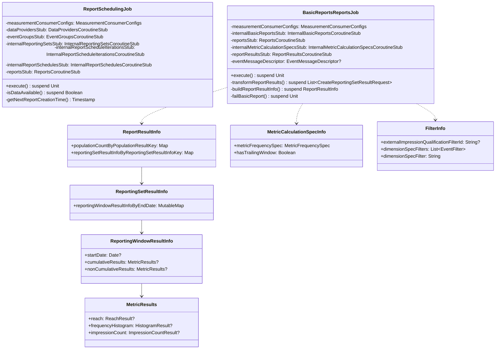

# org.wfanet.measurement.reporting.job

## Overview
This package provides job implementations for automated reporting operations in the Cross-Media Measurement system. It contains two primary job classes: ReportSchedulingJob handles the creation and scheduling of reports based on active report schedules, while BasicReportsReportsJob processes completed reports and transforms their results into structured report results for storage and analysis.

## Components

### ReportSchedulingJob
Executes scheduled report creation by polling active report schedules and creating reports when data is available.

| Method | Parameters | Returns | Description |
|--------|------------|---------|-------------|
| execute | None | `suspend Unit` | Processes all active report schedules and creates reports |

**Private Helper Methods:**

| Method | Parameters | Returns | Description |
|--------|------------|---------|-------------|
| isDataAvailable | `windowStart: Timestamp`, `eventTimestamp: Timestamp`, `eventGroupKeys: List<EventGroupKey>`, `dataProvidersStub: DataProvidersCoroutineStub`, `dataProvidersMap: MutableMap<String, DataProvider>`, `eventGroupsStub: EventGroupsCoroutineStub`, `eventGroupsMap: MutableMap<String, EventGroup>`, `apiAuthenticationKey: String` | `suspend Boolean` | Validates data availability across event groups |
| Timestamp.toOffsetDateTime | `utcOffset: Duration` | `OffsetDateTime` | Converts timestamp to offset date time |
| Timestamp.toZonedDateTime | `timeZone: TimeZone` | `ZonedDateTime` | Converts timestamp to zoned date time |
| getNextReportCreationTime | `temporal: Temporal`, `frequency: ReportSchedule.Frequency` | `Timestamp` | Calculates next report creation timestamp |

**Constructor Parameters:**

| Parameter | Type | Description |
|-----------|------|-------------|
| measurementConsumerConfigs | `MeasurementConsumerConfigs` | Configuration for measurement consumers |
| dataProvidersStub | `DataProvidersCoroutineStub` | gRPC stub for data provider operations |
| eventGroupsStub | `EventGroupsCoroutineStub` | gRPC stub for event group operations |
| internalReportingSetsStub | `InternalReportingSetsCoroutineStub` | gRPC stub for reporting sets |
| internalReportScheduleIterationsStub | `InternalReportScheduleIterationsCoroutineStub` | gRPC stub for schedule iterations |
| internalReportSchedulesStub | `InternalReportSchedulesCoroutineStub` | gRPC stub for report schedules |
| reportsStub | `ReportsCoroutineStub` | gRPC stub for report creation |

**Constants:**
- `BATCH_SIZE = 50` - Number of report schedules to process per batch

### BasicReportsReportsJob
Retrieves basic reports with state REPORT_CREATED and processes their results into structured report results.

| Method | Parameters | Returns | Description |
|--------|------------|---------|-------------|
| execute | None | `suspend Unit` | Processes all basic reports in REPORT_CREATED state |

**Private Helper Methods:**

| Method | Parameters | Returns | Description |
|--------|------------|---------|-------------|
| transformReportResults | `reportResult: ReportResult`, `basicReport: BasicReport`, `report: Report`, `eventTemplateFieldsByPath: Map<String, EventTemplateFieldInfo>`, `eventTemplateFieldByPredicate: Map<String, EventTemplateField>` | `suspend List<CreateReportingSetResultRequest>` | Transforms report into reporting set result requests |
| buildReportResultInfo | `report: Report`, `cmmsMeasurementConsumerId: String`, `externalCampaignGroupId: String` | `suspend ReportResultInfo` | Builds report result information from report |
| buildMetricCalculationSpecInfoByNameMap | `cmmsMeasurementConsumerId: String`, `externalCampaignGroupId: String` | `suspend Map<String, MetricCalculationSpecInfo>` | Creates metric calculation spec lookup map |
| buildEventTemplateFieldByPredicateMap | `eventTemplateFieldsByPath: Map<String, EventTemplateFieldInfo>` | `Map<String, EventTemplateField>` | Maps predicates to event template fields |
| buildFilterInfoByFilterString | `basicReport: BasicReport`, `eventTemplateFieldsByPath: Map<String, EventTemplateFieldInfo>` | `Map<String, FilterInfo>` | Maps filter strings to filter information |
| Timestamp.toDate | `zoneId: ZoneId` | `Date` | Converts timestamp to date in zone |
| MetricCalculationSpec.MetricFrequencySpec.toMetricFrequencySpec | None | `MetricFrequencySpec` | Transforms metric frequency specification |
| UnivariateStatistics.toNoisyMetricSetUnivariateStatistics | None | `NoisyMetricSet.UnivariateStatistics` | Converts univariate statistics format |
| MetricResult.ReachResult.toNoisyMetricSetReachResult | None | `NoisyMetricSet.ReachResult` | Converts reach result format |
| MetricResult.HistogramResult.toNoisyMetricSetHistogramResult | None | `NoisyMetricSet.HistogramResult` | Converts histogram result format |
| MetricResult.ImpressionCountResult.toNoisyMetricSetImpressionCountResult | None | `NoisyMetricSet.ImpressionCountResult` | Converts impression count result format |
| failBasicReport | `cmmsMeasurementConsumerId: String`, `externalBasicReportId: String` | `suspend Unit` | Marks basic report as failed |

**Constructor Parameters:**

| Parameter | Type | Description |
|-----------|------|-------------|
| measurementConsumerConfigs | `MeasurementConsumerConfigs` | Configuration for measurement consumers |
| internalBasicReportsStub | `InternalBasicReportsCoroutineStub` | gRPC stub for basic report operations |
| reportsStub | `ReportsCoroutineStub` | gRPC stub for report retrieval |
| internalMetricCalculationSpecsStub | `InternalMetricCalculationSpecsCoroutineStub` | gRPC stub for metric calculation specs |
| reportResultsStub | `ReportResultsCoroutineStub` | gRPC stub for report result operations |
| eventMessageDescriptor | `EventMessageDescriptor?` | Optional descriptor for event message schema |

**Constants:**
- `BATCH_SIZE = 10` - Number of basic reports to process per batch

## Data Structures

### MetricCalculationSpecInfo (BasicReportsReportsJob)
| Property | Type | Description |
|----------|------|-------------|
| metricFrequencySpec | `MetricCalculationSpec.MetricFrequencySpec` | Frequency specification for metrics |
| hasTrailingWindow | `Boolean` | Whether calculation uses trailing window |

### ReportResultInfo (BasicReportsReportsJob)
| Property | Type | Description |
|----------|------|-------------|
| populationCountByPopulationResultKey | `Map<PopulationResultKey, Long>` | Population counts indexed by result key |
| reportingSetResultInfoByReportingSetResultInfoKey | `Map<ReportingSetResultInfoKey, ReportingSetResultInfo>` | Reporting set results indexed by info key |

### PopulationResultKey (BasicReportsReportsJob)
| Property | Type | Description |
|----------|------|-------------|
| filter | `String` | Filter expression string |
| groupingPredicates | `Set<String>` | Set of grouping predicate expressions |

### ReportingSetResultInfoKey (BasicReportsReportsJob)
| Property | Type | Description |
|----------|------|-------------|
| externalReportingSetId | `String` | External identifier for reporting set |
| filter | `String` | Filter expression string |
| groupingPredicates | `Set<String>` | Set of grouping predicate expressions |
| metricFrequencySpec | `MetricFrequencySpec` | Metric frequency specification |

### ReportingSetResultInfo (BasicReportsReportsJob)
| Property | Type | Description |
|----------|------|-------------|
| reportingWindowResultInfoByEndDate | `MutableMap<Date, ReportingWindowResultInfo>` | Results indexed by reporting window end date |

### ReportingWindowResultInfo (BasicReportsReportsJob)
| Property | Type | Description |
|----------|------|-------------|
| startDate | `Date?` | Optional window start date |
| cumulativeResults | `MetricResults?` | Optional cumulative metric results |
| nonCumulativeResults | `MetricResults?` | Optional non-cumulative metric results |

### MetricResults (BasicReportsReportsJob)
| Property | Type | Description |
|----------|------|-------------|
| reach | `MetricResult.ReachResult?` | Optional reach metric result |
| frequencyHistogram | `MetricResult.HistogramResult?` | Optional frequency histogram result |
| impressionCount | `MetricResult.ImpressionCountResult?` | Optional impression count result |

### FilterInfo (BasicReportsReportsJob)
| Property | Type | Description |
|----------|------|-------------|
| externalImpressionQualificationFilterId | `String?` | Optional external filter identifier |
| dimensionSpecFilters | `List<EventFilter>` | List of dimension specification filters |
| dimensionSpecFilter | `String` | CEL expression string from filters |

## Dependencies

- `org.wfanet.measurement.config.reporting` - MeasurementConsumerConfigs for consumer configuration
- `org.wfanet.measurement.api.v2alpha` - Public API stubs for data providers, event groups, and measurement consumers
- `org.wfanet.measurement.internal.reporting.v2` - Internal reporting gRPC stubs and message types
- `org.wfanet.measurement.reporting.v2alpha` - Public reporting API stubs and types
- `org.wfanet.measurement.reporting.service.api.v2alpha` - Reporting service utilities and interceptors
- `org.wfanet.measurement.access.client.v1alpha` - Authentication interceptors for trusted principals
- `com.google.protobuf` - Protobuf types for timestamps and durations
- `com.google.type` - Google common types for dates and time zones
- `io.grpc` - gRPC framework for remote procedure calls
- `java.time` - Java time API for temporal calculations

## Usage Example

```kotlin
// Initialize ReportSchedulingJob
val reportSchedulingJob = ReportSchedulingJob(
  measurementConsumerConfigs = configs,
  dataProvidersStub = dataProvidersStub,
  eventGroupsStub = eventGroupsStub,
  internalReportingSetsStub = reportingSetsStub,
  internalReportScheduleIterationsStub = iterationsStub,
  internalReportSchedulesStub = schedulesStub,
  reportsStub = reportsStub
)

// Execute report scheduling
reportSchedulingJob.execute()

// Initialize BasicReportsReportsJob
val basicReportsJob = BasicReportsReportsJob(
  measurementConsumerConfigs = configs,
  internalBasicReportsStub = basicReportsStub,
  reportsStub = reportsStub,
  internalMetricCalculationSpecsStub = metricCalcSpecsStub,
  reportResultsStub = reportResultsStub,
  eventMessageDescriptor = descriptor
)

// Process basic reports
basicReportsJob.execute()
```

## Class Diagram


