# org.wfanet.measurement.reporting.postprocessing.v2alpha

## Overview
This package provides post-processing capabilities for measurement reports in the Cross-Media Measurement system. It includes interfaces and implementations for correcting inconsistent measurements, converting report formats, and processing report data with detailed logging. The package supports both no-op processing and sophisticated correction algorithms using Python-based libraries.

## Components

### ReportProcessor
Interface for correcting inconsistent measurements in serialized Report objects with logging capabilities.

| Method | Parameters | Returns | Description |
|--------|------------|---------|-------------|
| processReportJson | `report: String`, `verbose: Boolean = false` | `String` | Processes serialized Report and returns corrected version |
| processReportJsonAndLogResult | `report: String`, `projectId: String`, `bucketName: String`, `verbose: Boolean = false` | `ReportProcessingOutput` | Processes Report with detailed logging and GCS integration |

#### StorageFactory
Nested interface responsible for creating StorageClient instances.

| Method | Parameters | Returns | Description |
|--------|------------|---------|-------------|
| createStorageClient | `projectId: String`, `bucketName: String` | `StorageClient` | Creates StorageClient for specified GCS project and bucket |

#### ReportProcessor.Default (Companion Object)
Default implementation of ReportProcessor using Python-based correction libraries.

| Method | Parameters | Returns | Description |
|--------|------------|---------|-------------|
| setTestStorageFactory | `testFactory: StorageFactory` | `Unit` | Replaces current storage factory for testing purposes |
| resetToGcsStorageFactory | - | `Unit` | Resets storage factory to default GCS implementation |

### NoOpReportProcessor
No-operation implementation that returns reports without modifications.

| Method | Parameters | Returns | Description |
|--------|------------|---------|-------------|
| processReportJson | `report: String`, `verbose: Boolean` | `String` | Returns input report unchanged |
| processReportJsonAndLogResult | `report: String`, `projectId: String`, `bucketName: String`, `verbose: Boolean` | `ReportProcessingOutput` | Returns input report with empty log |

### ReportConversion
Object providing utility functions for converting and parsing report data.

| Method | Parameters | Returns | Description |
|--------|------------|---------|-------------|
| getReportFromJsonString | `reportAsJsonString: String` | `Report` | Parses JSON string into Report protobuf object |
| getReportingSetSummaryFromTag | `tag: String` | `ReportingSetSummary` | Extracts reporting set summary from tag string |
| getMetricCalculationSpecFromTag | `tag: String` | `MetricCalculationSpec` | Parses metric calculation specification from tag |
| getDemographicGroupPopulationFromTag | `tag: String` | `Map<String, Long>` | Extracts demographic population data from tag |
| convertJsontoReportSummaries | `reportAsJsonString: String` | `List<ReportSummary>` | Converts JSON report to list of ReportSummary objects |

### GcsStorageFactory
Implementation of StorageFactory for Google Cloud Storage.

| Method | Parameters | Returns | Description |
|--------|------------|---------|-------------|
| createStorageClient | `projectId: String`, `bucketName: String` | `StorageClient` | Creates GCS StorageClient instance |

## Extension Functions

### Report.toReportSummaries
| Method | Parameters | Returns | Description |
|--------|------------|---------|-------------|
| toReportSummaries | - | `List<ReportSummary>` | Converts Report to list of ReportSummary objects with demographic grouping |

## Data Structures

### ReportProcessingOutput
| Property | Type | Description |
|----------|------|-------------|
| updatedReportJson | `String` | JSON representation of processed report |
| reportPostProcessorLog | `ReportPostProcessorLog` | Detailed logs and metadata from processing |

### ReportingSetSummary
| Property | Type | Description |
|----------|------|-------------|
| measurementPolicy | `String` | Measurement policy used for reporting set |
| target | `List<String>` | Target identifiers for reporting set |
| uniqueReachTarget | `String` | Unique reach target identifier |
| lhsReportingSetIds | `List<String>` | Left-hand side reporting set IDs in set operations |
| rhsReportingSetIds | `List<String>` | Right-hand side reporting set IDs in set operations |

### MetricCalculationSpec
| Property | Type | Description |
|----------|------|-------------|
| commonFilter | `String` | Common filter applied in measurement |
| cumulative | `Boolean` | Whether measurement is cumulative |
| grouping | `String` | Grouping criteria for measurement |
| metricFrequency | `String` | Frequency of cumulative measurements |
| metrics | `List<String>` | List of metrics to measure |
| setOperation | `String` | Set operation used in calculation |

### ReportProcessorFailureException
Exception thrown when report processing fails.

## Dependencies
- `org.wfanet.measurement.reporting.v2alpha` - Core Report and Metric protobuf definitions
- `org.wfanet.measurement.internal.reporting.postprocessing` - Internal post-processing protobuf messages
- `com.google.protobuf.util` - JSON format conversion utilities
- `com.google.cloud.storage` - Google Cloud Storage integration
- `org.wfanet.measurement.gcloud.gcs` - GCS storage client implementation
- `org.wfanet.measurement.storage` - Abstract storage client interface
- `org.wfanet.measurement.common` - Common utilities for resource handling

## Usage Example
```kotlin
// No-op processing
val noOpProcessor = NoOpReportProcessor()
val reportJson = """{"name": "reports/123", "state": "SUCCEEDED"}"""
val processedReport = noOpProcessor.processReportJson(reportJson, verbose = false)

// Default processing with logging
val processor = ReportProcessor.Default
val output = processor.processReportJsonAndLogResult(
    report = reportJson,
    projectId = "my-gcp-project",
    bucketName = "my-bucket",
    verbose = true
)
println("Updated report: ${output.updatedReportJson}")
println("Processing successful: ${output.reportPostProcessorLog.postProcessingSuccessful}")

// Convert report to summaries
val summaries = ReportConversion.convertJsontoReportSummaries(reportJson)
summaries.forEach { summary ->
    println("Population: ${summary.population}")
    println("Demographic groups: ${summary.demographicGroupsList}")
}
```

## Class Diagram

```mermaid
classDiagram
    class ReportProcessor {
        <<interface>>
        +processReportJson(report: String, verbose: Boolean) String
        +processReportJsonAndLogResult(report: String, projectId: String, bucketName: String, verbose: Boolean) ReportProcessingOutput
    }

    class StorageFactory {
        <<interface>>
        +createStorageClient(projectId: String, bucketName: String) StorageClient
    }

    class NoOpReportProcessor {
        +processReportJson(report: String, verbose: Boolean) String
        +processReportJsonAndLogResult(report: String, projectId: String, bucketName: String, verbose: Boolean) ReportProcessingOutput
    }

    class GcsStorageFactory {
        +createStorageClient(projectId: String, bucketName: String) StorageClient
    }

    class ReportConversion {
        +getReportFromJsonString(reportAsJsonString: String) Report
        +getReportingSetSummaryFromTag(tag: String) ReportingSetSummary
        +getMetricCalculationSpecFromTag(tag: String) MetricCalculationSpec
        +getDemographicGroupPopulationFromTag(tag: String) Map~String, Long~
        +convertJsontoReportSummaries(reportAsJsonString: String) List~ReportSummary~
    }

    class ReportProcessingOutput {
        +updatedReportJson: String
        +reportPostProcessorLog: ReportPostProcessorLog
    }

    class ReportingSetSummary {
        +measurementPolicy: String
        +target: List~String~
        +uniqueReachTarget: String
        +lhsReportingSetIds: List~String~
        +rhsReportingSetIds: List~String~
    }

    class MetricCalculationSpec {
        +commonFilter: String
        +cumulative: Boolean
        +grouping: String
        +metricFrequency: String
        +metrics: List~String~
        +setOperation: String
    }

    class ReportProcessorFailureException {
        +message: String
        +cause: Throwable?
    }

    ReportProcessor <|.. NoOpReportProcessor
    ReportProcessor --> ReportProcessingOutput
    ReportProcessor --> StorageFactory
    StorageFactory <|.. GcsStorageFactory
    ReportConversion --> ReportingSetSummary
    ReportConversion --> MetricCalculationSpec
```

