# org.wfanet.measurement.reporting.service.api

## Overview
The reporting service API provides v2alpha gRPC service implementations for cross-media measurement reporting. This package handles report creation, scheduling, metric calculations, and data aggregation across measurement consumers. It serves as the primary public API layer for the reporting system, managing resources like Reports, BasicReports, ReportingSets, Metrics, EventGroups, and MetricCalculationSpecs.

## Components

### CelEnvProvider
Interface for providing CEL (Common Expression Language) environments with type registries for filtering operations.

| Method | Parameters | Returns | Description |
|--------|------------|---------|-------------|
| getTypeRegistryAndEnv | - | `TypeRegistryAndEnv` | Retrieves CEL environment and type registry |

### CelEnvCacheProvider
Caches and periodically refreshes CEL environments based on EventGroup metadata descriptors.

| Method | Parameters | Returns | Description |
|--------|------------|---------|-------------|
| getTypeRegistryAndEnv | - | `TypeRegistryAndEnv` | Returns cached CEL environment |
| waitForSync | - | `Unit` | Suspends until sync operations complete |
| close | - | `Unit` | Closes the cache provider and cancels jobs |

### EncryptionKeyPairStore
Interface for storing and retrieving encryption key pairs for measurement consumers.

| Method | Parameters | Returns | Description |
|--------|------------|---------|-------------|
| getPrivateKeyHandle | `principal: String`, `publicKey: ByteString` | `PrivateKeyHandle?` | Retrieves private key for given public key |

### InMemoryEncryptionKeyPairStore
In-memory implementation of EncryptionKeyPairStore using fingerprinted key maps.

| Method | Parameters | Returns | Description |
|--------|------------|---------|-------------|
| getPrivateKeyHandle | `principal: String`, `publicKey: ByteString` | `PrivateKeyHandle?` | Retrieves private key from in-memory map |

### submitBatchRequests
Splits items into batches and submits multiple RPCs with controlled concurrency (semaphore-limited to 3).

| Method | Parameters | Returns | Description |
|--------|------------|---------|-------------|
| submitBatchRequests | `items: Flow<ITEM>`, `limit: Int`, `callRpc: suspend (List<ITEM>) -> RESP`, `parseResponse: (RESP) -> List<RESULT>` | `Flow<List<RESULT>>` | Batches and submits RPC requests |

### ReportsService
Manages Report lifecycle including creation, listing, and retrieval with metric aggregation.

| Method | Parameters | Returns | Description |
|--------|------------|---------|-------------|
| createReport | `request: CreateReportRequest` | `Report` | Creates a new Report with time intervals |
| getReport | `request: GetReportRequest` | `Report` | Retrieves a single Report by name |
| listReports | `request: ListReportRequest` | `ListReportsResponse` | Lists Reports with pagination and filtering |

### BasicReportsService
Handles BasicReport creation and management with impression qualification filtering and campaign groups.

| Method | Parameters | Returns | Description |
|--------|------------|---------|-------------|
| createBasicReport | `request: CreateBasicReportRequest` | `BasicReport` | Creates BasicReport with qualification filters |
| getBasicReport | `request: GetBasicReportRequest` | `BasicReport` | Retrieves BasicReport by resource name |
| listBasicReports | `request: ListBasicReportsRequest` | `ListBasicReportsResponse` | Lists BasicReports with pagination |

### ReportingSetsService
Manages ReportingSets for grouping event groups into primitive or composite sets.

| Method | Parameters | Returns | Description |
|--------|------------|---------|-------------|
| createReportingSet | `request: CreateReportingSetRequest` | `ReportingSet` | Creates primitive or composite ReportingSet |
| getReportingSet | `request: GetReportingSetRequest` | `ReportingSet` | Retrieves ReportingSet by name |
| listReportingSets | `request: ListReportingSetsRequest` | `ListReportingSetsResponse` | Lists ReportingSets with pagination |

### MetricsService
Handles Metric creation and lifecycle management with state transitions.

| Method | Parameters | Returns | Description |
|--------|------------|---------|-------------|
| createMetric | `request: CreateMetricRequest` | `Metric` | Creates a new Metric calculation |
| batchCreateMetrics | `request: BatchCreateMetricsRequest` | `BatchCreateMetricsResponse` | Creates multiple Metrics in batch |
| getMetric | `request: GetMetricRequest` | `Metric` | Retrieves single Metric by name |
| batchGetMetrics | `request: BatchGetMetricsRequest` | `BatchGetMetricsResponse` | Retrieves multiple Metrics by names |

### MetricCalculationSpecsService
Manages specifications for metric calculations including groupings and frequency.

| Method | Parameters | Returns | Description |
|--------|------------|---------|-------------|
| createMetricCalculationSpec | `request: CreateMetricCalculationSpecRequest` | `MetricCalculationSpec` | Creates metric calculation specification |
| getMetricCalculationSpec | `request: GetMetricCalculationSpecRequest` | `MetricCalculationSpec` | Retrieves specification by name |
| listMetricCalculationSpecs | `request: ListMetricCalculationSpecsRequest` | `ListMetricCalculationSpecsResponse` | Lists specs with pagination |

### ReportSchedulesService
Manages scheduled report generation with recurring intervals (daily, weekly, monthly).

| Method | Parameters | Returns | Description |
|--------|------------|---------|-------------|
| createReportSchedule | `request: CreateReportScheduleRequest` | `ReportSchedule` | Creates report generation schedule |
| getReportSchedule | `request: GetReportScheduleRequest` | `ReportSchedule` | Retrieves schedule by name |
| listReportSchedules | `request: ListReportSchedulesRequest` | `ListReportSchedulesResponse` | Lists schedules with pagination |
| stopReportSchedule | `request: StopReportScheduleRequest` | `ReportSchedule` | Stops active report schedule |

### ReportScheduleIterationsService
Handles individual iterations of scheduled reports.

| Method | Parameters | Returns | Description |
|--------|------------|---------|-------------|
| listReportScheduleIterations | `request: ListReportScheduleIterationsRequest` | `ListReportScheduleIterationsResponse` | Lists iterations for a schedule |

### EventGroupsService
Provides access to EventGroups with metadata decryption and CEL filtering.

| Method | Parameters | Returns | Description |
|--------|------------|---------|-------------|
| listEventGroups | `request: ListEventGroupsRequest` | `ListEventGroupsResponse` | Lists EventGroups with CEL filter support |

### EventGroupMetadataDescriptorsService
Manages EventGroup metadata type descriptors.

| Method | Parameters | Returns | Description |
|--------|------------|---------|-------------|
| getEventGroupMetadataDescriptor | `request: GetEventGroupMetadataDescriptorRequest` | `EventGroupMetadataDescriptor` | Retrieves single descriptor |
| batchGetEventGroupMetadataDescriptors | `request: BatchGetEventGroupMetadataDescriptorsRequest` | `BatchGetEventGroupMetadataDescriptorsResponse` | Retrieves multiple descriptors |

### DataProvidersService
Provides read-only access to DataProvider information.

| Method | Parameters | Returns | Description |
|--------|------------|---------|-------------|
| getDataProvider | `request: GetDataProviderRequest` | `DataProvider` | Retrieves DataProvider by name |

### ImpressionQualificationFiltersService
Manages filters for qualifying impressions in reporting.

| Method | Parameters | Returns | Description |
|--------|------------|---------|-------------|
| createImpressionQualificationFilter | `request: CreateImpressionQualificationFilterRequest` | `ImpressionQualificationFilter` | Creates qualification filter |
| getImpressionQualificationFilter | `request: GetImpressionQualificationFilterRequest` | `ImpressionQualificationFilter` | Retrieves filter by name |
| listImpressionQualificationFilters | `request: ListImpressionQualificationFiltersRequest` | `ListImpressionQualificationFiltersResponse` | Lists filters with pagination |

### ModelLinesService
Provides access to model line information for measurement calculations.

| Method | Parameters | Returns | Description |
|--------|------------|---------|-------------|
| getModelLine | `request: GetModelLineRequest` | `ModelLine` | Retrieves ModelLine by resource name |

### SetExpressionCompiler
Compiles set expressions into weighted subset unions for Venn diagram cardinality computations.

| Method | Parameters | Returns | Description |
|--------|------------|---------|-------------|
| compileSetExpression | `setOperationExpression: SetOperationExpression`, `numReportingSets: Int` | `List<WeightedSubsetUnion>` | Compiles expression to subset unions |

## Data Structures

### BasicReportKey
| Property | Type | Description |
|----------|------|-------------|
| parentKey | `MeasurementConsumerKey` | Parent measurement consumer |
| basicReportId | `String` | Unique BasicReport identifier |

### ReportKey
| Property | Type | Description |
|----------|------|-------------|
| parentKey | `MeasurementConsumerKey` | Parent measurement consumer |
| reportId | `String` | Unique Report identifier |

### ReportingSetKey
| Property | Type | Description |
|----------|------|-------------|
| parentKey | `MeasurementConsumerKey` | Parent measurement consumer |
| reportingSetId | `String` | Unique ReportingSet identifier |

### MetricKey
| Property | Type | Description |
|----------|------|-------------|
| parentKey | `MeasurementConsumerKey` | Parent measurement consumer |
| metricId | `String` | Unique Metric identifier |

### MetricCalculationSpecKey
| Property | Type | Description |
|----------|------|-------------|
| parentKey | `MeasurementConsumerKey` | Parent measurement consumer |
| metricCalculationSpecId | `String` | Unique spec identifier |

### ReportScheduleKey
| Property | Type | Description |
|----------|------|-------------|
| parentKey | `MeasurementConsumerKey` | Parent measurement consumer |
| reportScheduleId | `String` | Unique schedule identifier |

### ReportScheduleIterationKey
| Property | Type | Description |
|----------|------|-------------|
| parentKey | `ReportScheduleKey` | Parent schedule |
| reportScheduleIterationId | `String` | Unique iteration identifier |

### EventGroupKey
| Property | Type | Description |
|----------|------|-------------|
| cmmsMeasurementConsumerId | `String` | Measurement consumer ID |
| cmmsEventGroupId | `String` | Event group ID |

### ImpressionQualificationFilterKey
| Property | Type | Description |
|----------|------|-------------|
| impressionQualificationFilterId | `String` | Filter identifier |

### WeightedSubsetUnion
| Property | Type | Description |
|----------|------|-------------|
| reportingSetIds | `List<Int>` | IDs of reporting sets in union |
| coefficient | `Int` | Coefficient for cardinality calculation |

### MeasurementConsumerCredentials
| Property | Type | Description |
|----------|------|-------------|
| callCredentials | `CallCredentials` | gRPC call credentials |
| measurementConsumerKey | `MeasurementConsumerKey` | Consumer resource key |

## Dependencies
- `org.wfanet.measurement.api.v2alpha` - Cross-Media Measurement System v2alpha API
- `org.wfanet.measurement.internal.reporting.v2` - Internal reporting service implementation
- `org.wfanet.measurement.access.client.v1alpha` - Authorization and access control
- `org.wfanet.measurement.common.crypto` - Encryption and key management
- `org.wfanet.measurement.consent.client.measurementconsumer` - Metadata decryption
- `org.projectnessie.cel` - Common Expression Language filtering
- `com.google.protobuf` - Protocol buffer serialization
- `io.grpc` - gRPC framework for service implementation
- `kotlinx.coroutines` - Asynchronous programming

## Error Handling

### ServiceException
Base sealed class for service-level exceptions with error reason and metadata.

### Exception Types
| Exception | Reason | Status Code |
|-----------|--------|-------------|
| BasicReportNotFoundException | BASIC_REPORT_NOT_FOUND | NOT_FOUND |
| BasicReportAlreadyExistsException | BASIC_REPORT_ALREADY_EXISTS | ALREADY_EXISTS |
| ReportingSetNotFoundException | REPORTING_SET_NOT_FOUND | NOT_FOUND |
| MetricNotFoundException | METRIC_NOT_FOUND | NOT_FOUND |
| CampaignGroupInvalidException | CAMPAIGN_GROUP_INVALID | FAILED_PRECONDITION |
| RequiredFieldNotSetException | REQUIRED_FIELD_NOT_SET | INVALID_ARGUMENT |
| InvalidFieldValueException | INVALID_FIELD_VALUE | INVALID_ARGUMENT |
| FieldUnimplementedException | FIELD_UNIMPLEMENTED | UNIMPLEMENTED |
| InvalidMetricStateTransitionException | INVALID_METRIC_STATE_TRANSITION | FAILED_PRECONDITION |
| ImpressionQualificationFilterNotFoundException | IMPRESSION_QUALIFICATION_FILTER_NOT_FOUND | NOT_FOUND |
| ModelLineNotFoundException | MODEL_LINE_NOT_FOUND | NOT_FOUND |
| ModelLineNotActiveException | MODEL_LINE_NOT_ACTIVE | FAILED_PRECONDITION |
| DataProviderNotFoundForCampaignGroupException | DATA_PROVIDER_NOT_FOUND_FOR_CAMPAIGN_GROUP | FAILED_PRECONDITION |
| EventTemplateFieldInvalidException | EVENT_TEMPLATE_FIELD_INVALID | INVALID_ARGUMENT |

## Authorization

All services enforce authorization checks using the `Authorization` client:
- `reporting.reports.create` - Create reports
- `reporting.reports.get` - Retrieve reports
- `reporting.reports.list` - List reports
- `reporting.basicReports.create` - Create basic reports
- `reporting.basicReports.createWithDevModelLine` - Create with dev model line
- `reporting.reportingSets.createPrimitive` - Create primitive sets
- `reporting.reportingSets.createComposite` - Create composite sets
- `reporting.metrics.create` - Create metrics
- `reporting.eventGroups.list` - List event groups
- `reporting.dataProviders.get` - Get data provider info

## Usage Example
```kotlin
// Create a reporting service with dependencies
val reportsService = ReportsService(
  internalReportsStub = internalStub,
  internalMetricCalculationSpecsStub = specsStub,
  metricsStub = metricsStub,
  metricSpecConfig = config,
  authorization = authClient,
  secureRandom = Random.Default
)

// Create a report with time intervals
val report = reportsService.createReport(
  createReportRequest {
    parent = "measurementConsumers/123"
    reportId = "report-456"
    report = report {
      reportingMetricEntries += reportingMetricEntry {
        key = "reportingSets/789"
        value = reportingMetricCalculationSpec {
          metricCalculationSpecs += "measurementConsumers/123/metricCalculationSpecs/spec-1"
        }
      }
      timeIntervals = timeIntervals {
        timeIntervals += interval {
          startTime = timestamp { seconds = startEpochSeconds }
          endTime = timestamp { seconds = endEpochSeconds }
        }
      }
    }
  }
)
```

## Class Diagram

```mermaid
classDiagram
    class ReportsService {
        +createReport(CreateReportRequest) Report
        +getReport(GetReportRequest) Report
        +listReports(ListReportsRequest) ListReportsResponse
    }
    class BasicReportsService {
        +createBasicReport(CreateBasicReportRequest) BasicReport
        +getBasicReport(GetBasicReportRequest) BasicReport
        +listBasicReports(ListBasicReportsRequest) ListBasicReportsResponse
    }
    class ReportingSetsService {
        +createReportingSet(CreateReportingSetRequest) ReportingSet
        +getReportingSet(GetReportingSetRequest) ReportingSet
        +listReportingSets(ListReportingSetsRequest) ListReportingSetsResponse
    }
    class MetricsService {
        +createMetric(CreateMetricRequest) Metric
        +batchCreateMetrics(BatchCreateMetricsRequest) BatchCreateMetricsResponse
        +getMetric(GetMetricRequest) Metric
        +batchGetMetrics(BatchGetMetricsRequest) BatchGetMetricsResponse
    }
    class MetricCalculationSpecsService {
        +createMetricCalculationSpec(CreateMetricCalculationSpecRequest) MetricCalculationSpec
        +getMetricCalculationSpec(GetMetricCalculationSpecRequest) MetricCalculationSpec
        +listMetricCalculationSpecs(ListMetricCalculationSpecsRequest) ListMetricCalculationSpecsResponse
    }
    class ReportSchedulesService {
        +createReportSchedule(CreateReportScheduleRequest) ReportSchedule
        +stopReportSchedule(StopReportScheduleRequest) ReportSchedule
        +listReportSchedules(ListReportSchedulesRequest) ListReportSchedulesResponse
    }
    class EventGroupsService {
        +listEventGroups(ListEventGroupsRequest) ListEventGroupsResponse
    }
    class CelEnvCacheProvider {
        +getTypeRegistryAndEnv() TypeRegistryAndEnv
        +waitForSync() Unit
    }
    class SetExpressionCompiler {
        +compileSetExpression(SetOperationExpression, Int) List~WeightedSubsetUnion~
    }
    class EncryptionKeyPairStore {
        <<interface>>
        +getPrivateKeyHandle(String, ByteString) PrivateKeyHandle
    }

    ReportsService --> MetricsService
    ReportsService --> MetricCalculationSpecsService
    BasicReportsService --> ReportingSetsService
    BasicReportsService --> MetricsService
    BasicReportsService --> ReportsService
    EventGroupsService --> CelEnvCacheProvider
    EventGroupsService --> EncryptionKeyPairStore
    ReportingSetsService --> SetExpressionCompiler
    ReportSchedulesService --> ReportingSetsService
```

