# org.wfanet.measurement.reporting.service.api.v2alpha.tools

## Overview
This package provides a command-line interface (CLI) tool for interacting with the Cross-Media Measurement Reporting API v2alpha. The tool enables management of reporting sets, reports, metric calculation specs, event groups, data providers, and event group metadata descriptors through gRPC-based services. It uses PicoCLI for command-line parsing and supports mutual TLS authentication.

## Components

### Reporting
Main entry point command that orchestrates all reporting-related subcommands.

| Method | Parameters | Returns | Description |
|--------|------------|---------|-------------|
| run | - | `Unit` | Executes the main command logic |
| main | `args: Array<String>` | `Unit` | Entry point for CLI execution |

**Properties:**
- `channel: ManagedChannel` - Lazy-initialized gRPC channel with mutual TLS
- `tlsFlags: TlsFlags` - TLS certificate configuration flags
- `apiFlags: ReportingApiFlags` - API endpoint configuration flags

### ReportingSetsCommand
Manages reporting set operations with create and list subcommands.

| Method | Parameters | Returns | Description |
|--------|------------|---------|-------------|
| run | - | `Unit` | Executes command (no-op parent) |

**Properties:**
- `reportingSetStub: ReportingSetsCoroutineStub` - gRPC stub for reporting set operations

### CreateReportingSetCommand
Creates a new reporting set with primitive or composite event groups.

| Method | Parameters | Returns | Description |
|--------|------------|---------|-------------|
| run | - | `Unit` | Creates reporting set via gRPC call |

**Key Parameters:**
- `measurementConsumerName: String` - Parent resource name
- `reportingSetId: String` - Resource ID for the reporting set
- `type: ReportingSetType` - Either CMMS event groups or set expression
- `filterExpression: String` - CEL filter predicate
- `displayNameInput: String` - Human-readable display name

### ListReportingSetsCommand
Lists reporting sets with pagination support.

| Method | Parameters | Returns | Description |
|--------|------------|---------|-------------|
| run | - | `Unit` | Lists reporting sets via gRPC call |

**Key Parameters:**
- `measurementConsumerName: String` - Parent resource name
- `pageParams: PageParams` - Pagination configuration

### ReportsCommand
Manages report operations with create, list, and get subcommands.

| Method | Parameters | Returns | Description |
|--------|------------|---------|-------------|
| run | - | `Unit` | Executes command (no-op parent) |

**Properties:**
- `reportsStub: ReportsCoroutineStub` - gRPC stub for report operations

### CreateReportCommand
Creates a new report with reporting metric entries and time intervals.

| Method | Parameters | Returns | Description |
|--------|------------|---------|-------------|
| run | - | `Unit` | Creates report via gRPC call |

**Key Parameters:**
- `measurementConsumerName: String` - Parent resource name
- `textFormatReportingMetricEntries: List<String>` - Protobuf text format metric entries
- `timeInput: TimeInput` - Time intervals or reporting interval specification
- `reportId: String` - Resource ID for the report
- `requestId: String` - Idempotency request ID

### ListReportsCommand
Lists reports with pagination and displays state information.

| Method | Parameters | Returns | Description |
|--------|------------|---------|-------------|
| run | - | `Unit` | Lists reports via gRPC call |

**Key Parameters:**
- `measurementConsumerName: String` - Parent resource name
- `pageParams: PageParams` - Pagination configuration

### GetReportCommand
Retrieves a specific report by resource name.

| Method | Parameters | Returns | Description |
|--------|------------|---------|-------------|
| run | - | `Unit` | Retrieves report via gRPC call |

**Key Parameters:**
- `reportName: String` - API resource name of the report

### MetricCalculationSpecsCommand
Manages metric calculation specification operations.

| Method | Parameters | Returns | Description |
|--------|------------|---------|-------------|
| run | - | `Unit` | Executes command (no-op parent) |

**Properties:**
- `metricCalculationSpecsStub: MetricCalculationSpecsCoroutineStub` - gRPC stub for metric calculation spec operations

### CreateMetricCalculationSpecCommand
Creates a metric calculation spec with metric specs, groupings, filters, and frequency specifications.

| Method | Parameters | Returns | Description |
|--------|------------|---------|-------------|
| run | - | `Unit` | Creates metric calculation spec via gRPC |

**Key Parameters:**
- `measurementConsumerName: String` - Parent resource name
- `textFormatMetricSpecs: List<String>` - Protobuf text format metric specs
- `groupings: List<String>` - Comma-separated predicate groupings
- `filter: String` - CEL filter predicate
- `metricFrequencySpecInput: MetricFrequencySpecInput` - Daily, weekly, or monthly frequency
- `trailingWindowInput: TrailingWindowInput` - Trailing window size (day/week/month)
- `metricCalculationSpecId: String` - Resource ID

### ListMetricCalculationSpecsCommand
Lists metric calculation specs with pagination.

| Method | Parameters | Returns | Description |
|--------|------------|---------|-------------|
| run | - | `Unit` | Lists metric calculation specs via gRPC |

**Key Parameters:**
- `measurementConsumerName: String` - Parent resource name
- `pageParams: PageParams` - Pagination configuration

### GetMetricCalculationSpecCommand
Retrieves a specific metric calculation spec by resource name.

| Method | Parameters | Returns | Description |
|--------|------------|---------|-------------|
| run | - | `Unit` | Retrieves metric calculation spec via gRPC |

**Key Parameters:**
- `metricCalculationSpecName: String` - API resource name

### EventGroupsCommand
Manages event group operations.

| Method | Parameters | Returns | Description |
|--------|------------|---------|-------------|
| run | - | `Unit` | Executes command (no-op parent) |

**Properties:**
- `eventGroupStub: EventGroupsCoroutineStub` - gRPC stub for event group operations

### ListEventGroups
Lists event groups with optional CEL filtering and pagination.

| Method | Parameters | Returns | Description |
|--------|------------|---------|-------------|
| run | - | `Unit` | Lists event groups via gRPC call |

**Key Parameters:**
- `measurementConsumerName: String` - Parent resource name
- `celFilter: String` - CEL filter expression
- `pageParams: PageParams` - Pagination configuration

### DataProvidersCommand
Manages data provider operations.

| Method | Parameters | Returns | Description |
|--------|------------|---------|-------------|
| run | - | `Unit` | Executes command (no-op parent) |

**Properties:**
- `dataProviderStub: DataProvidersCoroutineStub` - gRPC stub for data provider operations

### GetDataProvider
Retrieves a specific data provider by CMMS resource name.

| Method | Parameters | Returns | Description |
|--------|------------|---------|-------------|
| run | - | `Unit` | Retrieves data provider via gRPC call |

**Key Parameters:**
- `cmmsDataProviderName: String` - CMMS DataProvider resource name

### EventGroupMetadataDescriptorsCommand
Manages event group metadata descriptor operations.

| Method | Parameters | Returns | Description |
|--------|------------|---------|-------------|
| run | - | `Unit` | Executes command (no-op parent) |

**Properties:**
- `eventGroupMetadataDescriptorStub: EventGroupMetadataDescriptorsCoroutineStub` - gRPC stub for metadata descriptor operations

### GetEventGroupMetadataDescriptor
Retrieves a specific event group metadata descriptor by resource name.

| Method | Parameters | Returns | Description |
|--------|------------|---------|-------------|
| run | - | `Unit` | Retrieves metadata descriptor via gRPC |

**Key Parameters:**
- `cmmsEventGroupMetadataDescriptorName: String` - CMMS resource name

### BatchGetEventGroupMetadataDescriptors
Retrieves multiple event group metadata descriptors in a single batch request.

| Method | Parameters | Returns | Description |
|--------|------------|---------|-------------|
| run | - | `Unit` | Batch retrieves metadata descriptors via gRPC |

**Key Parameters:**
- `cmmsEventGroupMetadataDescriptorNames: List<String>` - List of CMMS resource names

### MetricsCommand
Manages metric operations including invalidation.

| Method | Parameters | Returns | Description |
|--------|------------|---------|-------------|
| run | - | `Unit` | Executes command (no-op parent) |
| invalidateMetric | `metricName: String` | `Unit` | Invalidates a specific metric |

**Properties:**
- `metricStub: MetricsCoroutineStub` - gRPC stub for metric operations

## Data Structures

### ReportingApiFlags
Configuration flags for reporting server API connection.

| Property | Type | Description |
|----------|------|-------------|
| apiTarget | `String` | gRPC target authority of reporting server |
| apiCertHost | `String?` | Expected hostname in TLS certificate |

### PageParams
Pagination parameters for list operations.

| Property | Type | Description |
|----------|------|-------------|
| pageSize | `Int` | Maximum items per page (max 1000) |
| pageToken | `String` | Token for retrieving next page |

### ReportingSetType
Defines the type of reporting set to create.

| Property | Type | Description |
|----------|------|-------------|
| cmmsEventGroups | `List<String>?` | List of CMMS EventGroup resource names |
| textFormatSetExpression | `String?` | SetExpression protobuf in text format |

### TimeInput
Time specification for reports supporting intervals or reporting intervals.

| Property | Type | Description |
|----------|------|-------------|
| timeIntervals | `List<TimeIntervalInput>?` | Multiple time intervals with start/end |
| reportingIntervalInput | `ReportingIntervalInput?` | Reporting interval specification |

### TimeIntervalInput
Single time interval with start and end times.

| Property | Type | Description |
|----------|------|-------------|
| intervalStartTime | `Instant` | Start time in ISO 8601 UTC format |
| intervalEndTime | `Instant` | End time in ISO 8601 UTC format |

### ReportingIntervalInput
Reporting interval with start date/time and end date.

| Property | Type | Description |
|----------|------|-------------|
| reportingIntervalReportStartTime | `LocalDateTime` | Start datetime (yyyy-MM-ddTHH:mm:ss) |
| reportingIntervalReportStartTimeOffset | `TimeOffset` | UTC offset or time zone |
| reportingIntervalReportEnd | `LocalDate` | End date (yyyy-mm-dd) |

### TimeOffset
UTC offset or time zone specification.

| Property | Type | Description |
|----------|------|-------------|
| utcOffset | `Duration?` | UTC offset in ISO-8601 format |
| timeZone | `String?` | IANA time zone identifier |

### MetricFrequencySpecInput
Frequency specification for metric calculation.

| Property | Type | Description |
|----------|------|-------------|
| daily | `Boolean` | Whether to use daily frequency |
| dayOfTheWeek | `Int` | Day of week (1-7, Monday=1, Sunday=7) |
| dayOfTheMonth | `Int` | Day of month (1-31) |

### TrailingWindowInput
Trailing window specification for metric calculation.

| Property | Type | Description |
|----------|------|-------------|
| dayCount | `Int` | Size of day window |
| weekCount | `Int` | Size of week window |
| monthCount | `Int` | Size of month window |

## Dependencies
- `io.grpc:grpc-kotlin-stub` - gRPC Kotlin coroutine stubs for async API calls
- `org.wfanet.measurement.api.v2alpha` - CMMS API client stubs (DataProviders, EventGroupMetadataDescriptors)
- `org.wfanet.measurement.reporting.v2alpha` - Reporting API client stubs and models
- `org.wfanet.measurement.common` - Common utilities for command-line parsing, duration formatting, and protobuf text parsing
- `org.wfanet.measurement.common.crypto` - TLS certificate management via SigningCerts
- `org.wfanet.measurement.common.grpc` - gRPC channel building with mutual TLS support
- `com.google.type` - Google common types (Date, DateTime, Interval, TimeZone, DayOfWeek)
- `picocli` - Command-line interface framework for argument parsing and command structure
- `kotlinx.coroutines` - Coroutine support for async gRPC operations using Dispatchers.IO

## Usage Example
```kotlin
// Create a reporting set with CMMS event groups
fun main(args: Array<String>) {
  val cliArgs = arrayOf(
    "reporting-sets", "create",
    "--parent", "measurementConsumers/123",
    "--cmms-event-group", "dataProviders/abc/eventGroups/eg1",
    "--cmms-event-group", "dataProviders/abc/eventGroups/eg2",
    "--filter", "eventTemplate.type == 'CLICK'",
    "--display-name", "Click Events Set",
    "--id", "reporting-set-123",
    "--reporting-server-api-target", "localhost:8443",
    "--tls-cert-file", "client.pem",
    "--tls-key-file", "client.key",
    "--cert-collection-file", "ca.pem"
  )
  Reporting.main(cliArgs)
}

// Create a report with time intervals
fun createReport() {
  val cliArgs = arrayOf(
    "reports", "create",
    "--parent", "measurementConsumers/123",
    "--reporting-metric-entry", "key: \"metric1\" value: { metric: \"metrics/m1\" }",
    "--interval-start-time", "2023-01-01T00:00:00Z",
    "--interval-end-time", "2023-01-31T23:59:59Z",
    "--id", "report-456",
    "--reporting-server-api-target", "localhost:8443",
    "--tls-cert-file", "client.pem",
    "--tls-key-file", "client.key",
    "--cert-collection-file", "ca.pem"
  )
  Reporting.main(cliArgs)
}
```

## Class Diagram

```mermaid
classDiagram
    class Reporting {
        +channel: ManagedChannel
        +run()
        +main(args: Array~String~)
    }
    class ReportingSetsCommand {
        +reportingSetStub: ReportingSetsCoroutineStub
        +run()
    }
    class ReportsCommand {
        +reportsStub: ReportsCoroutineStub
        +run()
    }
    class MetricCalculationSpecsCommand {
        +metricCalculationSpecsStub: MetricCalculationSpecsCoroutineStub
        +run()
    }
    class EventGroupsCommand {
        +eventGroupStub: EventGroupsCoroutineStub
        +run()
    }
    class DataProvidersCommand {
        +dataProviderStub: DataProvidersCoroutineStub
        +run()
    }
    class EventGroupMetadataDescriptorsCommand {
        +eventGroupMetadataDescriptorStub: EventGroupMetadataDescriptorsCoroutineStub
        +run()
    }
    class MetricsCommand {
        +metricStub: MetricsCoroutineStub
        +run()
        +invalidateMetric(metricName: String)
    }
    class CreateReportingSetCommand {
        +run()
    }
    class ListReportingSetsCommand {
        +run()
    }
    class CreateReportCommand {
        +run()
    }
    class ListReportsCommand {
        +run()
    }
    class GetReportCommand {
        +run()
    }
    class CreateMetricCalculationSpecCommand {
        +run()
    }
    class ListMetricCalculationSpecsCommand {
        +run()
    }
    class GetMetricCalculationSpecCommand {
        +run()
    }
    class ReportingApiFlags {
        +apiTarget: String
        +apiCertHost: String?
    }
    class PageParams {
        +pageSize: Int
        +pageToken: String
    }

    Reporting --> ReportingSetsCommand
    Reporting --> ReportsCommand
    Reporting --> MetricCalculationSpecsCommand
    Reporting --> EventGroupsCommand
    Reporting --> DataProvidersCommand
    Reporting --> EventGroupMetadataDescriptorsCommand
    Reporting --> MetricsCommand
    ReportingSetsCommand --> CreateReportingSetCommand
    ReportingSetsCommand --> ListReportingSetsCommand
    ReportsCommand --> CreateReportCommand
    ReportsCommand --> ListReportsCommand
    ReportsCommand --> GetReportCommand
    MetricCalculationSpecsCommand --> CreateMetricCalculationSpecCommand
    MetricCalculationSpecsCommand --> ListMetricCalculationSpecsCommand
    MetricCalculationSpecsCommand --> GetMetricCalculationSpecCommand
    Reporting --> ReportingApiFlags
    ListReportingSetsCommand --> PageParams
    ListReportsCommand --> PageParams
    ListMetricCalculationSpecsCommand --> PageParams
```

