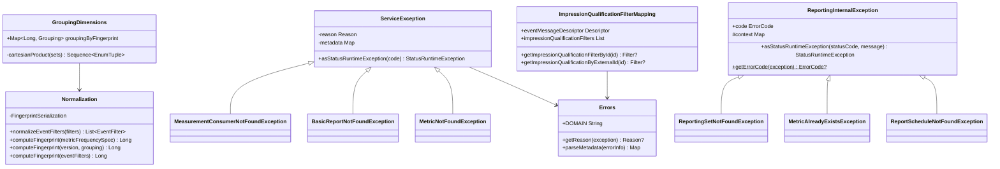

# org.wfanet.measurement.reporting.service.internal

## Overview
This package provides internal service infrastructure for the Cross-Media Measurement reporting system. It contains core utilities for error handling, data normalization, fingerprinting, grouping dimensions management, and impression qualification filter mapping. The package supports the internal gRPC service layer that handles measurement consumers, metrics, reports, and reporting sets.

## Components

### GroupingDimensions
Manages event message grouping dimensions and generates fingerprint mappings for reporting set results.

| Method | Parameters | Returns | Description |
|--------|------------|---------|-------------|
| constructor | `eventMessageDescriptor: Descriptors.Descriptor` | `GroupingDimensions` | Initializes grouping dimensions from event descriptor |
| cartesianProduct | `sets: List<List<Descriptors.EnumValueDescriptor>>` | `Sequence<EnumTuple>` | Generates Cartesian product of enum value sets |

**Properties:**
| Property | Type | Description |
|----------|------|-------------|
| groupingByFingerprint | `Map<Long, ReportingSetResult.Dimension.Grouping>` | Maps fingerprints to dimension groupings |

### Normalization
Object providing normalization and fingerprinting utilities for event filters, groupings, and metric frequency specifications.

| Method | Parameters | Returns | Description |
|--------|------------|---------|-------------|
| normalizeEventFilters | `eventFilters: Iterable<EventFilter>` | `List<EventFilter>` | Normalizes and sorts event filters deterministically |
| computeFingerprint | `metricFrequencySpec: MetricFrequencySpec` | `Long` | Computes FarmHash fingerprint of metric frequency spec |
| computeFingerprint | `eventMessageVersion: Int, grouping: ReportingSetResult.Dimension.Grouping` | `Long` | Computes FarmHash fingerprint of versioned grouping |
| computeFingerprint | `normalizedEventFilters: Iterable<EventFilter>` | `Long` | Computes FarmHash fingerprint of normalized filters |

### Errors
Object defining error domains, reasons, and metadata keys for reporting service exceptions.

| Constant | Type | Value |
|----------|------|-------|
| DOMAIN | `String` | `"internal.reporting.halo-cmm.org"` |

**Enumerations:**

**Reason:**
- MEASUREMENT_CONSUMER_NOT_FOUND
- BASIC_REPORT_NOT_FOUND
- METRIC_NOT_FOUND
- BASIC_REPORT_ALREADY_EXISTS
- REQUIRED_FIELD_NOT_SET
- IMPRESSION_QUALIFICATION_FILTER_NOT_FOUND
- INVALID_METRIC_STATE_TRANSITION
- INVALID_FIELD_VALUE
- REPORT_RESULT_NOT_FOUND
- REPORTING_SET_RESULT_NOT_FOUND
- REPORTING_WINDOW_RESULT_NOT_FOUND
- BASIC_REPORT_STATE_INVALID
- INVALID_BASIC_REPORT

**Metadata:**
- CMMS_MEASUREMENT_CONSUMER_ID
- EXTERNAL_BASIC_REPORT_ID
- IMPRESSION_QUALIFICATION_FILTER_ID
- EXTERNAL_METRIC_ID
- METRIC_STATE
- NEW_METRIC_STATE
- FIELD_NAME
- EXTERNAL_REPORT_RESULT_ID
- EXTERNAL_REPORTING_SET_RESULT_ID
- REPORTING_WINDOW_NON_CUMULATIVE_START
- REPORTING_WINDOW_END
- BASIC_REPORT_STATE

| Method | Parameters | Returns | Description |
|--------|------------|---------|-------------|
| getReason | `exception: StatusException` | `Reason?` | Extracts error reason from status exception |
| getReason | `errorInfo: ErrorInfo` | `Reason?` | Extracts error reason from error info |
| parseMetadata | `errorInfo: ErrorInfo` | `Map<Metadata, String>` | Parses error metadata into typed map |

### ServiceException
Sealed base class for reporting service exceptions with structured error information.

| Method | Parameters | Returns | Description |
|--------|------------|---------|-------------|
| asStatusRuntimeException | `code: Status.Code` | `StatusRuntimeException` | Converts to gRPC status runtime exception |

**Subclasses:**
- `MeasurementConsumerNotFoundException`
- `BasicReportNotFoundException`
- `BasicReportAlreadyExistsException`
- `BasicReportStateInvalidException`
- `ReportResultNotFoundException`
- `ReportingSetResultNotFoundException`
- `ReportingWindowResultNotFoundException`
- `RequiredFieldNotSetException`
- `ImpressionQualificationFilterNotFoundException`
- `InvalidFieldValueException`
- `MetricNotFoundException`
- `InvalidMetricStateTransitionException`
- `InvalidBasicReportException`

### ReportingInternalException
Sealed base class for legacy internal reporting exceptions with error code enumeration.

| Method | Parameters | Returns | Description |
|--------|------------|---------|-------------|
| asStatusRuntimeException | `statusCode: Status.Code, message: String` | `StatusRuntimeException` | Converts to gRPC status runtime exception |
| getErrorCode | `exception: StatusException` | `ErrorCode?` | Extracts error code from status exception |
| getErrorCode | `errorInfo: ErrorInfo` | `ErrorCode?` | Extracts error code from error info |

**Properties:**
| Property | Type | Description |
|----------|------|-------------|
| code | `ErrorCode` | Internal error code enumeration value |
| context | `Map<String, String>` | Additional context metadata |
| DOMAIN | `String` | Error domain from ErrorCode descriptor |

**Subclasses:**
- `ReportingSetAlreadyExistsException`
- `MetricAlreadyExistsException`
- `ReportAlreadyExistsException`
- `MeasurementAlreadyExistsException`
- `MeasurementNotFoundException`
- `ReportingSetNotFoundException`
- `MeasurementCalculationTimeIntervalNotFoundException`
- `ReportNotFoundException`
- `CampaignGroupInvalidException`
- `MeasurementStateInvalidException`
- `MeasurementConsumerAlreadyExistsException`
- `MetricCalculationSpecAlreadyExistsException`
- `MetricCalculationSpecNotFoundException`
- `ReportScheduleAlreadyExistsException`
- `ReportScheduleNotFoundException`
- `ReportScheduleStateInvalidException`
- `ReportScheduleIterationNotFoundException`
- `ReportScheduleIterationStateInvalidException`

### ImpressionQualificationFilterMapping
Maps and validates impression qualification filter configurations against event message descriptors.

| Method | Parameters | Returns | Description |
|--------|------------|---------|-------------|
| constructor | `config: ImpressionQualificationFilterConfig, eventMessageDescriptor: Descriptors.Descriptor` | `ImpressionQualificationFilterMapping` | Initializes mapping with validation |
| getImpressionQualificationFilterById | `impressionQualificationFilterInternalId: Long` | `ImpressionQualificationFilter?` | Retrieves filter by internal ID |
| getImpressionQualificationByExternalId | `externalImpressionQualificationFilterId: String` | `ImpressionQualificationFilter?` | Retrieves filter by external ID |

**Properties:**
| Property | Type | Description |
|----------|------|-------------|
| eventMessageDescriptor | `Descriptors.Descriptor` | Protobuf descriptor for event messages |
| impressionQualificationFilters | `List<ImpressionQualificationFilter>` | Validated and sorted filter list |

## Testing Utilities (v2)

### ResourceCreationMethods
Provides suspend functions for creating test resources in internal reporting service tests.

| Function | Parameters | Returns | Description |
|----------|-----------|---------|-------------|
| createReportingSet | `cmmsMeasurementConsumerId: String, reportingSetsService: ReportingSetsCoroutineImplBase, externalReportingSetId: String, cmmsDataProviderId: String, cmmsEventGroupId: String` | `ReportingSet` | Creates test reporting set resource |
| createMeasurementConsumer | `cmmsMeasurementConsumerId: String, measurementConsumersService: MeasurementConsumersCoroutineImplBase` | `Unit` | Creates test measurement consumer |
| createMetricCalculationSpec | `cmmsMeasurementConsumerId: String, metricCalculationSpecsService: MetricCalculationSpecsCoroutineImplBase, externalMetricCalculationSpecId: String` | `MetricCalculationSpec` | Creates test metric calculation spec |
| createReportSchedule | `cmmsMeasurementConsumerId: String, reportingSet: ReportingSet, metricCalculationSpec: MetricCalculationSpec, reportSchedulesService: ReportSchedulesCoroutineImplBase, externalReportScheduleId: String` | `ReportSchedule` | Creates test report schedule |

### Test Service Abstracts
Abstract test classes for internal reporting service implementations:

- `MeasurementConsumersServiceTest` - Tests for measurement consumer service
- `MeasurementsServiceTest` - Tests for measurements service
- `MetricCalculationSpecsServiceTest` - Tests for metric calculation specs service
- `ReportScheduleIterationsServiceTest` - Tests for report schedule iterations service
- `ReportSchedulesServiceTest` - Tests for report schedules service
- `ReportsServiceTest` - Tests for reports service
- `MetricsServiceTest` - Tests for metrics service
- `ReportingSetsServiceTest` - Tests for reporting sets service
- `BasicReportsServiceTest` - Tests for basic reports service
- `ImpressionQualificationFiltersServiceTest` - Tests for impression qualification filters service
- `ReportResultsServiceTest` - Tests for report results service

## Dependencies

- `com.google.protobuf` - Protocol buffer definitions and descriptors
- `com.google.common.hash` - FarmHash fingerprinting (Guava)
- `com.google.common.collect` - Ordering utilities (Guava)
- `com.google.rpc` - Standard RPC error definitions
- `io.grpc` - gRPC status and exception handling
- `org.wfanet.measurement.api.v2alpha` - Public API event templates and descriptors
- `org.wfanet.measurement.internal.reporting` - Internal reporting protocol definitions
- `org.wfanet.measurement.internal.reporting.v2` - V2 internal reporting protocols
- `org.wfanet.measurement.common` - Common utilities and gRPC extensions
- `org.wfanet.measurement.common.api` - Resource ID validation
- `org.wfanet.measurement.config.reporting` - Reporting configuration definitions

## Usage Example

```kotlin
// Normalize and fingerprint event filters
val eventFilters = listOf(
  eventFilter {
    terms += eventTemplateField {
      path = "age"
      value = EventTemplateFieldKt.fieldValue { stringValue = "18-35" }
    }
  }
)
val normalized = Normalization.normalizeEventFilters(eventFilters)
val fingerprint = Normalization.computeFingerprint(normalized)

// Create grouping dimensions
val groupingDimensions = GroupingDimensions(eventMessageDescriptor)
val grouping = groupingDimensions.groupingByFingerprint[fingerprint]

// Handle service exceptions
try {
  // Service operation
} catch (e: BasicReportNotFoundException) {
  throw e.asStatusRuntimeException(Status.Code.NOT_FOUND)
}

// Validate impression qualification filters
val filterMapping = ImpressionQualificationFilterMapping(config, eventDescriptor)
val filter = filterMapping.getImpressionQualificationByExternalId("filter-123")
```

## Class Diagram


