# org.wfanet.measurement.reporting.service.internal.testing.v2

## Overview

Testing framework for internal v2 reporting services providing abstract test suites for validating service implementations. This package contains comprehensive test classes for measurement consumers, metrics, reporting sets, reports, schedules, and related components in the Cross-Media Measurement reporting system.

## Components

### MeasurementConsumersServiceTest

Abstract test class for validating MeasurementConsumers service implementations.

| Method | Parameters | Returns | Description |
|--------|------------|---------|-------------|
| newService | `idGenerator: IdGenerator` | `T` | Constructs service instance under test |
| createMeasurementConsumer succeeds | - | Unit | Validates successful measurement consumer creation |
| createMeasurementConsumer throws ALREADY_EXISTS when MeasurementConsumer already exists | - | Unit | Validates duplicate prevention |

### MeasurementsServiceTest

Abstract test class for batch measurement operations including ID assignment, result updates, and failure handling.

| Method | Parameters | Returns | Description |
|--------|------------|---------|-------------|
| newServices | `idGenerator: IdGenerator` | `Services<T>` | Constructs required service instances |
| batchSetCmmsMeasurementIds | - | Unit | Validates batch measurement ID assignment |
| batchSetMeasurementResults | - | Unit | Validates batch measurement result updates |
| batchSetMeasurementFailures | - | Unit | Validates batch measurement failure recording |

### MetricCalculationSpecsServiceTest

Abstract test class for metric calculation specification management.

| Method | Parameters | Returns | Description |
|--------|------------|---------|-------------|
| newServices | `idGenerator: IdGenerator` | `Services<T>` | Creates service dependencies |
| createMetricCalculationSpec | - | Unit | Validates spec creation |
| getMetricCalculationSpec | - | Unit | Validates spec retrieval |
| listMetricCalculationSpecs | - | Unit | Validates spec listing with pagination |
| batchGetMetricCalculationSpecs | - | Unit | Validates batch spec retrieval |

### MetricsServiceTest

Abstract test class for metrics operations (file too large for complete analysis, exceeds 25000 tokens).

### ReportScheduleIterationsServiceTest

Abstract test class for report schedule iteration lifecycle management.

| Method | Parameters | Returns | Description |
|--------|------------|---------|-------------|
| newServices | `idGenerator: IdGenerator` | `Services<T>` | Creates service dependencies |
| createReportScheduleIteration | - | Unit | Validates iteration creation |
| getReportScheduleIteration | - | Unit | Validates iteration retrieval |
| listReportScheduleIterations | - | Unit | Validates iteration listing by schedule |
| setReportScheduleIterationState | - | Unit | Validates state transitions |

### ReportSchedulesServiceTest

Abstract test class for report schedule management.

| Method | Parameters | Returns | Description |
|--------|------------|---------|-------------|
| newServices | `idGenerator: IdGenerator` | `Services<T>` | Creates service dependencies |
| createReportSchedule | - | Unit | Validates schedule creation |
| getReportSchedule | - | Unit | Validates schedule retrieval |
| listReportSchedules | - | Unit | Validates schedule listing with filters |
| stopReportSchedule | - | Unit | Validates schedule termination |

### ReportsServiceTest

Abstract test class for report creation and management (first 1000 lines analyzed).

| Method | Parameters | Returns | Description |
|--------|------------|---------|-------------|
| newServices | `idGenerator: IdGenerator, disableMetricsReuse: Boolean` | `Services<T>` | Creates service dependencies with optional metrics reuse control |
| createReport with details set succeeds | - | Unit | Validates report creation with full details |
| createReport reuses existing metrics from the other report | - | Unit | Validates metric reuse optimization |

### ReportingSetsServiceTest

Abstract test class for reporting set operations including primitive and composite sets.

| Method | Parameters | Returns | Description |
|--------|------------|---------|-------------|
| newServices | `idGenerator: IdGenerator` | `Services<T>` | Creates service dependencies |
| createReportingSet | - | Unit | Validates reporting set creation |
| batchGetReportingSets | - | Unit | Validates batch reporting set retrieval |
| streamReportingSets | - | Unit | Validates streaming reporting set listing |

### BasicReportsServiceTest

Abstract test class for basic report operations (file too large for complete analysis).

### ImpressionQualificationFiltersServiceTest

Abstract test class for impression qualification filter management.

| Method | Parameters | Returns | Description |
|--------|------------|---------|-------------|
| newService | - | `T` | Constructs service instance under test |
| getImpressionQualificationFilter | - | Unit | Validates filter retrieval |
| listImpressionQualificationFilter | - | Unit | Validates filter listing with pagination |

### ReportResultsServiceTest

Abstract test class for report result management and processing.

| Method | Parameters | Returns | Description |
|--------|------------|---------|-------------|
| createServices | `idGenerator: IdGenerator, impressionQualificationFilterMapping: ImpressionQualificationFilterMapping` | `List<BindableService>` | Creates all required services |
| createReportResult | - | Unit | Validates report result creation |
| batchCreateReportingSetResults | - | Unit | Validates batch reporting set result creation |
| addProcessedResultValues | - | Unit | Validates adding processed result values to reporting sets |

## Data Structures

### Services

Nested data class holding service dependencies for test initialization.

| Property | Type | Description |
|----------|------|-------------|
| measurementsService | `T` | Primary service under test |
| metricsService | `MetricsCoroutineImplBase` | Metrics service dependency |
| reportingSetsService | `ReportingSetsCoroutineImplBase` | Reporting sets service dependency |
| measurementConsumersService | `MeasurementConsumersCoroutineImplBase` | Measurement consumers service dependency |

## Dependencies

- `com.google.common.truth` - Truth assertion library for fluent test assertions
- `io.grpc` - gRPC framework for service testing
- `org.junit` - JUnit 4 testing framework
- `kotlinx.coroutines` - Kotlin coroutines for asynchronous testing
- `org.wfanet.measurement.common.identity` - ID generation utilities
- `org.wfanet.measurement.internal.reporting.v2` - Internal reporting v2 protocol buffers
- `org.wfanet.measurement.reporting.service.internal` - Internal reporting service errors

## Usage Example

```kotlin
class ConcreteReportingSetsServiceTest : ReportingSetsServiceTest<ReportingSetsService>() {
  override fun newServices(idGenerator: IdGenerator): Services<ReportingSetsService> {
    val measurementConsumersService = InMemoryMeasurementConsumersService(idGenerator)
    val reportingSetsService = InMemoryReportingSetsService(idGenerator)

    return Services(
      reportingSetsService = reportingSetsService,
      measurementConsumersService = measurementConsumersService
    )
  }
}
```

## Class Diagram

```mermaid
classDiagram
    class MeasurementConsumersServiceTest {
        #idGenerator: RandomIdGenerator
        #newService(IdGenerator) T
        +createMeasurementConsumer succeeds()
    }

    class MeasurementsServiceTest {
        #idGenerator: RandomIdGenerator
        #newServices(IdGenerator) Services~T~
        +batchSetCmmsMeasurementIds()
        +batchSetMeasurementResults()
        +batchSetMeasurementFailures()
    }

    class MetricCalculationSpecsServiceTest {
        #idGenerator: RandomIdGenerator
        #newServices(IdGenerator) Services~T~
        +createMetricCalculationSpec()
        +getMetricCalculationSpec()
        +listMetricCalculationSpecs()
    }

    class ReportSchedulesServiceTest {
        #idGenerator: RandomIdGenerator
        #newServices(IdGenerator) Services~T~
        +createReportSchedule()
        +stopReportSchedule()
    }

    class ReportingSetsServiceTest {
        #idGenerator: RandomIdGenerator
        #newServices(IdGenerator) Services~T~
        +createReportingSet()
        +batchGetReportingSets()
        +streamReportingSets()
    }

    class ReportsServiceTest {
        #idGenerator: RandomIdGenerator
        #newServices(IdGenerator, Boolean) Services~T~
        +createReport()
    }

    class ResourceCreationMethods {
        +createReportingSet(String, ReportingSetsCoroutineImplBase) ReportingSet
        +createMeasurementConsumer(String, MeasurementConsumersCoroutineImplBase)
        +createMetricCalculationSpec(String, MetricCalculationSpecsCoroutineImplBase) MetricCalculationSpec
        +createReportSchedule(String, ReportingSet, MetricCalculationSpec, ReportSchedulesCoroutineImplBase) ReportSchedule
    }

    ReportsServiceTest --> ResourceCreationMethods
    ReportSchedulesServiceTest --> ResourceCreationMethods
    MetricCalculationSpecsServiceTest --> ResourceCreationMethods
```


