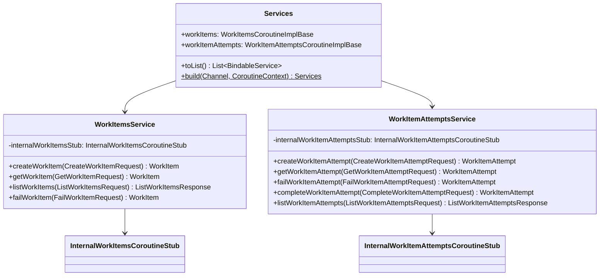

# org.wfanet.measurement.securecomputation.controlplane.v1alpha

## Overview
This package provides public gRPC service implementations for managing work items and work item attempts within the secure computation control plane. It acts as a facade layer that translates between public v1alpha API contracts and internal service implementations, handling resource naming, pagination, error translation, and state management for distributed task execution.

## Components

### WorkItemsService
gRPC service implementation managing the lifecycle of work items, including creation, retrieval, listing, and failure operations.

| Method | Parameters | Returns | Description |
|--------|------------|---------|-------------|
| createWorkItem | `request: CreateWorkItemRequest` | `WorkItem` | Creates a new work item in a queue |
| getWorkItem | `request: GetWorkItemRequest` | `WorkItem` | Retrieves a work item by resource name |
| listWorkItems | `request: ListWorkItemsRequest` | `ListWorkItemsResponse` | Lists work items with pagination support |
| failWorkItem | `request: FailWorkItemRequest` | `WorkItem` | Marks a work item as failed |

### WorkItemAttemptsService
gRPC service implementation managing individual execution attempts for work items, supporting creation, state transitions, and querying.

| Method | Parameters | Returns | Description |
|--------|------------|---------|-------------|
| createWorkItemAttempt | `request: CreateWorkItemAttemptRequest` | `WorkItemAttempt` | Creates a new execution attempt for a work item |
| getWorkItemAttempt | `request: GetWorkItemAttemptRequest` | `WorkItemAttempt` | Retrieves an attempt by resource name |
| failWorkItemAttempt | `request: FailWorkItemAttemptRequest` | `WorkItemAttempt` | Marks an attempt as failed with error message |
| completeWorkItemAttempt | `request: CompleteWorkItemAttemptRequest` | `WorkItemAttempt` | Marks an attempt as successfully completed |
| listWorkItemAttempts | `request: ListWorkItemAttemptsRequest` | `ListWorkItemAttemptsResponse` | Lists attempts with pagination support |

### Services
Service container and factory for instantiating public API service implementations.

| Method | Parameters | Returns | Description |
|--------|------------|---------|-------------|
| toList | none | `List<BindableService>` | Converts service container to bindable list |
| build | `internalApiChannel: Channel, coroutineContext: CoroutineContext` | `Services` | Creates service instances from internal channel |

## Data Structures

### Services
| Property | Type | Description |
|----------|------|-------------|
| workItems | `WorkItemsCoroutineImplBase` | Work items service implementation |
| workItemAttempts | `WorkItemAttemptsCoroutineImplBase` | Work item attempts service implementation |

## Extensions

### InternalWorkItem.State.toWorkItemState
Converts internal work item state enumeration to public API state representation.

### InternalWorkItemAttempt.State.toWorkItemAttemptState
Converts internal work item attempt state enumeration to public API state representation.

### InternalWorkItem.toWorkItem
Transforms internal work item protobuf message to public API work item resource with proper naming and timestamp conversion.

### InternalWorkItemAttempt.toWorkItemAttempt
Transforms internal work item attempt protobuf message to public API attempt resource with naming, attempt number, and error details.

## Dependencies
- `io.grpc` - gRPC framework for service implementation and channel management
- `org.wfanet.measurement.internal.securecomputation.controlplane` - Internal API stubs and message types
- `org.wfanet.measurement.common.api` - Resource ID validation utilities
- `org.wfanet.measurement.common` - Base64 URL encoding/decoding for pagination tokens
- `org.wfanet.measurement.securecomputation.service` - Exception types and resource key parsing
- `kotlin.coroutines` - Coroutine context for asynchronous operation support

## Usage Example
```kotlin
// Build services from internal API channel
val services = Services.build(
  internalApiChannel = grpcChannel,
  coroutineContext = Dispatchers.Default
)

// Register with gRPC server
val grpcServer = ServerBuilder.forPort(8080)
  .addService(services.workItems)
  .addService(services.workItemAttempts)
  .build()

// Create a work item
val createRequest = createWorkItemRequest {
  workItem = workItem {
    queue = "my-queue"
    workItemParams = Any.pack(customParams)
  }
  workItemId = "task-123"
}
val created = services.workItems.createWorkItem(createRequest)

// Create an attempt
val attemptRequest = createWorkItemAttemptRequest {
  parent = created.name
  workItemAttemptId = "attempt-1"
}
val attempt = services.workItemAttempts.createWorkItemAttempt(attemptRequest)

// Complete the attempt
val completeRequest = completeWorkItemAttemptRequest {
  name = attempt.name
}
val completed = services.workItemAttempts.completeWorkItemAttempt(completeRequest)
```

## Class Diagram


## Error Handling
Both service implementations translate internal gRPC status exceptions to public API exceptions:
- `WorkItemNotFoundException` / `WorkItemAttemptNotFoundException` - Resource not found
- `WorkItemAlreadyExistsException` / `WorkItemAttemptAlreadyExistsException` - Duplicate creation
- `WorkItemInvalidStateException` / `WorkItemAttemptInvalidStateException` - Invalid state transition
- `RequiredFieldNotSetException` - Missing required request field
- `InvalidFieldValueException` - Malformed field value or resource name

## Pagination
List operations support pagination with configurable page sizes:
- Default page size: 50 items
- Maximum page size: 100 items
- Page tokens use base64-URL-encoded internal protobuf tokens
- Invalid page tokens result in `INVALID_ARGUMENT` status

## Validation
Request validation includes:
- Resource name format validation using `WorkItemKey` and `WorkItemAttemptKey` parsers
- RFC 1034 compliance for resource IDs
- Non-negative page size enforcement
- Required field presence checks
