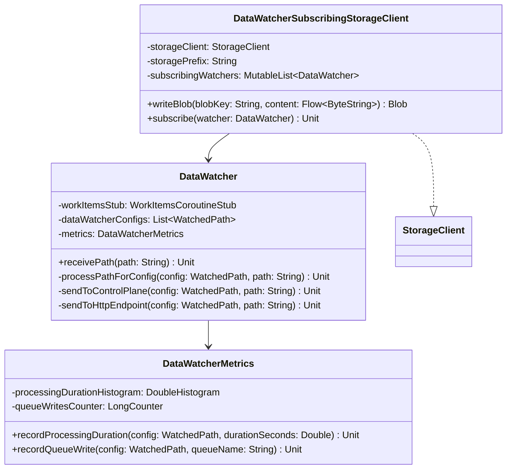

# org.wfanet.measurement.securecomputation.datawatcher

## Overview
Provides blob storage event observation and routing capabilities for secure computation workloads. Monitors blob creation events via configured path patterns and dispatches notifications to either control plane work queues or HTTP endpoints. Includes OpenTelemetry instrumentation for processing metrics and trace events.

## Components

### DataWatcher
Observes blob creation events and routes them to configured sinks based on path regex matching.

| Method | Parameters | Returns | Description |
|--------|------------|---------|-------------|
| receivePath | `path: String` | `suspend Unit` | Evaluates path against all configs and processes matches |
| processPathForConfig | `config: WatchedPath`, `path: String` | `suspend Unit` | Tests path against config regex and routes to appropriate sink |
| sendToControlPlane | `config: WatchedPath`, `path: String` | `suspend Unit` | Creates work item and submits to control plane queue |
| sendToHttpEndpoint | `config: WatchedPath`, `path: String` | `Unit` | Sends authenticated HTTP POST to configured endpoint |
| onProcessingCompleted | `config: WatchedPath`, `path: String`, `durationSeconds: Double` | `Unit` | Records successful processing metrics and trace events |
| onProcessingFailed | `config: WatchedPath`, `path: String`, `durationSeconds: Double`, `throwable: Throwable` | `Unit` | Logs failure with trace attributes and error details |
| onQueueWrite | `config: WatchedPath`, `path: String`, `queueName: String`, `workItemId: String` | `Unit` | Records queue submission metrics and trace event |
| onHttpDispatch | `config: WatchedPath`, `path: String`, `statusCode: Int` | `Unit` | Records HTTP endpoint dispatch with status code |
| errorTypeOf | `throwable: Throwable` | `String` | Extracts simple class name from throwable for telemetry |

**Constructor Parameters:**
| Parameter | Type | Description |
|-----------|------|-------------|
| workItemsStub | `WorkItemsCoroutineStub` | gRPC stub for control plane work item creation |
| dataWatcherConfigs | `List<WatchedPath>` | Path configurations with regex patterns and sink targets |
| workItemIdGenerator | `() -> String` | Generates unique work item IDs (default: UUID-based) |
| idTokenProvider | `IdTokenProvider` | Provides Google Cloud ID tokens for HTTP authentication |
| meter | `Meter` | OpenTelemetry meter for instrumentation |

### DataWatcherMetrics
Collects OpenTelemetry metrics for path processing and queue operations.

| Method | Parameters | Returns | Description |
|--------|------------|---------|-------------|
| recordProcessingDuration | `config: WatchedPath`, `durationSeconds: Double` | `Unit` | Records histogram of processing time by sink type |
| recordQueueWrite | `config: WatchedPath`, `queueName: String` | `Unit` | Increments counter for work items submitted to queue |

**Constructor Parameters:**
| Parameter | Type | Description |
|-----------|------|-------------|
| meter | `Meter` | OpenTelemetry meter instance |
| sinkTypeKey | `AttributeKey<String>` | Attribute key for sink type dimension |
| queueKey | `AttributeKey<String>` | Attribute key for queue name dimension |

**Metrics:**
| Metric Name | Type | Unit | Description |
|-------------|------|------|-------------|
| edpa.data_watcher.processing_duration | DoubleHistogram | s | Time from regex match to successful sink submission |
| edpa.data_watcher.queue_writes | LongCounter | - | Number of work items submitted to control plane queue |

### DataWatcherSubscribingStorageClient (testing)
Test harness that wraps StorageClient to simulate storage notifications.

| Method | Parameters | Returns | Description |
|--------|------------|---------|-------------|
| writeBlob | `blobKey: String`, `content: Flow<ByteString>` | `suspend StorageClient.Blob` | Writes blob and notifies all subscribed watchers |
| getBlob | `blobKey: String` | `suspend StorageClient.Blob?` | Delegates to wrapped storage client |
| listBlobs | `prefix: String?` | `suspend Flow<StorageClient.Blob>` | Delegates to wrapped storage client |
| subscribe | `watcher: DataWatcher` | `Unit` | Registers watcher to receive notifications on blob writes |

**Constructor Parameters:**
| Parameter | Type | Description |
|-----------|------|-------------|
| storageClient | `StorageClient` | Underlying storage client to delegate operations to |
| storagePrefix | `String` | Prefix prepended to blob keys in notifications |

## Dependencies
- `org.wfanet.measurement.config.securecomputation` - WatchedPath configuration protocol
- `org.wfanet.measurement.securecomputation.controlplane.v1alpha` - Work item creation API
- `org.wfanet.measurement.storage` - StorageClient abstraction for blob operations
- `org.wfanet.measurement.common` - Instrumentation utilities and protobuf extensions
- `io.opentelemetry.api` - Metrics and tracing instrumentation
- `com.google.auth.oauth2` - Google Cloud authentication for HTTP endpoints
- `java.net.http` - HTTP client for endpoint notifications
- `kotlinx.coroutines.flow` - Asynchronous data streams

## Usage Example
```kotlin
// Configure path patterns and sinks
val configs = listOf(
  watchedPath {
    identifier = "encryption-events"
    sourcePathRegex = "gs://bucket/encrypted/.*\\.enc"
    controlPlaneQueueSink = controlPlaneQueueSink {
      queue = "encryption-processor"
      appParams = Any.pack(encryptionParams { ... })
    }
  }
)

// Create watcher instance
val watcher = DataWatcher(
  workItemsStub = WorkItemsCoroutineStub(channel),
  dataWatcherConfigs = configs,
  meter = openTelemetry.getMeter("data-watcher")
)

// Process incoming path (typically called by storage event handler)
watcher.receivePath("gs://bucket/encrypted/file123.enc")
```

## Testing Example
```kotlin
// Wrap storage client for testing
val testStorageClient = DataWatcherSubscribingStorageClient(
  storageClient = InMemoryStorageClient(),
  storagePrefix = "gs://test-bucket/"
)

// Register watcher to receive notifications
testStorageClient.subscribe(dataWatcher)

// Writing blobs triggers watcher
testStorageClient.writeBlob("data/input.dat", flowOf(content))
```

## Trace Events
| Event Name | Attributes | Description |
|------------|------------|-------------|
| edpa.data_watcher.processing_completed | sink_type, data_path, status, duration_seconds | Successful path processing |
| edpa.data_watcher.processing_failed | sink_type, data_path, status, duration_seconds, error_type, error_message | Failed path processing |
| edpa.data_watcher.queue_write | sink_type, data_path, queue, work_item_id, status | Work item submitted to queue |
| edpa.data_watcher.http_dispatch_completed | sink_type, data_path, status, http.status.code | HTTP endpoint notification sent |

## HTTP Endpoint Integration
When configured with `httpEndpointSink`, DataWatcher sends authenticated POST requests:
- **Authentication**: Google Cloud ID token (Bearer token)
- **Header**: `X-DataWatcher-Path` contains the blob path
- **Body**: JSON-serialized application parameters from configuration
- **Expected Response**: HTTP 200 (non-200 causes processing failure)

## Class Diagram

