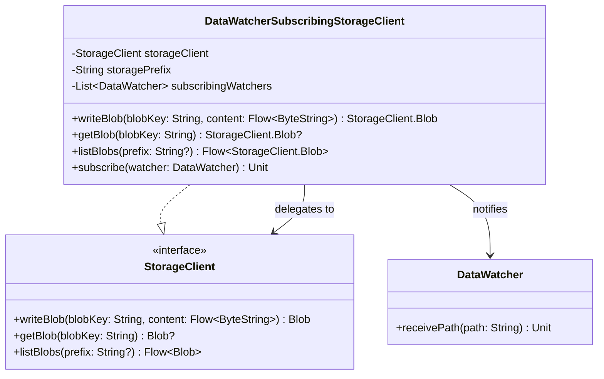

# org.wfanet.measurement.securecomputation.datawatcher.testing

## Overview
This package provides testing utilities for the DataWatcher system, enabling in-process testing of storage notification mechanisms without requiring Google Cloud Pub/Sub infrastructure. The primary component is a decorator for StorageClient that emulates storage notifications by publishing blob write events to subscribed DataWatcher instances.

## Components

### DataWatcherSubscribingStorageClient
A StorageClient decorator that intercepts blob write operations and notifies subscribed DataWatcher instances, simulating Google Pub/Sub storage notifications for in-process testing.

| Method | Parameters | Returns | Description |
|--------|------------|---------|-------------|
| writeBlob | `blobKey: String`, `content: Flow<ByteString>` | `StorageClient.Blob` | Writes blob and notifies all subscribed watchers |
| getBlob | `blobKey: String` | `StorageClient.Blob?` | Retrieves blob from underlying storage client |
| listBlobs | `prefix: String?` | `Flow<StorageClient.Blob>` | Lists blobs from underlying storage client |
| subscribe | `watcher: DataWatcher` | `Unit` | Registers a DataWatcher to receive notifications |

**Constructor Parameters:**
| Parameter | Type | Description |
|-----------|------|-------------|
| storageClient | `StorageClient` | Underlying storage client to delegate operations to |
| storagePrefix | `String` | Prefix prepended to blob keys when notifying watchers |

## Data Structures

This package contains no data classes or enums. The class uses internal mutable state to track subscribers.

## Dependencies
- `org.wfanet.measurement.securecomputation.datawatcher.DataWatcher` - Receives path notifications
- `org.wfanet.measurement.storage.StorageClient` - Delegated storage operations interface
- `com.google.protobuf.ByteString` - Binary data representation
- `kotlinx.coroutines.flow.Flow` - Asynchronous streaming of blob content
- `java.util.logging.Logger` - Logging blob write notifications

## Usage Example
```kotlin
// Create underlying storage client
val fileSystemClient = FileSystemStorageClient(tempDirectory.root)

// Wrap with subscribing decorator
val subscribingClient = DataWatcherSubscribingStorageClient(
    storageClient = fileSystemClient,
    storagePrefix = "file:///bucket-name/"
)

// Subscribe a DataWatcher instance
val dataWatcher = DataWatcher(workItemsStub, configs)
subscribingClient.subscribe(dataWatcher)

// Write a blob - triggers notification to subscribed watchers
subscribingClient.writeBlob(
    "path/to/blob.dat",
    flowOf("content".toByteStringUtf8())
)
// DataWatcher.receivePath("file:///bucket-name/path/to/blob.dat") is called
```

## Class Diagram


## Testing Strategy
This class enables integration testing of DataWatcher behavior without external dependencies. When writeBlob is called, all subscribed DataWatcher instances receive a notification with the full storage path (storagePrefix + blobKey), mimicking the production behavior where Google Cloud Storage notifications trigger DataWatcher processing via Pub/Sub.
