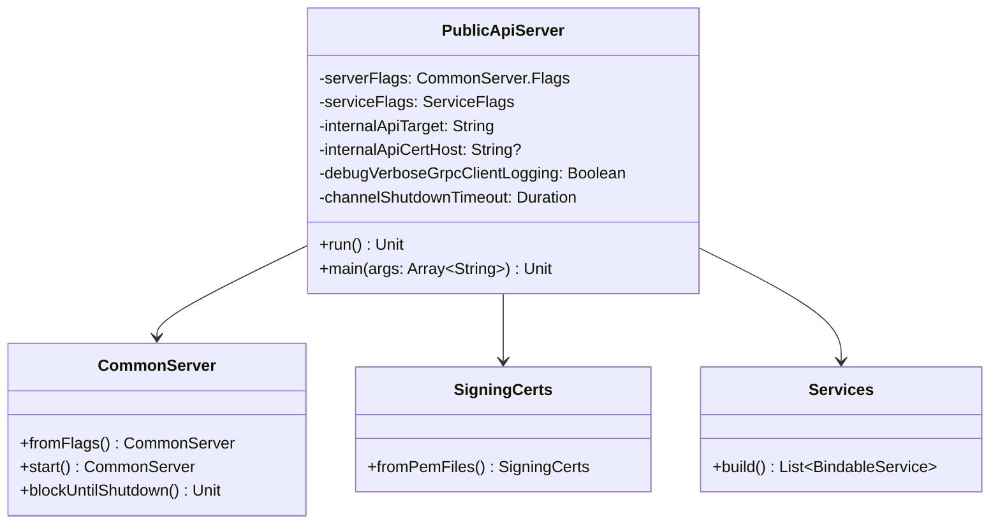

# org.wfanet.measurement.securecomputation.deploy.common.server

## Overview
This package provides server deployment infrastructure for the Secure Computation public API. It implements a gRPC server that exposes secure computation control plane services to external clients, acting as a gateway to the internal Secure Computation API with mutual TLS authentication.

## Components

### PublicApiServer
Command-line application that bootstraps and runs the Secure Computation public API server. Configures mutual TLS connections to the internal API backend and exposes public-facing gRPC services.

| Method | Parameters | Returns | Description |
|--------|------------|---------|-------------|
| run | - | `Unit` | Initializes TLS certificates, builds internal API channel, creates gRPC services, and starts the server |
| main | `args: Array<String>` | `Unit` | Entry point that parses command-line arguments and executes the server |

#### Command-Line Options

| Option | Type | Required | Description |
|--------|------|----------|-------------|
| `--secure-computation-internal-api-target` | String | Yes | gRPC target of the Secure Computation internal API server |
| `--secure-computation-internal-api-cert-host` | String | No | Expected hostname in the internal API server's TLS certificate |
| `--debug-verbose-grpc-client-logging` | Boolean | No | Enables full gRPC request/response logging for outgoing calls (default: false) |
| `--channel-shutdown-timeout` | Duration | No | Grace period for gRPC channel shutdown (default: 3s) |

## Dependencies
- `org.wfanet.measurement.common` - Command-line utilities and crypto certificate handling
- `org.wfanet.measurement.common.grpc` - gRPC server infrastructure, channel builders, and service execution
- `org.wfanet.measurement.securecomputation.controlplane.v1alpha` - Control plane service definitions and service builder
- `io.grpc` - Core gRPC framework for service binding
- `picocli` - Command-line argument parsing and validation
- `kotlinx.coroutines` - Coroutine dispatcher for asynchronous service execution

## Usage Example
```kotlin
// Run from command line
fun main(args: Array<String>) {
    val serverArgs = arrayOf(
        "--secure-computation-internal-api-target=localhost:8080",
        "--secure-computation-internal-api-cert-host=internal-api.example.com",
        "--tls-cert-file=/path/to/cert.pem",
        "--tls-key-file=/path/to/key.pem",
        "--cert-collection-file=/path/to/trusted-certs.pem",
        "--port=8443",
        "--debug-verbose-grpc-client-logging=true",
        "--channel-shutdown-timeout=5s"
    )
    PublicApiServer.main(serverArgs)
}

// Programmatic usage
val server = PublicApiServer()
// Configure via command line parsing or property injection
server.run()
```

## Architecture

The PublicApiServer follows a gateway pattern:

1. **Certificate Loading**: Loads TLS certificates from files specified in server flags
2. **Internal Channel Setup**: Creates a mutual TLS channel to the internal Secure Computation API
3. **Service Building**: Constructs public-facing gRPC services using the Services builder from the control plane
4. **Server Bootstrap**: Initializes a CommonServer with the configured services and starts accepting connections

The server acts as a trusted intermediary, authenticating external clients and forwarding validated requests to the internal backend.

## Class Diagram

