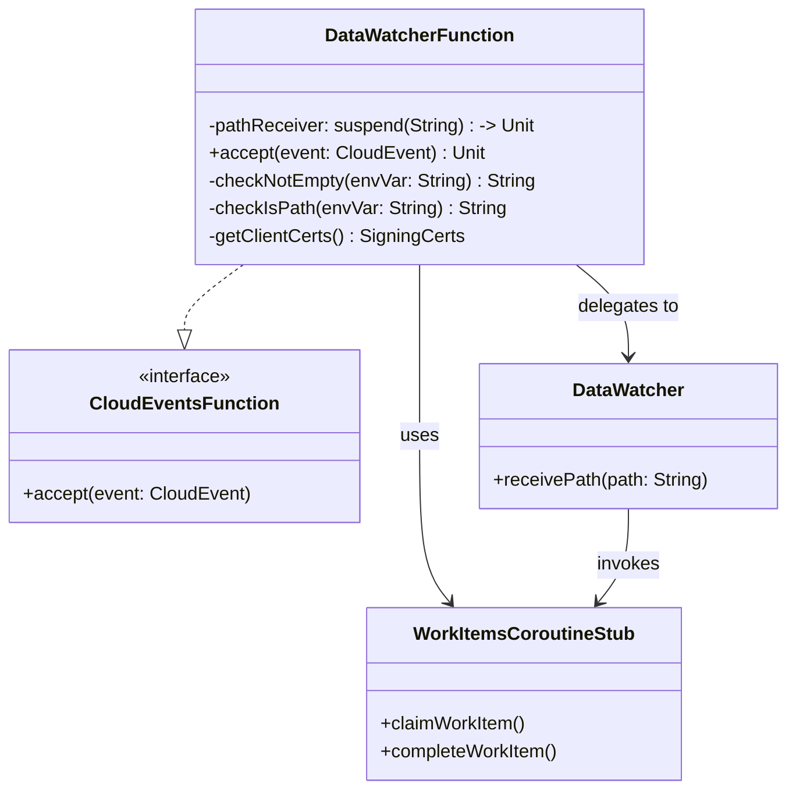

# org.wfanet.measurement.securecomputation.deploy.gcloud.datawatcher

## Overview
This package provides a Google Cloud Function implementation that monitors Google Cloud Storage events and triggers data processing workflows. The function receives CloudEvents from GCS bucket notifications, validates the incoming data paths, and delegates to the DataWatcher component to initiate work items in the secure computation control plane.

## Components

### DataWatcherFunction
Google Cloud Function that processes storage object events and triggers data watching workflows.

| Method | Parameters | Returns | Description |
|--------|------------|---------|-------------|
| accept | `event: CloudEvent` | `Unit` | Processes incoming CloudEvent from GCS bucket notifications |
| DataWatcherFunction (constructor) | `pathReceiver: suspend (String) -> Unit` | `DataWatcherFunction` | Creates function with custom path receiver for testing |

**Key Behavior:**
- Parses CloudEvent data to extract GCS bucket and blob information
- Constructs GCS path in format `gs://bucket/blobKey`
- Validates blob size (allows empty blobs only if name ends with "done")
- Extracts W3C trace context for distributed tracing
- Invokes pathReceiver within OpenTelemetry span for observability
- Flushes telemetry metrics before function termination

### Companion Object (Configuration & Dependencies)

| Method | Parameters | Returns | Description |
|--------|------------|---------|-------------|
| checkNotEmpty | `envVar: String` | `String` | Validates environment variable exists and is non-blank |
| checkIsPath | `envVar: String` | `String` | Validates environment variable contains valid path |
| getClientCerts | None | `SigningCerts` | Loads mTLS certificates from configured file paths |

**Lazy-Initialized Properties:**
- `grpcTelemetry`: OpenTelemetry instrumentation for gRPC calls
- `publicChannel`: Mutual TLS channel to control plane with telemetry interceptor
- `workItemsStub`: gRPC stub for WorkItems service
- `dataWatcherConfig`: Configuration loaded from `data-watcher-config.textproto`
- `defaultDataWatcher`: DataWatcher instance with loaded configuration

## Environment Variables

| Variable | Required | Description |
|----------|----------|-------------|
| CERT_FILE_PATH | Yes | Path to client certificate PEM file |
| PRIVATE_KEY_FILE_PATH | Yes | Path to client private key PEM file |
| CERT_COLLECTION_FILE_PATH | Yes | Path to trusted CA certificate collection |
| CONTROL_PLANE_TARGET | Yes | gRPC target address for control plane service |
| CONTROL_PLANE_CERT_HOST | Yes | Expected hostname in control plane certificate |
| CONTROL_PLANE_CHANNEL_SHUTDOWN_DURATION_SECONDS | No | Channel shutdown timeout (default: 3 seconds) |

## Dependencies
- `com.google.cloud.functions` - Cloud Functions framework for event handling
- `com.google.events.cloud.storage.v1` - Storage event data structures
- `io.cloudevents` - CloudEvents specification implementation
- `io.opentelemetry` - Distributed tracing and observability
- `org.wfanet.measurement.common.crypto` - Certificate and signing utilities
- `org.wfanet.measurement.common.grpc` - gRPC channel construction with mTLS
- `org.wfanet.measurement.securecomputation.controlplane.v1alpha` - WorkItems service client
- `org.wfanet.measurement.securecomputation.datawatcher` - Core DataWatcher logic
- `org.wfanet.measurement.edpaggregator.telemetry` - Telemetry initialization and tracing
- `org.wfanet.measurement.config.securecomputation` - Configuration protocol buffers

## Usage Example
```kotlin
// Deployment as Cloud Function (configured via infrastructure)
// The function is instantiated by GCP with default constructor
val function = DataWatcherFunction()

// For testing with custom path receiver
val testFunction = DataWatcherFunction(
  pathReceiver = { path ->
    println("Received path: $path")
    // Custom test logic
  }
)

// CloudEvent is provided by GCP runtime when GCS event occurs
// Event structure:
// - type: google.cloud.storage.object.v1.finalized
// - data: { bucket: "my-bucket", name: "path/to/file.dat", size: 12345 }
```

## Configuration
The function loads configuration from a blob named `data-watcher-config.textproto` using the EdpAggregator configuration system. This configuration specifies:
- Watched path patterns for blob monitoring
- Work item parameters for control plane invocations
- Results fulfiller parameters (extensible via TypeRegistry)

## Telemetry
- **Tracing**: Propagates W3C trace context from CloudEvent headers
- **Span**: Creates `data_watcher.handle_event` span with attributes:
  - `bucket`: GCS bucket name
  - `blob_name`: Object key within bucket
  - `data_path`: Full `gs://` URI
  - `blob_size_bytes`: Object size in bytes
- **Metrics**: Automatically flushed via `EdpaTelemetry.flush()` before function termination

## Class Diagram

