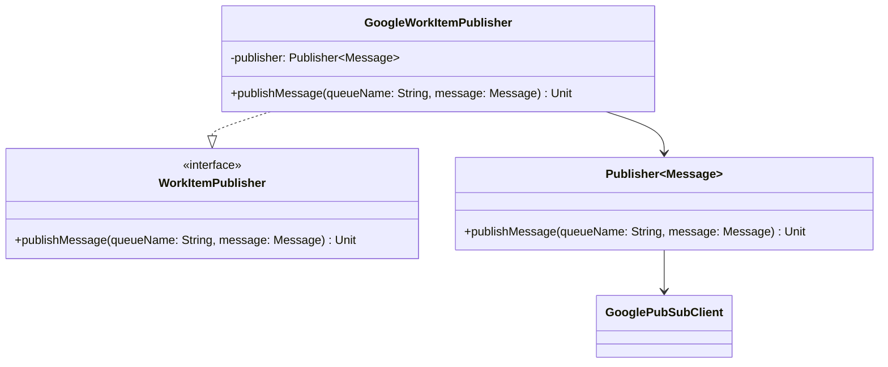

# org.wfanet.measurement.securecomputation.deploy.gcloud.publisher

## Overview
Provides Google Cloud Platform-specific implementation for publishing work items to Pub/Sub queues. This package bridges the secure computation service layer with Google Cloud Pub/Sub infrastructure, enabling asynchronous task distribution across distributed computation workers.

## Components

### GoogleWorkItemPublisher
Google Cloud Pub/Sub implementation of the WorkItemPublisher interface that delegates message publishing to the underlying Publisher infrastructure.

| Method | Parameters | Returns | Description |
|--------|------------|---------|-------------|
| publishMessage | `queueName: String`, `message: Message` | `Unit` (suspend) | Publishes a protobuf message to the specified Pub/Sub queue |

#### Constructor Parameters
| Parameter | Type | Description |
|-----------|------|-------------|
| projectId | `String` | Google Cloud project identifier for Pub/Sub resources |
| googlePubSubClient | `GooglePubSubClient` | Client instance for Google Pub/Sub operations |

## Dependencies
- `org.wfanet.measurement.securecomputation.service.internal` - Implements WorkItemPublisher interface contract
- `org.wfanet.measurement.gcloud.pubsub` - Provides Publisher and GooglePubSubClient infrastructure
- `com.google.protobuf` - Uses Message type for serializable work items

## Usage Example
```kotlin
val googlePubSubClient = GooglePubSubClient(credentials)
val publisher = GoogleWorkItemPublisher(
  projectId = "my-gcp-project",
  googlePubSubClient = googlePubSubClient
)

// Publish a work item message
val workItem: Message = buildWorkItemMessage()
publisher.publishMessage(
  queueName = "computation-tasks",
  message = workItem
)
```

## Usage Context
The GoogleWorkItemPublisher is used in:
- **InternalApiServer** - Instantiated as the work item publisher for the internal API service
- **InProcessEdpAggregatorComponents** - Used in integration testing for EDP aggregator components
- **WorkItemsServiceTest** - Used in service layer testing to verify work item distribution

## Class Diagram

