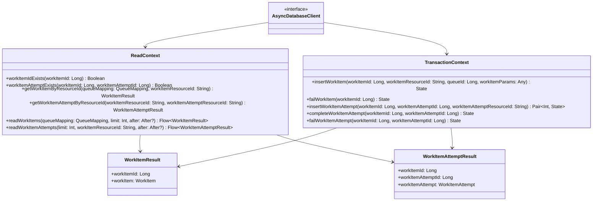

# org.wfanet.measurement.securecomputation.deploy.gcloud.spanner.db

## Overview
This package provides Google Cloud Spanner database access layer for work item management in the secure computation control plane. It implements extension functions on `AsyncDatabaseClient` for CRUD operations on WorkItems and WorkItemAttempts tables, managing the lifecycle of asynchronous work processing with retry attempts and state transitions.

## Components

### WorkItems.kt

Extension functions and utilities for managing WorkItem entities in Spanner.

| Method | Parameters | Returns | Description |
|--------|------------|---------|-------------|
| workItemIdExists | `workItemId: Long` | `Boolean` | Checks whether a WorkItem with the specified ID exists |
| failWorkItem | `workItemId: Long` | `WorkItem.State` | Marks WorkItem as FAILED and buffers update mutation |
| insertWorkItem | `workItemId: Long`, `workItemResourceId: String`, `queueId: Long`, `workItemParams: Any` | `WorkItem.State` | Buffers insert mutation for new WorkItem with QUEUED state |
| getWorkItemByResourceId | `queueMapping: QueueMapping`, `workItemResourceId: String` | `WorkItemResult` | Retrieves WorkItem by resource ID with queue mapping resolution |
| readWorkItems | `queueMapping: QueueMapping`, `limit: Int`, `after: ListWorkItemsPageToken.After?` | `Flow<WorkItemResult>` | Streams WorkItems ordered by creation time with pagination support |

### WorkItemAttempts.kt

Extension functions and utilities for managing WorkItemAttempt entities representing retry attempts for work items.

| Method | Parameters | Returns | Description |
|--------|------------|---------|-------------|
| workItemAttemptExists | `workItemId: Long`, `workItemAttemptId: Long` | `Boolean` | Checks whether a WorkItemAttempt with specified IDs exists |
| insertWorkItemAttempt | `workItemId: Long`, `workItemAttemptId: Long`, `workItemAttemptResourceId: String` | `Pair<Int, WorkItemAttempt.State>` | Buffers insert mutation and updates parent WorkItem to RUNNING |
| getWorkItemAttemptByResourceId | `workItemResourceId: String`, `workItemAttemptResourceId: String` | `WorkItemAttemptResult` | Retrieves WorkItemAttempt by resource IDs with join query |
| completeWorkItemAttempt | `workItemId: Long`, `workItemAttemptId: Long` | `WorkItemAttempt.State` | Marks attempt as SUCCEEDED and updates parent WorkItem |
| failWorkItemAttempt | `workItemId: Long`, `workItemAttemptId: Long` | `WorkItemAttempt.State` | Marks attempt as FAILED and buffers update mutation |
| readWorkItemAttempts | `limit: Int`, `workItemResourceId: String`, `after: ListWorkItemAttemptsPageToken.After?` | `Flow<WorkItemAttemptResult>` | Streams attempts for a WorkItem ordered by creation time |

## Data Structures

### WorkItemResult
| Property | Type | Description |
|----------|------|-------------|
| workItemId | `Long` | Internal Spanner primary key for the work item |
| workItem | `WorkItem` | Protobuf representation of the work item entity |

### WorkItemAttemptResult
| Property | Type | Description |
|----------|------|-------------|
| workItemId | `Long` | Internal Spanner primary key for the parent work item |
| workItemAttemptId | `Long` | Internal Spanner primary key for the work item attempt |
| workItemAttempt | `WorkItemAttempt` | Protobuf representation of the attempt entity |

## Dependencies
- `com.google.cloud.spanner` - Cloud Spanner client library for database operations
- `org.wfanet.measurement.gcloud.spanner` - Custom Spanner utilities for async operations and mutations
- `org.wfanet.measurement.internal.securecomputation.controlplane` - Protobuf definitions for WorkItem and WorkItemAttempt
- `org.wfanet.measurement.securecomputation.service.internal` - Service layer exceptions and queue mapping
- `kotlinx.coroutines.flow` - Coroutine Flow for streaming query results

## Usage Example

```kotlin
// Insert a new work item
val workItemState = transactionContext.insertWorkItem(
  workItemId = 12345L,
  workItemResourceId = "workitems/abc123",
  queueId = 1L,
  workItemParams = Any.pack(myParams)
)

// Create an attempt for the work item
val (attemptNumber, attemptState) = transactionContext.insertWorkItemAttempt(
  workItemId = 12345L,
  workItemAttemptId = 67890L,
  workItemAttemptResourceId = "attempts/def456"
)

// Complete the attempt successfully
readContext.completeWorkItemAttempt(
  workItemId = 12345L,
  workItemAttemptId = 67890L
)

// Read work items with pagination
val workItems: Flow<WorkItemResult> = readContext.readWorkItems(
  queueMapping = myQueueMapping,
  limit = 50,
  after = pageToken.after
)
```

## Class Diagram



## State Transitions

### WorkItem States
- **QUEUED** - Initial state when work item is created
- **RUNNING** - Set when first WorkItemAttempt is created
- **SUCCEEDED** - Set when a WorkItemAttempt completes successfully
- **FAILED** - Set when work item is explicitly failed

### WorkItemAttempt States
- **ACTIVE** - Initial state when attempt is created
- **SUCCEEDED** - Set when attempt completes successfully
- **FAILED** - Set when attempt fails

## Database Schema Notes

The package operates on two Spanner tables:

**WorkItems**
- Primary Key: `WorkItemId`
- Contains: `WorkItemResourceId`, `QueueId`, `State`, `WorkItemParams`, `CreateTime`, `UpdateTime`

**WorkItemAttempts**
- Primary Key: `(WorkItemId, WorkItemAttemptId)`
- Contains: `WorkItemAttemptResourceId`, `State`, `ErrorMessage`, `CreateTime`, `UpdateTime`
- Foreign Key relationship with WorkItems table

Both tables use commit timestamps for `CreateTime` and `UpdateTime` fields, enabling temporal queries and ordering.
