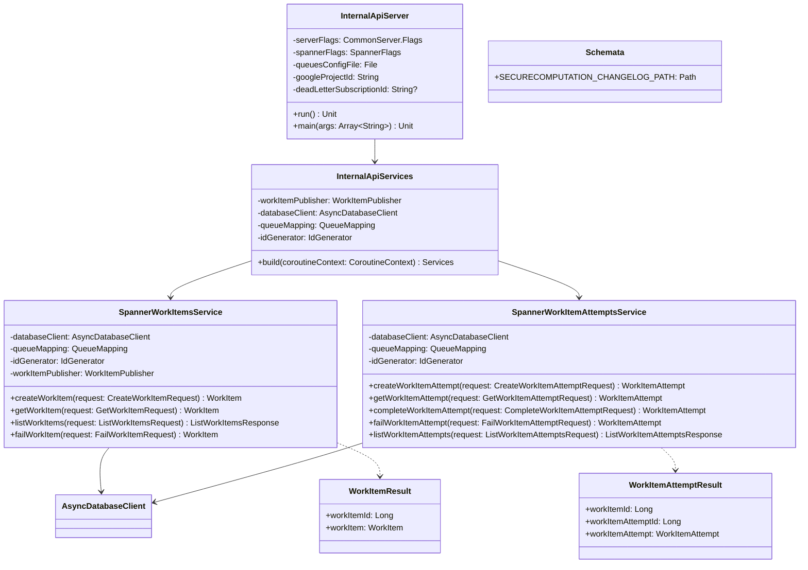

# org.wfanet.measurement.securecomputation.deploy.gcloud.spanner

## Overview

Google Cloud Spanner deployment implementation for the Secure Computation Control Plane's work item management system. Provides gRPC service implementations backed by Spanner database for managing work items and their execution attempts, including queue-based task distribution, state management, and integration with Google Pub/Sub for event publishing and dead letter queue handling.

## Components

### SpannerWorkItemsService

gRPC service implementation managing work item lifecycle operations with Spanner persistence and Pub/Sub publishing.

| Method | Parameters | Returns | Description |
|--------|------------|---------|-------------|
| createWorkItem | `request: CreateWorkItemRequest` | `WorkItem` | Creates new work item in queue with validation |
| getWorkItem | `request: GetWorkItemRequest` | `WorkItem` | Retrieves work item by resource identifier |
| listWorkItems | `request: ListWorkItemsRequest` | `ListWorkItemsResponse` | Lists work items with pagination support |
| failWorkItem | `request: FailWorkItemRequest` | `WorkItem` | Marks work item and all attempts as failed |

**Constructor Parameters:**
- `databaseClient: AsyncDatabaseClient` - Spanner database client for persistence
- `queueMapping: QueueMapping` - Maps queue resource IDs to internal queue metadata
- `idGenerator: IdGenerator` - Generates unique internal database IDs
- `workItemPublisher: WorkItemPublisher` - Publishes work items to Pub/Sub topics
- `coroutineContext: CoroutineContext` - Context for coroutine execution

**Pagination:**
- Default page size: 50
- Maximum page size: 100

### SpannerWorkItemAttemptsService

gRPC service implementation managing individual execution attempts for work items with state transitions.

| Method | Parameters | Returns | Description |
|--------|------------|---------|-------------|
| createWorkItemAttempt | `request: CreateWorkItemAttemptRequest` | `WorkItemAttempt` | Creates new attempt, transitions parent to RUNNING |
| getWorkItemAttempt | `request: GetWorkItemAttemptRequest` | `WorkItemAttempt` | Retrieves attempt by resource identifiers |
| completeWorkItemAttempt | `request: CompleteWorkItemAttemptRequest` | `WorkItemAttempt` | Marks attempt SUCCEEDED, parent to SUCCEEDED |
| failWorkItemAttempt | `request: FailWorkItemAttemptRequest` | `WorkItemAttempt` | Marks attempt as FAILED |
| listWorkItemAttempts | `request: ListWorkItemAttemptsRequest` | `ListWorkItemAttemptsResponse` | Lists attempts for work item with pagination |

**Constructor Parameters:**
- `databaseClient: AsyncDatabaseClient` - Spanner database client for persistence
- `queueMapping: QueueMapping` - Maps queue resource IDs to internal queue metadata
- `idGenerator: IdGenerator` - Generates unique internal database IDs
- `coroutineContext: CoroutineContext` - Context for coroutine execution

**State Validation:**
- Prevents operations on FAILED, SUCCEEDED, or unspecified states
- Enforces state machine: QUEUED → RUNNING → SUCCEEDED/FAILED

**Pagination:**
- Default page size: 50
- Maximum page size: 100

### InternalApiServer

Command-line server application orchestrating gRPC services with optional dead letter queue monitoring.

| Method | Parameters | Returns | Description |
|--------|------------|---------|-------------|
| run | - | `Unit` | Launches server and optional DLQ listener |
| createMainServer | `services: List<BindableService>` | `CommonServer` | Constructs gRPC server with all services |
| createDeadLetterQueueListener | `spannerWorkItemsService: SpannerWorkItemsService, subscriptionId: String, queueSubscriber: QueueSubscriber` | `DeadLetterQueueListener` | Creates DLQ listener with in-process channel |
| createInProcessServer | `spannerWorkItemsService: SpannerWorkItemsService` | `Pair<Server, ManagedChannel>` | Creates in-process server for DLQ communication |

**Command-Line Flags:**
- `--queue-config` - Path to QueuesConfig protobuf text file (required)
- `--google-project-id` - Google Cloud project ID for Pub/Sub (required)
- `--dead-letter-subscription-id` - Pub/Sub subscription for dead letters (optional)
- `--channel-shutdown-timeout` - gRPC channel shutdown grace period (default: 3s)

**Lifecycle:**
1. Initializes Spanner database client and Pub/Sub connections
2. Starts main gRPC server asynchronously
3. Optionally starts dead letter queue listener in parallel
4. Blocks until shutdown signal received
5. Gracefully shuts down all components

### InternalApiServices

Factory for constructing configured service instances with shared dependencies.

| Method | Parameters | Returns | Description |
|--------|------------|---------|-------------|
| build | `coroutineContext: CoroutineContext` | `Services` | Creates configured service instances |

**Constructor Parameters:**
- `workItemPublisher: WorkItemPublisher` - Publishes work items to queues
- `databaseClient: AsyncDatabaseClient` - Spanner database client
- `queueMapping: QueueMapping` - Queue configuration mapping
- `idGenerator: IdGenerator` - ID generation strategy (default: IdGenerator.Default)

## Database Access Layer (db subpackage)

### WorkItems.kt

Database operations for WorkItems table with Spanner-specific query construction.

| Function | Parameters | Returns | Description |
|----------|------------|---------|-------------|
| workItemIdExists | `workItemId: Long` | `Boolean` | Checks if work item ID exists in database |
| insertWorkItem | `workItemId: Long, workItemResourceId: String, queueId: Long, workItemParams: Any` | `WorkItem.State` | Buffers insert mutation, returns QUEUED state |
| getWorkItemByResourceId | `queueMapping: QueueMapping, workItemResourceId: String` | `WorkItemResult` | Retrieves work item with queue metadata |
| readWorkItems | `queueMapping: QueueMapping, limit: Int, after: ListWorkItemsPageToken.After?` | `Flow<WorkItemResult>` | Streams paginated work items ordered by creation |
| failWorkItem | `workItemId: Long` | `WorkItem.State` | Buffers update mutation to FAILED state |

### WorkItemAttempts.kt

Database operations for WorkItemAttempts table with automatic attempt numbering.

| Function | Parameters | Returns | Description |
|----------|------------|---------|-------------|
| workItemAttemptExists | `workItemId: Long, workItemAttemptId: Long` | `Boolean` | Checks if attempt exists for work item |
| insertWorkItemAttempt | `workItemId: Long, workItemAttemptId: Long, workItemAttemptResourceId: String` | `Pair<Int, WorkItemAttempt.State>` | Inserts attempt, updates parent to RUNNING |
| getWorkItemAttemptByResourceId | `workItemResourceId: String, workItemAttemptResourceId: String` | `WorkItemAttemptResult` | Retrieves attempt with join to work item |
| completeWorkItemAttempt | `workItemId: Long, workItemAttemptId: Long` | `WorkItemAttempt.State` | Updates attempt and parent to SUCCEEDED |
| failWorkItemAttempt | `workItemId: Long, workItemAttemptId: Long` | `WorkItemAttempt.State` | Updates attempt to FAILED |
| readWorkItemAttempts | `limit: Int, workItemResourceId: String, after: ListWorkItemAttemptsPageToken.After?` | `Flow<WorkItemAttemptResult>` | Streams paginated attempts ordered by creation |

**Attempt Numbering:**
- Automatically calculates sequential attempt numbers based on creation time
- Uses subquery to count prior attempts: `SELECT COUNT(*) FROM WorkItemAttempts WHERE CreateTime <= current`

## Data Structures

### WorkItemResult

| Property | Type | Description |
|----------|------|-------------|
| workItemId | `Long` | Internal Spanner database identifier |
| workItem | `WorkItem` | Protobuf message with external resource ID |

### WorkItemAttemptResult

| Property | Type | Description |
|----------|------|-------------|
| workItemId | `Long` | Parent work item internal identifier |
| workItemAttemptId | `Long` | Attempt internal identifier |
| workItemAttempt | `WorkItemAttempt` | Protobuf message with attempt details |

### Schemata (testing subpackage)

| Property | Type | Description |
|----------|------|-------------|
| SECURECOMPUTATION_CHANGELOG_PATH | `Path` | Path to Liquibase changelog.yaml for schema |

## Dependencies

- `com.google.cloud.spanner` - Spanner client library for database operations and transactions
- `org.wfanet.measurement.gcloud.spanner` - Custom async Spanner client wrapper with Flow support
- `org.wfanet.measurement.gcloud.pubsub` - Google Pub/Sub client for message publishing and subscription
- `org.wfanet.measurement.internal.securecomputation.controlplane` - Internal protobuf service definitions and messages
- `org.wfanet.measurement.securecomputation.service.internal` - Service layer abstractions (QueueMapping, exceptions)
- `org.wfanet.measurement.common` - Shared utilities (IdGenerator, protobuf extensions)
- `io.grpc` - gRPC framework for service implementation
- `kotlinx.coroutines` - Coroutine support for async database and service operations
- `picocli` - Command-line argument parsing for server configuration

## State Management

### WorkItem States

```
QUEUED → RUNNING → SUCCEEDED
                 → FAILED
```

- **QUEUED**: Initial state after creation
- **RUNNING**: Set when first WorkItemAttempt is created
- **SUCCEEDED**: Set when any attempt completes successfully (cascades parent)
- **FAILED**: Set via explicit failWorkItem call or DLQ processing

### WorkItemAttempt States

```
ACTIVE → SUCCEEDED
       → FAILED
```

- **ACTIVE**: Initial state when attempt is created
- **SUCCEEDED**: Terminal state when completeWorkItemAttempt is called
- **FAILED**: Terminal state when failWorkItemAttempt is called

## Usage Example

```kotlin
// Initialize dependencies
val databaseClient = spanner.databaseClient
val queueMapping = QueueMapping(queuesConfig)
val workItemPublisher = GoogleWorkItemPublisher(projectId, pubSubClient)

// Create services
val services = InternalApiServices(
    workItemPublisher = workItemPublisher,
    databaseClient = databaseClient,
    queueMapping = queueMapping
).build(coroutineContext)

// Create a work item
val workItem = services.workItems.createWorkItem(
    createWorkItemRequest {
        workItem = workItem {
            queueResourceId = "queue-123"
            workItemResourceId = "work-item-456"
            workItemParams = Any.pack(myParams)
        }
    }
)

// Create an attempt
val attempt = services.workItemAttempts.createWorkItemAttempt(
    createWorkItemAttemptRequest {
        workItemAttempt = workItemAttempt {
            workItemResourceId = "work-item-456"
            workItemAttemptResourceId = "attempt-789"
        }
    }
)

// Complete the attempt
val completed = services.workItemAttempts.completeWorkItemAttempt(
    completeWorkItemAttemptRequest {
        workItemResourceId = "work-item-456"
        workItemAttemptResourceId = "attempt-789"
    }
)
```

## Error Handling

All service methods throw `StatusRuntimeException` with appropriate gRPC status codes:

| Exception | gRPC Status | Description |
|-----------|-------------|-------------|
| RequiredFieldNotSetException | INVALID_ARGUMENT | Missing required request field |
| InvalidFieldValueException | INVALID_ARGUMENT | Invalid field value (e.g., negative page size) |
| WorkItemNotFoundException | NOT_FOUND | Work item resource ID not found |
| WorkItemAttemptNotFoundException | NOT_FOUND | Work item attempt resource ID not found |
| WorkItemAlreadyExistsException | ALREADY_EXISTS | Duplicate work item resource ID |
| WorkItemAttemptAlreadyExistsException | ALREADY_EXISTS | Duplicate attempt resource ID |
| WorkItemInvalidStateException | FAILED_PRECONDITION | Work item in invalid state for operation |
| WorkItemAttemptInvalidStateException | FAILED_PRECONDITION | Attempt in invalid state for operation |
| QueueNotFoundException | FAILED_PRECONDITION | Queue resource ID not in mapping |
| QueueNotFoundForWorkItem | NOT_FOUND / INTERNAL | Queue ID from database not in mapping |

## Transaction Semantics

### Read-Write Transactions

All mutating operations use Spanner read-write transactions with retry logic:

- `createWorkItem` - Generates unique ID, inserts row, publishes to Pub/Sub after commit
- `createWorkItemAttempt` - Validates parent state, inserts attempt, updates parent state atomically
- `completeWorkItemAttempt` - Updates attempt and parent work item states atomically
- `failWorkItemAttempt` - Updates attempt state
- `failWorkItem` - Updates work item and all child attempts atomically

### Read-Only Transactions

Single-use read contexts for queries:

- `getWorkItem` - Single row read with queue lookup
- `getWorkItemAttempt` - Single row read with join
- `listWorkItems` - Paginated streaming query
- `listWorkItemAttempts` - Paginated streaming query with filter by work item

### Commit Timestamps

All mutations use `Value.COMMIT_TIMESTAMP` for `CreateTime` and `UpdateTime`, ensuring consistency and avoiding clock skew issues.

## Class Diagram


