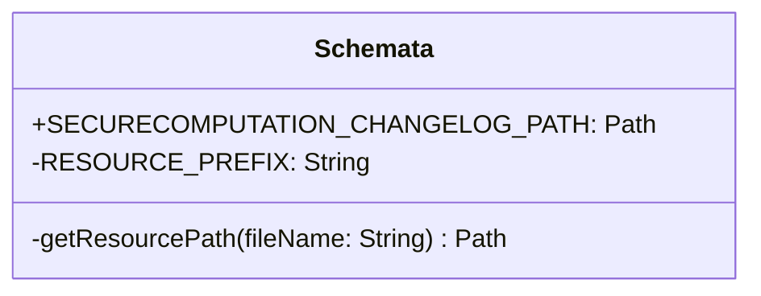

# org.wfanet.measurement.securecomputation.deploy.gcloud.spanner.testing

## Overview
This package provides testing utilities for the Secure Computation module's Google Cloud Spanner deployment. It centralizes access to database schema resources required for test database initialization and validation, enabling consistent schema loading across integration tests and schema verification tests.

## Components

### Schemata
Singleton object that provides access to Spanner database schema resources for testing purposes.

| Method | Parameters | Returns | Description |
|--------|------------|---------|-------------|
| getResourcePath | `fileName: String` | `Path` | Retrieves the file path for a Spanner schema resource |

| Property | Type | Description |
|----------|------|-------------|
| SECURECOMPUTATION_CHANGELOG_PATH | `Path` | Path to the Liquibase changelog YAML file for the Secure Computation Spanner schema |
| RESOURCE_PREFIX | `String` | Constant defining the base resource path (`"securecomputation/spanner"`) |

## Dependencies
- `java.nio.file.Path` - File system path representation
- `org.wfanet.measurement.common.getJarResourcePath` - Extension function for loading resources from JAR files

## Usage Example
```kotlin
import org.wfanet.measurement.securecomputation.deploy.gcloud.spanner.testing.Schemata
import org.wfanet.measurement.gcloud.spanner.testing.UsingSpannerEmulator

class SecurecomputationSchemaTest : UsingSpannerEmulator(Schemata.SECURECOMPUTATION_CHANGELOG_PATH) {
  @Test
  fun `database is created`() {
    // Test database creation with schema
  }
}
```

## Class Diagram


## Implementation Details

### Resource Loading Strategy
The `Schemata` object uses a private `getResourcePath` method that:
1. Constructs a fully-qualified resource name by prefixing the filename with `RESOURCE_PREFIX`
2. Retrieves the class loader from the `Schemata` object
3. Uses the `getJarResourcePath` extension function to locate the resource within the JAR
4. Throws a `requireNotNull` error with a descriptive message if the resource is not found

### Resource Path
The schema changelog file is loaded from the resource path:
- **Resource Name**: `securecomputation/spanner/changelog.yaml`
- **Access Point**: `Schemata.SECURECOMPUTATION_CHANGELOG_PATH`

## Usage in Tests
This package is primarily used in:
- **Schema Validation Tests**: `SecurecomputationSchemaTest` extends `UsingSpannerEmulator` with the changelog path to verify schema creation
- **Service Integration Tests**: Tests like `SpannerWorkItemsServiceTest` and `SpannerWorkItemAttemptsServiceTest` use the schema for database initialization
- **Integration Test Infrastructure**: `SecureComputationServicesProviderRule` uses the schema to provision test databases

## Error Handling
The `getResourcePath` method will throw an `IllegalArgumentException` with the message "Resource {resourceName} not found" if:
- The specified resource file does not exist in the JAR
- The resource path is incorrectly specified
- The classloader cannot access the resource
