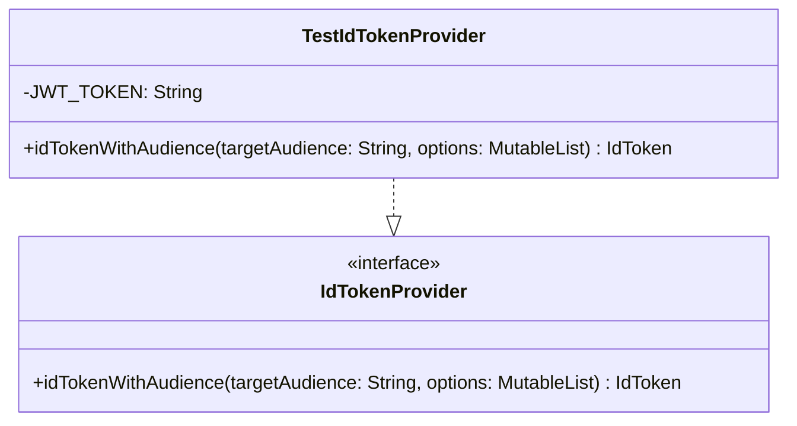

# org.wfanet.measurement.securecomputation.deploy.gcloud.testing

## Overview
This package provides testing utilities for Google Cloud Platform deployment components in the secure computation system. It contains mock implementations of authentication and identity token providers specifically designed for testing scenarios where real GCP credentials are not available or desirable.

## Components

### TestIdTokenProvider
Test implementation of Google's `IdTokenProvider` interface that returns a hardcoded JWT token for testing purposes.

| Method | Parameters | Returns | Description |
|--------|------------|---------|-------------|
| idTokenWithAudience | `targetAudience: String`, `options: MutableList<IdTokenProvider.Option>?` | `IdToken` | Creates and returns a test ID token with a fixed JWT payload |

## Data Structures

This package contains only implementation classes without dedicated data structures.

## Dependencies
- `com.google.auth.oauth2.IdToken` - Google Auth library for OAuth2 identity tokens
- `com.google.auth.oauth2.IdTokenProvider` - Interface for providing ID tokens with audience claims

## Usage Example
```kotlin
// Create a test ID token provider for unit tests
val tokenProvider = TestIdTokenProvider()

// Obtain an ID token for a specific audience
val idToken = tokenProvider.idTokenWithAudience(
    targetAudience = "https://example.com",
    options = null
)

// The returned token will always be the same hardcoded JWT
// Decoded payload: {"sub":"1234567890","name":"John Doe","admin":true,"iat":1516239022,"exp":1516242622}
```

## Class Diagram


## Notes
- The JWT token is hardcoded and contains a test payload with subject "1234567890", name "John Doe", and admin flag set to true
- The token has fixed issued-at (iat) and expiration (exp) timestamps from 2018
- This provider ignores the `targetAudience` and `options` parameters and always returns the same token
- Intended solely for testing; should never be used in production environments
