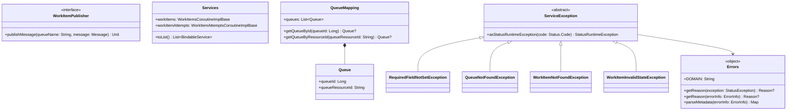

# org.wfanet.measurement.securecomputation.service.internal

## Overview
This package provides the internal service layer for the Secure Computation Control Plane. It defines core interfaces for work item publishing, gRPC service containers, queue management with fingerprint-based mapping, and a comprehensive error handling system with domain-specific exceptions for work item and queue operations.

## Components

### WorkItemPublisher
Interface for publishing work item messages to named queues.

| Method | Parameters | Returns | Description |
|--------|------------|---------|-------------|
| publishMessage | `queueName: String, message: Message` | `Unit` | Publishes protobuf message to specified queue |

### Services
Container data class aggregating Control Plane internal API gRPC services.

| Method | Parameters | Returns | Description |
|--------|------------|---------|-------------|
| toList | - | `List<BindableService>` | Converts service container to bindable service list |

### QueueMapping
Maps queue resource identifiers to internal queue IDs using farmhash fingerprinting.

| Method | Parameters | Returns | Description |
|--------|------------|---------|-------------|
| getQueueById | `queueId: Long` | `Queue?` | Retrieves queue by numeric fingerprint ID |
| getQueueByResourceId | `queueResourceId: String` | `Queue?` | Retrieves queue by string resource identifier |

**Constructor Parameters:**
| Parameter | Type | Description |
|-----------|------|-------------|
| config | `QueuesConfig` | Queue configuration defining available queues |

**Properties:**
| Property | Type | Description |
|----------|------|-------------|
| queues | `List<Queue>` | All configured queues sorted by resource ID |

### Errors
Singleton object defining error domain, reason codes, and metadata keys for Control Plane exceptions.

| Method | Parameters | Returns | Description |
|--------|------------|---------|-------------|
| getReason | `exception: StatusException` | `Reason?` | Extracts reason enum from gRPC status exception |
| getReason | `errorInfo: ErrorInfo` | `Reason?` | Extracts reason enum from error info protobuf |
| parseMetadata | `errorInfo: ErrorInfo` | `Map<Metadata, String>` | Parses error metadata into typed map |

**Constants:**
| Constant | Value | Description |
|----------|-------|-------------|
| DOMAIN | `"internal.control-plane.secure-computation.halo-cmm.org"` | Error domain identifier for all Control Plane errors |

## Data Structures

### QueueMapping.Queue
Represents a work queue with both numeric and string identifiers.

| Property | Type | Description |
|----------|------|-------------|
| queueId | `Long` | FarmHash fingerprint of queue resource ID |
| queueResourceId | `String` | Human-readable queue identifier string |

### Errors.Reason
Enumeration of Control Plane error reason codes.

| Value | Description |
|-------|-------------|
| REQUIRED_FIELD_NOT_SET | Mandatory request field was not populated |
| QUEUE_NOT_FOUND | Queue with specified ID does not exist |
| QUEUE_NOT_FOUND_FOR_WORK_ITEM | No queue configured for given work item |
| INVALID_WORK_ITEM_STATE | Work item state incompatible with operation |
| INVALID_WORK_ITEM_ATTEMPT_STATE | Work item attempt state incompatible with operation |
| WORK_ITEM_NOT_FOUND | Work item with specified ID does not exist |
| WORK_ITEM_ATTEMPT_NOT_FOUND | Work item attempt with specified IDs not found |
| WORK_ITEM_ALREADY_EXISTS | Attempted to create duplicate work item |
| WORK_ITEM_ATTEMPT_ALREADY_EXISTS | Attempted to create duplicate work item attempt |
| INVALID_FIELD_VALUE | Field contains invalid or malformed value |

### Errors.Metadata
Enumeration of metadata keys for error information.

| Value | Key String | Description |
|-------|------------|-------------|
| QUEUE_RESOURCE_ID | `"queueResourceId"` | Queue resource identifier |
| QUEUE_ID | `"queueId"` | Queue numeric ID |
| WORK_ITEM_RESOURCE_ID | `"workItemResourceId"` | Work item resource identifier |
| WORK_ITEM_STATE | `"workItemState"` | Work item state value |
| WORK_ITEM_ATTEMPT_RESOURCE_ID | `"workItemAttemptResourceId"` | Work item attempt resource identifier |
| WORK_ITEM_ATTEMPT_STATE | `"workItemAttemptState"` | Work item attempt state value |
| FIELD_NAME | `"fieldName"` | Name of invalid field |

## Exception Hierarchy

### ServiceException
Abstract base class for all Control Plane service exceptions. Converts to gRPC StatusRuntimeException with structured error metadata.

| Method | Parameters | Returns | Description |
|--------|------------|---------|-------------|
| asStatusRuntimeException | `code: Status.Code` | `StatusRuntimeException` | Converts exception to gRPC status with error info |

### Concrete Exception Classes

| Exception | Constructor Parameters | gRPC Status Code | Description |
|-----------|----------------------|------------------|-------------|
| RequiredFieldNotSetException | `fieldName: String` | INVALID_ARGUMENT | Required field not populated in request |
| QueueNotFoundException | `queueResourceId: String` | NOT_FOUND | Queue does not exist |
| QueueNotFoundForWorkItem | `workItemResourceId: String` | NOT_FOUND | No queue mapping for work item |
| WorkItemNotFoundException | `workItemResourceId: String` | NOT_FOUND | Work item does not exist |
| WorkItemAttemptNotFoundException | `workItemResourceId: String, workItemAttemptResourceId: String` | NOT_FOUND | Work item attempt does not exist |
| WorkItemAlreadyExistsException | - | ALREADY_EXISTS | Work item creation conflict |
| WorkItemAttemptAlreadyExistsException | - | ALREADY_EXISTS | Work item attempt creation conflict |
| WorkItemInvalidStateException | `workItemResourceId: String, workItemState: WorkItem.State` | FAILED_PRECONDITION | Work item state prevents operation |
| WorkItemAttemptInvalidStateException | `workItemResourceId: String, workItemAttemptResourceId: String, workItemAttemptState: WorkItemAttempt.State` | FAILED_PRECONDITION | Work item attempt state prevents operation |
| InvalidFieldValueException | `fieldName: String, buildMessage: (String) -> String = {...}` | INVALID_ARGUMENT | Field contains invalid value |

## Dependencies

- `com.google.protobuf` - Protobuf message serialization for work item publishing
- `com.google.rpc` - gRPC error info metadata structures
- `io.grpc` - gRPC service binding and status exception handling
- `com.google.common.hash` - FarmHash fingerprinting for queue ID generation
- `org.wfanet.measurement.common.grpc` - Common error handling utilities
- `org.wfanet.measurement.config.securecomputation` - Queue configuration proto definitions
- `org.wfanet.measurement.internal.securecomputation.controlplane` - Work item and work item attempt proto definitions and gRPC service stubs

## Usage Example

```kotlin
// Queue mapping initialization
val queuesConfig = queuesConfig {
  queueInfos.add(queueInfo { queueResourceId = "computation-queue" })
}
val queueMapping = QueueMapping(queuesConfig)

// Queue lookup
val queue = queueMapping.getQueueByResourceId("computation-queue")
  ?: throw QueueNotFoundException("computation-queue")

// Publishing work items
val publisher: WorkItemPublisher = // ... implementation
publisher.publishMessage(queue.queueResourceId, workItemMessage)

// Service aggregation
val services = Services(
  workItems = WorkItemsService(queueMapping, publisher),
  workItemAttempts = WorkItemAttemptsService(queueMapping)
)
services.toList().forEach { server.addService(it) }

// Error handling
try {
  workItemsService.getWorkItem(request)
} catch (e: WorkItemNotFoundException) {
  throw e.asStatusRuntimeException(Status.Code.NOT_FOUND)
}
```

## Class Diagram


