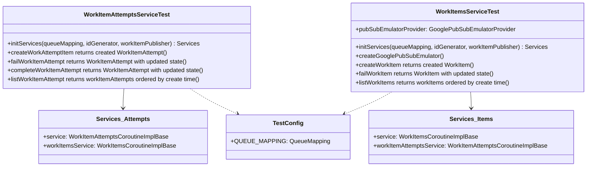

# org.wfanet.measurement.securecomputation.service.internal.testing

## Overview
Provides abstract test suites and configuration utilities for validating secure computation service implementations. This package contains abstract base classes for testing WorkItems and WorkItemAttempts gRPC services, along with shared test configuration. Implementations extend these test classes to verify compliance with the internal control plane API contracts.

## Components

### TestConfig
Singleton object providing shared test configuration for service testing.

| Property | Type | Description |
|----------|------|-------------|
| QUEUE_MAPPING | `QueueMapping` | Pre-configured queue mapping with test topic ID |

### WorkItemAttemptsServiceTest
Abstract JUnit4 test suite for validating WorkItemAttempts service implementations.

| Method | Parameters | Returns | Description |
|--------|------------|---------|-------------|
| initServices | `queueMapping: QueueMapping`, `idGenerator: IdGenerator`, `workItemPublisher: WorkItemPublisher` | `Services` | Initializes service under test with dependencies |
| createWorkAttemptItem returns created WorkItemAttempt | - | `Unit` | Verifies attempt creation with valid request |
| createWorkItemAttempt throws INVALID_ARGUMENT if workItemResourceId is missing | - | `Unit` | Validates required field enforcement |
| createWorkItemAttempt throws INVALID_ARGUMENT if workItemAttemptResourceId is missing | - | `Unit` | Validates required field enforcement |
| getWorkItemAttempt throws INVALID_ARGUMENT if workItemResourceId is missing | - | `Unit` | Validates required field enforcement |
| getWorkItemAttempt throws INVALID_ARGUMENT if workItemAttemptResourceId is missing | - | `Unit` | Validates required field enforcement |
| getWorkItemAttempt throws NOT_FOUND when WorkItemAttempt not found | - | `Unit` | Verifies error handling for missing attempts |
| failWorkItemAttempt returns WorkItemAttempt with updated state | - | `Unit` | Validates state transition to FAILED |
| failWorkItemAttempt throws INVALID_WORK_ITEM_ATTEMPT_STATE if workItemAttempt state is not ACTIVE | - | `Unit` | Validates state precondition enforcement |
| failWorkItemAttempt throws INVALID_ARGUMENT if workItemResourceId is missing | - | `Unit` | Validates required field enforcement |
| failWorkItemAttempt throws INVALID_ARGUMENT if workItemAttemptResourceId is missing | - | `Unit` | Validates required field enforcement |
| failWorkItemAttempt throws NOT_FOUND when WorkItemAttempt not found | - | `Unit` | Verifies error handling for missing attempts |
| completeWorkItemAttempt returns WorkItemAttempt with updated state | - | `Unit` | Validates state transition to SUCCEEDED |
| completeWorkItemAttempt throws INVALID_WORK_ITEM_ATTEMPT_STATE if workItemAttempt state is not ACTIVE | - | `Unit` | Validates state precondition enforcement |
| completeWorkItemAttempt throws INVALID_ARGUMENT if workItemResourceId is missing | - | `Unit` | Validates required field enforcement |
| completeWorkItemAttempt throws INVALID_ARGUMENT if workItemAttemptResourceId is missing | - | `Unit` | Validates required field enforcement |
| completeWorkItemAttempt throws NOT_FOUND when WorkItemAttempt not found | - | `Unit` | Verifies error handling for missing attempts |
| listWorkItemAttempt returns workItemAttempts ordered by create time | - | `Unit` | Validates listing and ordering behavior |
| listWorkItemAttempts returns workItemAttempts when page size is specified | - | `Unit` | Validates pagination with page size |
| listWorkItemAttempts returns next page token when there are more results | - | `Unit` | Validates pagination token generation |
| listWorkItemAttempts returns results after page token | - | `Unit` | Validates pagination continuation |

### WorkItemsServiceTest
Abstract JUnit4 test suite for validating WorkItems service implementations with Google Pub/Sub integration.

| Method | Parameters | Returns | Description |
|--------|------------|---------|-------------|
| initServices | `queueMapping: QueueMapping`, `idGenerator: IdGenerator`, `workItemPublisher: WorkItemPublisher` | `Services` | Initializes service under test with dependencies |
| createGooglePubSubEmulator | - | `Unit` | Sets up emulator client before each test |
| createWorkItem returns created WorkItem | - | `Unit` | Verifies item creation and message publishing |
| createWorkItem throws INVALID_ARGUMENT if queueResourceId is missing | - | `Unit` | Validates required field enforcement |
| createWorkItem throws INVALID_ARGUMENT if workItemParams is missing | - | `Unit` | Validates required field enforcement |
| createWorkItem throws INVALID_ARGUMENT if workItemResourceId is missing | - | `Unit` | Validates required field enforcement |
| createWorkItem throws FAILED_PRECONDITION if queue_resource_id not found | - | `Unit` | Validates queue existence check |
| getWorkItem throws INVALID_ARGUMENT if workItemResourceId is missing | - | `Unit` | Validates required field enforcement |
| getWorkItem throws NOT_FOUND when WorkItem not found | - | `Unit` | Verifies error handling for missing items |
| failWorkItem returns WorkItem with updated state | - | `Unit` | Validates state transition to FAILED |
| failWorkItem throws INVALID_ARGUMENT if workItemResourceId is missing | - | `Unit` | Validates required field enforcement |
| listWorkItems returns workItems ordered by create time | - | `Unit` | Validates listing and ordering behavior |
| listWorkItems returns workItems when page size is specified | - | `Unit` | Validates pagination with page size |
| listWorkItems returns next page token when there are more results | - | `Unit` | Validates pagination token generation |
| listWorkItems returns results after page token | - | `Unit` | Validates pagination continuation |

## Data Structures

### Services (WorkItemAttemptsServiceTest)
| Property | Type | Description |
|----------|------|-------------|
| service | `WorkItemAttemptsCoroutineImplBase` | Service implementation under test |
| workItemsService | `WorkItemsCoroutineImplBase` | Dependency service for creating work items |

### Services (WorkItemsServiceTest)
| Property | Type | Description |
|----------|------|-------------|
| service | `WorkItemsCoroutineImplBase` | Service implementation under test |
| workItemAttemptsService | `WorkItemAttemptsCoroutineImplBase` | Dependency service for managing attempts |

## Dependencies
- `org.wfanet.measurement.internal.securecomputation.controlplane` - Protobuf message types and service definitions
- `org.wfanet.measurement.securecomputation.service.internal` - QueueMapping, WorkItemPublisher, and error definitions
- `org.wfanet.measurement.common` - IdGenerator and utility functions
- `org.wfanet.measurement.gcloud.pubsub.testing` - Google Pub/Sub emulator for integration testing
- `com.google.common.truth` - Assertion library for test validation
- `io.grpc` - gRPC framework for service communication
- `org.junit` - JUnit 4 testing framework
- `kotlinx.coroutines` - Coroutine support for async testing

## Usage Example
```kotlin
@RunWith(JUnit4::class)
class MyWorkItemsServiceTest : WorkItemsServiceTest() {
    override fun initServices(
        queueMapping: QueueMapping,
        idGenerator: IdGenerator,
        workItemPublisher: WorkItemPublisher
    ): Services {
        val service = MyWorkItemsService(queueMapping, idGenerator, workItemPublisher)
        val attemptsService = MyWorkItemAttemptsService()
        return Services(service, attemptsService)
    }
}
```

## Class Diagram

