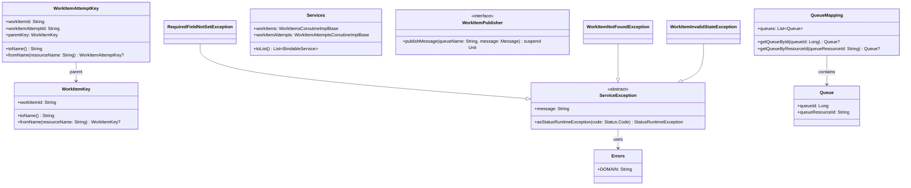

# org.wfanet.measurement.securecomputation.service

## Overview
This package provides service layer components for secure computation control plane operations, managing work items and their execution attempts. It includes resource key implementations, error handling with gRPC status mapping, queue management, and internal API service interfaces for work item lifecycle management.

## Components

### Errors (Public API)
Domain-specific error handling for the secure computation control plane service layer, translating internal errors to gRPC status exceptions.

| Method | Parameters | Returns | Description |
|--------|------------|---------|-------------|
| ServiceException.asStatusRuntimeException | `code: Status.Code` | `StatusRuntimeException` | Converts exception to gRPC status with error info |
| Factory.fromInternal | `cause: StatusException` | `T: ServiceException` | Creates service exception from internal error |

**Error Reasons:**
- `REQUIRED_FIELD_NOT_SET` - Mandatory field missing
- `INVALID_WORK_ITEM_STATE` - Work item in wrong state for operation
- `INVALID_WORK_ITEM_ATTEMPT_STATE` - Work item attempt in wrong state
- `WORK_ITEM_NOT_FOUND` - Work item does not exist
- `WORK_ITEM_ATTEMPT_NOT_FOUND` - Work item attempt does not exist
- `WORK_ITEM_ALREADY_EXISTS` - Duplicate work item creation
- `WORK_ITEM_ATTEMPT_ALREADY_EXISTS` - Duplicate work item attempt creation
- `INVALID_FIELD_VALUE` - Field contains invalid value

### IdVariable
Internal enum for resource name parsing and assembly, defining work item and work item attempt identifiers.

| Method | Parameters | Returns | Description |
|--------|------------|---------|-------------|
| assembleName | `idMap: Map<IdVariable, String>` | `String` | Assembles resource name from ID map |
| parseIdVars | `resourceName: String` | `Map<IdVariable, String>?` | Parses resource name into ID variables |

### WorkItemKey
Resource key for work item entities with name parsing and assembly capabilities.

| Method | Parameters | Returns | Description |
|--------|------------|---------|-------------|
| toName | - | `String` | Converts key to resource name |
| fromName | `resourceName: String` | `WorkItemKey?` | Parses resource name to key |

### WorkItemAttemptKey
Child resource key for work item attempts, maintaining parent-child relationship with work items.

| Method | Parameters | Returns | Description |
|--------|------------|---------|-------------|
| toName | - | `String` | Converts key to resource name |
| fromName | `resourceName: String` | `WorkItemAttemptKey?` | Parses resource name to key |

## Data Structures

### Errors
| Property | Type | Description |
|----------|------|-------------|
| DOMAIN | `String` | Error domain for control plane service |

### Errors.Reason
| Value | Description |
|-------|-------------|
| REQUIRED_FIELD_NOT_SET | Mandatory field not provided |
| INVALID_WORK_ITEM_STATE | Work item state invalid for operation |
| INVALID_WORK_ITEM_ATTEMPT_STATE | Work item attempt state invalid |
| WORK_ITEM_NOT_FOUND | Work item resource not found |
| WORK_ITEM_ATTEMPT_NOT_FOUND | Work item attempt not found |
| WORK_ITEM_ALREADY_EXISTS | Work item already exists |
| WORK_ITEM_ATTEMPT_ALREADY_EXISTS | Work item attempt already exists |
| INVALID_FIELD_VALUE | Field value is invalid |

### Errors.Metadata
| Property | Type | Description |
|----------|------|-------------|
| WORK_ITEM | `String` ("workItem") | Work item metadata key |
| WORK_ITEM_ATTEMPT | `String` ("workItem") | Work item attempt metadata key |
| WORK_ITEM_ATTEMPT_STATE | `String` ("workItemAttemptState") | Attempt state metadata key |
| WORK_ITEM_STATE | `String` ("workItemState") | Work item state metadata key |
| FIELD_NAME | `String` ("fieldName") | Field name metadata key |

### Exception Types
| Exception | Parameters | Description |
|-----------|------------|-------------|
| RequiredFieldNotSetException | `fieldName: String, cause: Throwable?` | Required field missing |
| InvalidFieldValueException | `fieldName: String, cause: Throwable?, buildMessage: (String) -> String` | Invalid field value |
| WorkItemNotFoundException | `name: String, cause: Throwable?` | Work item not found |
| WorkItemAttemptNotFoundException | `name: String, cause: Throwable?` | Work item attempt not found |
| WorkItemAlreadyExistsException | `name: String, cause: Throwable?` | Work item already exists |
| WorkItemAttemptAlreadyExistsException | `name: String, cause: Throwable?` | Work item attempt already exists |
| WorkItemInvalidStateException | `name: String, workItemState: String, cause: Throwable?` | Work item invalid state |
| WorkItemAttemptInvalidStateException | `name: String, workItemAttemptState: String, cause: Throwable?` | Work item attempt invalid state |

### WorkItemKey
| Property | Type | Description |
|----------|------|-------------|
| workItemId | `String` | Work item identifier |

### WorkItemAttemptKey
| Property | Type | Description |
|----------|------|-------------|
| workItemId | `String` | Parent work item identifier |
| workItemAttemptId | `String` | Work item attempt identifier |
| parentKey | `WorkItemKey` | Parent work item resource key |

## Internal Package Components

### internal.Errors
Internal error definitions with extended metadata for queue and resource ID tracking.

| Method | Parameters | Returns | Description |
|--------|------------|---------|-------------|
| getReason | `exception: StatusException` | `Reason?` | Extracts error reason from exception |
| getReason | `errorInfo: ErrorInfo` | `Reason?` | Extracts error reason from error info |
| parseMetadata | `errorInfo: ErrorInfo` | `Map<Metadata, String>` | Parses error info metadata map |

**Additional Error Reasons:**
- `QUEUE_NOT_FOUND` - Queue does not exist
- `QUEUE_NOT_FOUND_FOR_WORK_ITEM` - Queue not found for work item

### internal.QueueMapping
Maps queue resource IDs to numeric queue IDs using fingerprinting for efficient lookup.

| Method | Parameters | Returns | Description |
|--------|------------|---------|-------------|
| getQueueById | `queueId: Long` | `Queue?` | Retrieves queue by numeric ID |
| getQueueByResourceId | `queueResourceId: String` | `Queue?` | Retrieves queue by resource ID |

### internal.Queue
| Property | Type | Description |
|----------|------|-------------|
| queueId | `Long` | Numeric queue identifier (fingerprint) |
| queueResourceId | `String` | String resource identifier |

### internal.Services
Container for control plane internal API service implementations.

| Method | Parameters | Returns | Description |
|--------|------------|---------|-------------|
| toList | - | `List<BindableService>` | Converts services to bindable list |

| Property | Type | Description |
|----------|------|-------------|
| workItems | `WorkItemsCoroutineImplBase` | Work items service implementation |
| workItemAttempts | `WorkItemAttemptsCoroutineImplBase` | Work item attempts service |

### internal.WorkItemPublisher
Interface for publishing work item messages to queues.

| Method | Parameters | Returns | Description |
|--------|------------|---------|-------------|
| publishMessage | `queueName: String, message: Message` | `suspend Unit` | Publishes protobuf message to queue |

## Dependencies
- `org.wfanet.measurement.common` - Resource name parsing and API key infrastructure
- `org.wfanet.measurement.common.grpc` - gRPC error handling utilities
- `org.wfanet.measurement.config.securecomputation` - Queue configuration
- `org.wfanet.measurement.internal.securecomputation.controlplane` - Internal protobuf API definitions
- `io.grpc` - gRPC status and exception types
- `com.google.rpc` - Standard RPC error info
- `com.google.protobuf` - Protocol buffer message types
- `com.google.common.hash` - Hash functions for queue ID fingerprinting

## Usage Example
```kotlin
// Parse work item resource name
val workItemKey = WorkItemKey.fromName("workItems/abc123")
  ?: throw IllegalArgumentException("Invalid work item name")

// Create work item attempt key
val attemptKey = WorkItemAttemptKey(
  workItemId = "abc123",
  workItemAttemptId = "attempt-001"
)
val attemptName = attemptKey.toName() // "workItems/abc123/workItemAttempts/attempt-001"

// Handle errors with gRPC status mapping
try {
  // Service operation
} catch (e: StatusException) {
  when (Errors.getReason(e)) {
    Errors.Reason.WORK_ITEM_NOT_FOUND -> {
      throw WorkItemNotFoundException("workItems/abc123", e)
        .asStatusRuntimeException(Status.Code.NOT_FOUND)
    }
    else -> throw e
  }
}

// Queue mapping for work distribution
val queueMapping = QueueMapping(queuesConfig)
val queue = queueMapping.getQueueByResourceId("queue-a")
  ?: throw QueueNotFoundException("queue-a")

// Publish work item to queue
val publisher: WorkItemPublisher = // implementation
publisher.publishMessage(queue.queueResourceId, workItemMessage)
```

## Class Diagram


## Architecture Notes

### Resource Naming
Resource names follow the pattern:
- Work Items: `workItems/{work_item}`
- Work Item Attempts: `workItems/{work_item}/workItemAttempts/{work_item_attempt}`

### Error Handling Strategy
The package implements a two-tier error system:
1. **Internal errors** (`internal.Errors`) - Used within service implementations, include detailed metadata like resource IDs and queue IDs
2. **Public errors** (`Errors`) - Exposed to external clients, translated from internal errors with user-friendly resource names

Errors are converted to gRPC `StatusRuntimeException` with structured `ErrorInfo` for wire transmission.

### Queue Management
Queue resource IDs are mapped to numeric queue IDs using FarmHash fingerprinting (64-bit) for efficient storage and lookup. The `QueueMapping` class validates resource IDs against regex pattern and detects fingerprint collisions.
