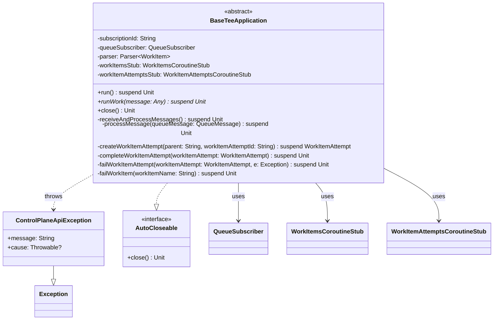

# org.wfanet.measurement.securecomputation.teesdk

## Overview
This package provides infrastructure for building TEE (Trusted Execution Environment) applications that process work items from a queue. It includes a base application class that manages the lifecycle of queue subscription, message processing, and work item state transitions through a control plane API, along with specialized exception handling.

## Components

### BaseTeeApplication
Abstract base class for TEE applications that automatically subscribes to a queue and processes work items with built-in error handling and state management.

| Method | Parameters | Returns | Description |
|--------|------------|---------|-------------|
| run | - | `suspend Unit` | Starts the application and listens for messages |
| runWork | `message: Any` | `suspend Unit` | Abstract method to implement work processing logic |
| close | - | `Unit` | Closes the application and queue subscriber |

**Constructor Parameters:**
- `subscriptionId: String` - Name of the subscription to monitor
- `queueSubscriber: QueueSubscriber` - Client for queue interactions
- `parser: Parser<WorkItem>` - Protobuf parser for work items
- `workItemsStub: WorkItemsCoroutineStub` - gRPC stub for work item operations
- `workItemAttemptsStub: WorkItemAttemptsCoroutineStub` - gRPC stub for work item attempt operations

**Key Behavior:**
- Automatically creates work item attempts with unique UUIDs
- Handles message acknowledgment/negative-acknowledgment based on processing outcomes
- Gracefully handles non-retriable errors (invalid state, not found) by acknowledging messages
- Manages work item attempt lifecycle (create, complete, fail)
- Provides comprehensive logging at each processing stage

### ControlPlaneApiException
Custom exception wrapping failures in control plane API interactions.

| Property | Type | Description |
|----------|------|-------------|
| message | `String` | Error description |
| cause | `Throwable?` | Optional underlying cause |

## Dependencies
- `com.google.protobuf` - Protocol buffer support for message parsing
- `io.grpc` - gRPC framework for control plane communication
- `kotlinx.coroutines.channels` - Coroutine channel for message streaming
- `org.wfanet.measurement.common.grpc` - gRPC utilities including error info extraction
- `org.wfanet.measurement.queue` - Queue subscription abstraction
- `org.wfanet.measurement.securecomputation.controlplane.v1alpha` - Control plane API stubs and messages
- `org.wfanet.measurement.securecomputation.service` - Shared error definitions and key types

## Usage Example
```kotlin
class MyTeeApplication(
  subscriptionId: String,
  queueSubscriber: QueueSubscriber,
  parser: Parser<WorkItem>,
  workItemsStub: WorkItemsCoroutineStub,
  workItemAttemptsStub: WorkItemAttemptsCoroutineStub,
) : BaseTeeApplication(
  subscriptionId,
  queueSubscriber,
  parser,
  workItemsStub,
  workItemAttemptsStub
) {
  override suspend fun runWork(message: Any) {
    // Unpack and process the work item parameters
    val params = message.unpack(MyWorkParams::class.java)
    // Perform computation in TEE
    performSecureComputation(params)
  }
}

// Start the application
val app = MyTeeApplication(...)
app.use { it.run() }
```

## Class Diagram


## Error Handling Strategy

The package implements a sophisticated error handling strategy:

1. **Non-retriable Control Plane Errors**: When work item creation fails due to `INVALID_WORK_ITEM_STATE` or `WORK_ITEM_NOT_FOUND`, messages are acknowledged to prevent infinite retries.

2. **Protocol Buffer Parsing Errors**: Invalid messages trigger work item failure and message acknowledgment.

3. **Work Processing Errors**: Exceptions during `runWork` execution cause work item attempt failure and message negative-acknowledgment for retry.

4. **Idempotency Protection**: Completing an already-succeeded work item attempt is treated as success to handle duplicate message delivery.
