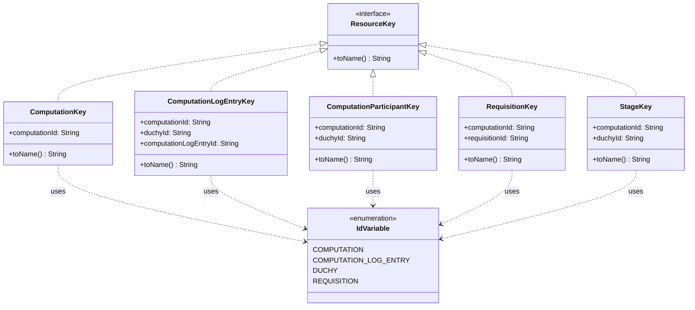

# org.wfanet.measurement.system.v1alpha

## Overview
This package provides resource key implementations for the system v1alpha API. It defines typed resource identifiers for computations, requisitions, participants, stages, and log entries, enabling type-safe resource name parsing and assembly with hierarchical resource relationships.

## Components

### ComputationKey
Resource key for identifying a Computation resource.

| Method | Parameters | Returns | Description |
|--------|------------|---------|-------------|
| toName | - | `String` | Assembles resource name from computation ID |
| fromName | `resourceName: String` | `ComputationKey?` | Parses resource name into key instance |

**Properties:**
- `computationId: String` - Unique identifier for the computation

**Resource Name Pattern:** `computations/{computation}`

### ComputationLogEntryKey
Resource key for identifying a ComputationLogEntry resource within a computation participant.

| Method | Parameters | Returns | Description |
|--------|------------|---------|-------------|
| toName | - | `String` | Assembles resource name from component IDs |
| fromName | `resourceName: String` | `ComputationLogEntryKey?` | Parses resource name into key instance |

**Properties:**
- `computationId: String` - Parent computation identifier
- `duchyId: String` - Duchy participant identifier
- `computationLogEntryId: String` - Unique log entry identifier

**Resource Name Pattern:** `computations/{computation}/participants/{duchy}/logEntries/{computation_log_entry}`

### ComputationParticipantKey
Resource key for identifying a ComputationParticipant (duchy) within a computation.

| Method | Parameters | Returns | Description |
|--------|------------|---------|-------------|
| toName | - | `String` | Assembles resource name from computation and duchy IDs |
| fromName | `resourceName: String` | `ComputationParticipantKey?` | Parses resource name into key instance |

**Properties:**
- `computationId: String` - Parent computation identifier
- `duchyId: String` - Duchy participant identifier

**Resource Name Pattern:** `computations/{computation}/participants/{duchy}`

### RequisitionKey
Resource key for identifying a Requisition within a computation.

| Method | Parameters | Returns | Description |
|--------|------------|---------|-------------|
| toName | - | `String` | Assembles resource name from computation and requisition IDs |
| fromName | `resourceName: String` | `RequisitionKey?` | Parses resource name into key instance |

**Properties:**
- `computationId: String` - Parent computation identifier
- `requisitionId: String` - Unique requisition identifier

**Resource Name Pattern:** `computations/{computation}/requisitions/{requisition}`

### StageKey
Resource key for identifying a Stage within a computation participant.

| Method | Parameters | Returns | Description |
|--------|------------|---------|-------------|
| toName | - | `String` | Assembles resource name from computation and duchy IDs |
| fromName | `resourceName: String` | `StageKey?` | Parses resource name into key instance |

**Properties:**
- `computationId: String` - Parent computation identifier
- `duchyId: String` - Duchy participant identifier

**Resource Name Pattern:** `computations/{computation}/participants/{duchy}/stage`

### IdVariable
Internal enum defining variable names used in resource name patterns.

**Enum Values:**
- `COMPUTATION` - Computation identifier variable
- `COMPUTATION_LOG_ENTRY` - Log entry identifier variable
- `DUCHY` - Duchy identifier variable
- `REQUISITION` - Requisition identifier variable

## Extension Functions

| Function | Parameters | Returns | Description |
|----------|------------|---------|-------------|
| assembleName | `idMap: Map<IdVariable, String>` | `String` | Converts IdVariable map to lowercase string map for ResourceNameParser |
| parseIdVars | `resourceName: String` | `Map<IdVariable, String>?` | Parses resource name into IdVariable map with uppercase conversion |

## Dependencies
- `org.wfanet.measurement.common` - Provides ResourceNameParser for pattern-based name parsing
- `org.wfanet.measurement.common.api` - Provides ResourceKey interface and factory pattern

## Usage Example
```kotlin
// Create and serialize a computation key
val computationKey = ComputationKey("comp-123")
val resourceName = computationKey.toName()
// Result: "computations/comp-123"

// Parse a resource name
val parsedKey = ComputationKey.fromName("computations/comp-456")
// Result: ComputationKey(computationId="comp-456")

// Create a hierarchical resource key
val logEntryKey = ComputationLogEntryKey(
  computationId = "comp-123",
  duchyId = "duchy-a",
  computationLogEntryId = "log-001"
)
val hierarchicalName = logEntryKey.toName()
// Result: "computations/comp-123/participants/duchy-a/logEntries/log-001"
```

## Class Diagram

