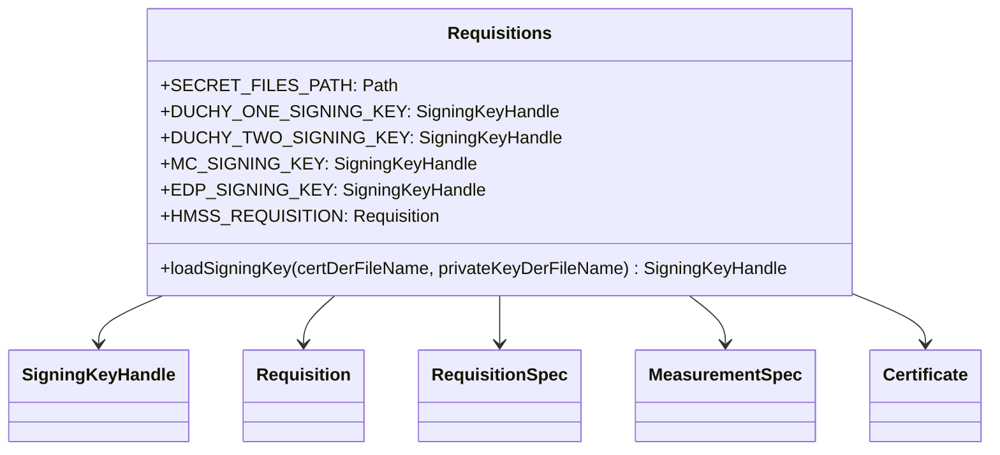

# org.wfanet.measurement.testing

## Overview
The `org.wfanet.measurement.testing` package provides test fixtures and utilities for creating Cross-Media Measurement requisitions. It centralizes cryptographic key loading, certificate management, and pre-configured test data structures used across measurement system integration tests.

## Components

### Requisitions
Singleton object providing test fixtures for requisition creation, including signing keys, certificates, duchy configurations, and sample measurement specifications.

| Property | Type | Description |
|----------|------|-------------|
| `SECRET_FILES_PATH` | `Path` | Path to test secret files directory |
| `EDP_DISPLAY_NAME` | `String` | Display name for test data provider ("edp1") |
| `EDP_ID` | `String` | External data provider identifier |
| `EDP_NAME` | `String` | Full resource name for data provider |
| `MC_ID` | `String` | Measurement consumer identifier |
| `MC_NAME` | `String` | Full resource name for measurement consumer |
| `DUCHY_ONE_ID` | `String` | First duchy worker identifier ("worker1") |
| `DUCHY_TWO_ID` | `String` | Second duchy worker identifier ("worker2") |
| `DUCHY_ONE_NAME` | `String` | Full resource name for first duchy |
| `DUCHY_TWO_NAME` | `String` | Full resource name for second duchy |
| `DUCHY_ONE_SIGNING_KEY` | `SigningKeyHandle` | Signing key for first duchy |
| `DUCHY_TWO_SIGNING_KEY` | `SigningKeyHandle` | Signing key for second duchy |
| `DUCHY_ONE_CERTIFICATE` | `Certificate` | X.509 certificate for first duchy |
| `DUCHY_TWO_CERTIFICATE` | `Certificate` | X.509 certificate for second duchy |
| `DUCHY1_ENCRYPTION_PUBLIC_KEY` | `EncryptionPublicKey` | Public encryption key for first duchy |
| `EDP_SIGNING_KEY` | `SigningKeyHandle` | Data provider signing key |
| `EDP_RESULT_SIGNING_KEY` | `SigningKeyHandle` | Data provider result signing key |
| `DATA_PROVIDER_CERTIFICATE_KEY` | `DataProviderCertificateKey` | Certificate key for data provider |
| `DATA_PROVIDER_RESULT_CERTIFICATE_KEY` | `DataProviderCertificateKey` | Result certificate key for data provider |
| `DATA_PROVIDER_CERTIFICATE` | `Certificate` | X.509 certificate for data provider |
| `DATA_PROVIDER_RESULT_CERTIFICATE` | `Certificate` | X.509 result certificate for data provider |
| `DUCHY_ENTRY_ONE` | `Requisition.DuchyEntry` | First duchy configuration with HMSS protocol |
| `DUCHY_ENTRY_TWO` | `Requisition.DuchyEntry` | Second duchy configuration |
| `MEASUREMENT_NAME` | `String` | Sample measurement resource name |
| `MEASUREMENT_CONSUMER_NAME` | `String` | Measurement consumer resource name |
| `MEASUREMENT_CONSUMER_CERTIFICATE_NAME` | `String` | MC certificate resource name |
| `MEASUREMENT_CONSUMER_CERTIFICATE_DER` | `ByteString` | DER-encoded MC certificate |
| `MEASUREMENT_CONSUMER_CERTIFICATE` | `Certificate` | Measurement consumer X.509 certificate |
| `MC_PUBLIC_KEY` | `EncryptionPublicKey` | MC public encryption key |
| `MC_PRIVATE_KEY` | `PrivateKey` | MC private encryption key |
| `MC_SIGNING_KEY` | `SigningKeyHandle` | MC signing key |
| `DATA_PROVIDER_PUBLIC_KEY` | `EncryptionPublicKey` | Data provider public encryption key |
| `EVENT_GROUP_NAME` | `String` | Sample event group resource name |
| `LAST_EVENT_DATE` | `LocalDate` | End date for test time range |
| `FIRST_EVENT_DATE` | `LocalDate` | Start date for test time range |
| `TIME_RANGE` | `OpenEndTimeRange` | Two-day test time range |
| `REQUISITION_SPEC` | `RequisitionSpec` | Sample requisition specification with event filters |
| `OUTPUT_DP_PARAMS` | `DifferentialPrivacyParams` | Differential privacy parameters (ε=1.0, δ=1E-12) |
| `RF_MEASUREMENT_SPEC` | `MeasurementSpec` | Reach and frequency measurement specification |
| `ENCRYPTED_REQUISITION_SPEC` | `EncryptedRequisitionSpec` | Encrypted and signed requisition spec |
| `NOISE_MECHANISM` | `ProtocolConfig.NoiseMechanism` | Discrete Gaussian noise mechanism |
| `HMSS_REQUISITION` | `Requisition` | Complete HMSS requisition with all configurations |

| Method | Parameters | Returns | Description |
|--------|------------|---------|-------------|
| `loadSigningKey` | `certDerFileName: String`, `privateKeyDerFileName: String` | `SigningKeyHandle` | Loads signing key from certificate and private key files |

## Dependencies
- `org.wfanet.measurement.api.v2alpha` - Core API protocol buffer definitions
- `org.wfanet.measurement.common.crypto` - Cryptographic utilities for signing and hashing
- `org.wfanet.measurement.common.crypto.tink` - Tink-based encryption key management
- `org.wfanet.measurement.consent.client.measurementconsumer` - Requisition encryption and signing
- `org.wfanet.measurement.common` - Common utilities for ID conversion and time handling
- `com.google.protobuf` - Protocol buffer serialization

## Usage Example
```kotlin
import org.wfanet.measurement.testing.Requisitions

// Use pre-configured HMSS requisition for testing
val testRequisition = Requisitions.HMSS_REQUISITION

// Load custom signing keys from test secrets
val customKey = Requisitions.loadSigningKey(
  "custom_cert.der",
  "custom_private.der"
)

// Access measurement consumer credentials
val mcPublicKey = Requisitions.MC_PUBLIC_KEY
val mcSigningKey = Requisitions.MC_SIGNING_KEY

// Use test event filtering configuration
val requisitionSpec = Requisitions.REQUISITION_SPEC
val encryptedSpec = Requisitions.ENCRYPTED_REQUISITION_SPEC
```

## Class Diagram

