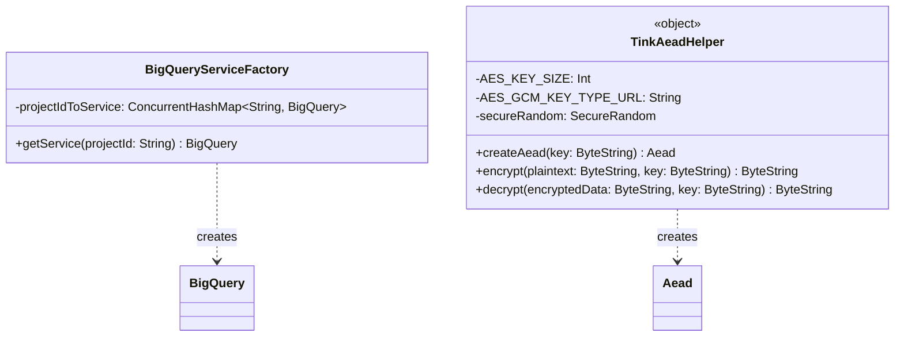

# org.wfanet.panelmatch.client.authorizedview

## Overview
Provides infrastructure for BigQuery service management and cryptographic operations in the authorized view workflow. Implements factory-based BigQuery client caching and Tink-based AES-GCM encryption utilities for secure data handling in panel match operations.

## Components

### BigQueryServiceFactory
Factory that creates and caches BigQuery service instances to prevent redundant client initialization.

| Method | Parameters | Returns | Description |
|--------|------------|---------|-------------|
| getService | `projectId: String` | `BigQuery` | Returns cached BigQuery service for project, creates if missing |

**Implementation Details:**
- Uses `ConcurrentHashMap` for thread-safe caching
- One service instance per unique project ID
- Lazy initialization on first access per project

### TinkAeadHelper
Singleton providing AES-GCM encryption operations using Tink AEAD primitives with RAW output prefix.

| Method | Parameters | Returns | Description |
|--------|------------|---------|-------------|
| createAead | `key: ByteString` | `Aead` | Creates Tink AEAD primitive from raw key bytes |
| encrypt | `plaintext: ByteString`, `key: ByteString` | `ByteString` | Encrypts data using AES-256-GCM via Tink |
| decrypt | `encryptedData: ByteString`, `key: ByteString` | `ByteString` | Decrypts AES-GCM encrypted data via Tink |

**Encryption Format:**
- Output: `IV (12 bytes) || ciphertext || auth tag (16 bytes)`
- Uses `OutputPrefixType.RAW` for standard AES-GCM compatibility
- No associated data (AAD) included in encryption
- 256-bit AES key size (first 32 bytes of provided key used)

**Security Constraints:**
- Minimum key length: 32 bytes (enforced via `require` check)
- Throws `IllegalArgumentException` if key < 32 bytes
- Throws `GeneralSecurityException` on decryption/authentication failure

## Dependencies
- `com.google.cloud.bigquery` - BigQuery client library for service creation and caching
- `com.google.crypto.tink` - Tink cryptographic library for AEAD operations
- `org.wfanet.panelmatch.common` - Common utilities including logging infrastructure

## Usage Example
```kotlin
// BigQuery service management
val factory = BigQueryServiceFactory()
val bqService = factory.getService("my-gcp-project")
val dataset = bqService.getDataset("dataset-id")

// Encryption/decryption operations
val encryptionKey = ByteString.copyFrom(generateSecureKey()) // 32+ bytes
val plaintext = ByteString.copyFromUtf8("sensitive data")

val encrypted = TinkAeadHelper.encrypt(plaintext, encryptionKey)
val decrypted = TinkAeadHelper.decrypt(encrypted, encryptionKey)

// Direct AEAD primitive usage
val aead = TinkAeadHelper.createAead(encryptionKey)
val ciphertext = aead.encrypt(data, emptyByteArray())
```

## Class Diagram


## Integration Points
This package is consumed by:
- `WriteToBigQueryTask` - Uses BigQueryServiceFactory for writing encrypted events
- `ReadEncryptedEventsFromBigQueryTask` - Reads encrypted data from BigQuery tables
- `PreprocessEventsTask` - Preprocessing pipeline for event data
- `DecryptAndMatchEventsTask` - Uses TinkAeadHelper for decryption and event matching
- `ProductionExchangeTaskMapper` - Production workflow orchestration
- `ExchangeWorkflowDaemonFromFlags` - Daemon initialization and configuration

## Notes
- `TinkAeadHelper` planned for migration to `common-jvm` library (see TODO #365)
- AES-GCM format ensures interoperability with standard encryption tools
- Thread-safe design enables concurrent access across exchange workflow tasks
