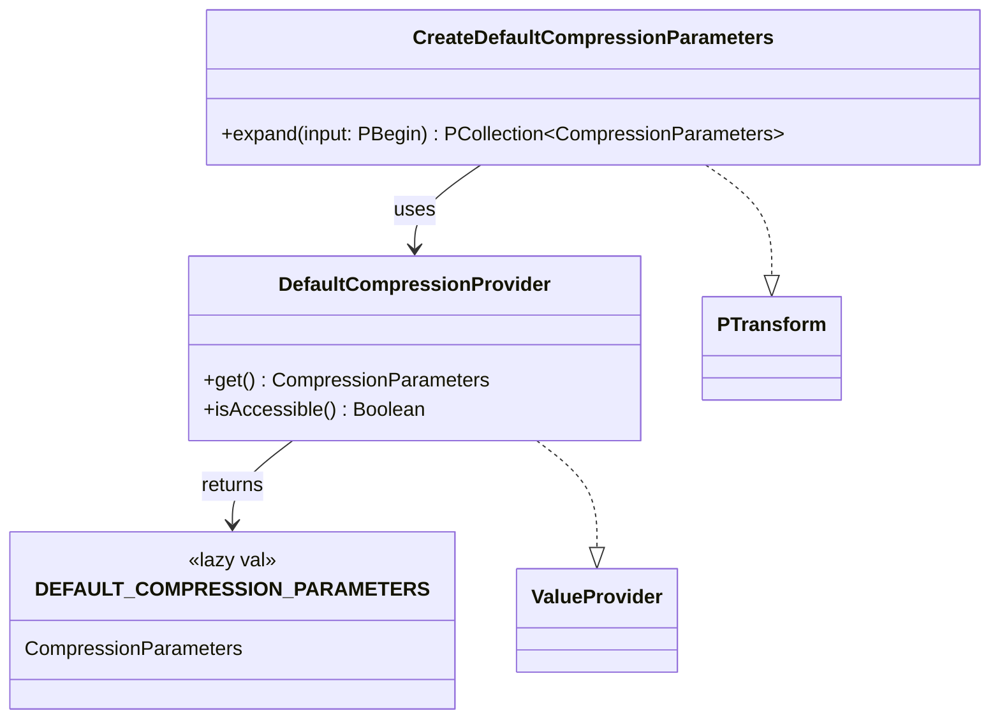

# org.wfanet.panelmatch.client.common.compression

## Overview
Provides default compression parameters using Brotli compression with a built-in dictionary for panel match data processing. The package includes utilities for creating Apache Beam PCollection instances containing recommended compression configurations for efficient data handling in distributed processing pipelines.

## Components

### DEFAULT_COMPRESSION_PARAMETERS
Global constant providing pre-configured Brotli compression with dictionary-based compression.

| Property | Type | Description |
|----------|------|-------------|
| DEFAULT_COMPRESSION_PARAMETERS | `CompressionParameters` | Lazily initialized Brotli compression parameters with built-in dictionary |

### CreateDefaultCompressionParameters
Apache Beam PTransform that creates a singleton PCollection containing recommended compression parameters.

| Method | Parameters | Returns | Description |
|--------|------------|---------|-------------|
| expand | `input: PBegin` | `PCollection<CompressionParameters>` | Creates PCollection with default compression parameters |

### DefaultCompressionProvider
Private ValueProvider implementation for lazy access to default compression parameters.

| Method | Parameters | Returns | Description |
|--------|------------|---------|-------------|
| get | - | `CompressionParameters` | Returns default compression parameters instance |
| isAccessible | - | `Boolean` | Always returns true indicating availability |

## Dependencies
- `com.google.protobuf.ByteString` - Binary data handling for dictionary
- `org.apache.beam.sdk.extensions.protobuf.ProtoCoder` - Protocol buffer encoding for Beam
- `org.apache.beam.sdk.transforms.Create` - Beam transform for collection creation
- `org.apache.beam.sdk.transforms.PTransform` - Base transform interface
- `org.apache.beam.sdk.options.ValueProvider` - Deferred value resolution
- `org.wfanet.panelmatch.common.compression.CompressionParameters` - Protobuf message for compression configuration

## Usage Example
```kotlin
// In an Apache Beam pipeline
val compressionParams: PCollection<CompressionParameters> =
    pipeline.apply(CreateDefaultCompressionParameters())

// Direct access to default parameters
val params = DEFAULT_COMPRESSION_PARAMETERS
```

## Class Diagram

