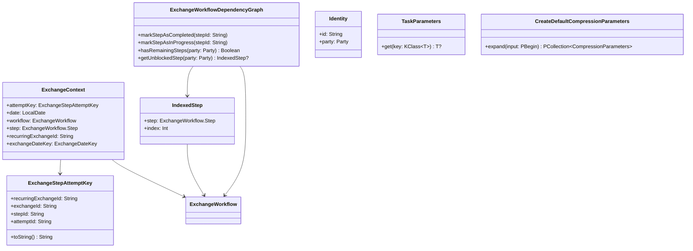

# org.wfanet.panelmatch.client.common

## Overview
Provides core abstractions and utilities for panel match exchange workflow execution. Manages exchange context, workflow dependencies, identity representation, protocol buffer conversions, task parameterization, and compression configurations for data exchange between data providers and model providers.

## Components

### ExchangeContext
Encapsulates contextual information for an exchange step attempt execution.

| Property | Type | Description |
|----------|------|-------------|
| attemptKey | `ExchangeStepAttemptKey` | Unique identifier for the step attempt |
| date | `LocalDate` | Date of the exchange |
| workflow | `ExchangeWorkflow` | The workflow being executed |
| step | `ExchangeWorkflow.Step` | The specific step being executed |
| recurringExchangeId | `String` | ID of the recurring exchange (computed) |
| exchangeDateKey | `ExchangeDateKey` | Combined key of exchange ID and date (lazy) |

### ExchangeStepAttemptKey
Uniquely identifies an exchange step attempt across the hierarchy.

| Property | Type | Description |
|----------|------|-------------|
| recurringExchangeId | `String` | Parent recurring exchange identifier |
| exchangeId | `String` | Specific exchange instance identifier |
| stepId | `String` | Workflow step identifier |
| attemptId | `String` | Attempt number for this step |

| Method | Parameters | Returns | Description |
|--------|------------|---------|-------------|
| toString | - | `String` | Formats as resource path |

### ExchangeWorkflowDependencyGraph
Tracks step dependencies and execution state within an exchange workflow.

| Method | Parameters | Returns | Description |
|--------|------------|---------|-------------|
| markStepAsCompleted | `stepId: String` | `Unit` | Marks step completed, unblocks dependents |
| markStepAsInProgress | `stepId: String` | `Unit` | Marks step in-progress, remains blocking |
| hasRemainingSteps | `party: ExchangeWorkflow.Party` | `Boolean` | Checks if party has incomplete steps |
| getUnblockedStep | `party: ExchangeWorkflow.Party` | `IndexedStep?` | Finds next executable step for party |
| fromWorkflow | `workflow: ExchangeWorkflow` | `ExchangeWorkflowDependencyGraph` | Factory method creating graph from workflow |

#### IndexedStep
| Property | Type | Description |
|----------|------|-------------|
| step | `ExchangeWorkflow.Step` | The workflow step |
| index | `Int` | Position in workflow sequence |

### Identity
Represents a party (data provider or model provider) with its identifier.

| Property | Type | Description |
|----------|------|-------------|
| id | `String` | Party identifier |
| party | `Party` | Party type (DATA_PROVIDER or MODEL_PROVIDER) |

### TaskParameters
Type-safe parameter storage for task-specific contexts.

| Method | Parameters | Returns | Description |
|--------|------------|---------|-------------|
| TaskParameters | `parameters: Set<Any>` | - | Constructs parameter map from data classes |
| get | `key: KClass<T>` | `T?` | Retrieves parameter by class type |

## Data Structures

### ProtoConversions (Extension Functions)

| Function | Parameters | Returns | Description |
|----------|------------|---------|-------------|
| toInternal | `V2AlphaExchangeWorkflow` | `ExchangeWorkflow` | Converts public API workflow to internal representation |
| shardIdOf | `id: Int` | `ShardId` | Creates shard identifier |
| bucketIdOf | `id: Int` | `BucketId` | Creates bucket identifier |
| queryIdOf | `id: Int` | `QueryId` | Creates query identifier |
| unencryptedQueryOf | `shardId, bucketId, queryId` | `UnencryptedQuery` | Constructs query structure |
| decryptedQueryResultOf | `queryId, bucketContents` | `DecryptedQueryResult` | Creates query result with contents |
| databaseShardOf | `shardId, buckets` | `DatabaseShard` | Constructs database shard |
| bucketOf | `bucketId, items` | `Bucket` | Creates bucket with items |
| encryptedQueryResultOf | `queryId, serialized` | `EncryptedQueryResult` | Constructs encrypted result |
| encryptedQueryBundleOf | `shardId, queryIds, serialized` | `EncryptedQueryBundle` | Creates encrypted query bundle |
| plaintextOf | `payload: ByteString` | `Plaintext` | Wraps payload as plaintext |
| joinKeyOf | `key: ByteString` | `JoinKey` | Creates join key |
| joinKeyIdentifierOf | `id: ByteString` | `JoinKeyIdentifier` | Creates join key identifier |
| joinKeyAndIdOf | `key, id` | `JoinKeyAndId` | Combines key and identifier |
| joinKeyAndIdCollectionOf | `items: List<JoinKeyAndId>` | `JoinKeyAndIdCollection` | Creates collection of key-id pairs |
| encryptedEntryOf | `data: ByteString` | `EncryptedEntry` | Wraps encrypted data |
| databaseEntryOf | `lookupKey, encryptedEntry` | `DatabaseEntry` | Creates database entry |
| unprocessedEventOf | `eventId, eventData` | `UnprocessedEvent` | Constructs unprocessed event |
| lookupKeyOf | `key: Long` | `LookupKey` | Creates lookup key from long |
| lookupKeyAndIdOf | `key: Long, id` | `LookupKeyAndId` | Combines lookup key and identifier |
| paddingNonceOf | `nonce: ByteString` | `PaddingNonce` | Creates padding nonce |

### Compression (Subpackage)

#### CreateDefaultCompressionParameters
Apache Beam PTransform producing default compression parameters.

| Method | Parameters | Returns | Description |
|--------|------------|---------|-------------|
| expand | `input: PBegin` | `PCollection<CompressionParameters>` | Creates singleton collection with defaults |

#### DefaultCompressionParameters
| Constant | Type | Description |
|----------|------|-------------|
| DEFAULT_COMPRESSION_PARAMETERS | `CompressionParameters` | Brotli compression with built-in dictionary |

## Dependencies
- `org.wfanet.panelmatch.client.internal` - Internal workflow and step definitions
- `org.wfanet.measurement.api.v2alpha` - Public API exchange workflow models
- `org.wfanet.panelmatch.common` - Common data structures and utilities
- `org.wfanet.panelmatch.client.privatemembership` - Private membership query structures
- `org.wfanet.panelmatch.client.exchangetasks` - Join key data structures
- `org.wfanet.panelmatch.client.eventpreprocessing` - Event processing structures
- `com.google.protobuf` - Protocol buffer base types
- `org.apache.beam.sdk` - Apache Beam data processing framework
- `java.time` - Java time API for date handling
- `kotlin.reflect` - Kotlin reflection for type-safe parameter storage

## Usage Example
```kotlin
// Create exchange context
val attemptKey = ExchangeStepAttemptKey(
  recurringExchangeId = "recurring-123",
  exchangeId = "exchange-456",
  stepId = "step-1",
  attemptId = "attempt-1"
)
val context = ExchangeContext(
  attemptKey = attemptKey,
  date = LocalDate.now(),
  workflow = workflow,
  step = workflow.stepsList[0]
)

// Manage workflow dependencies
val graph = ExchangeWorkflowDependencyGraph.fromWorkflow(workflow)
val nextStep = graph.getUnblockedStep(ExchangeWorkflow.Party.DATA_PROVIDER)
if (nextStep != null) {
  graph.markStepAsInProgress(nextStep.step.stepId)
  // Execute step...
  graph.markStepAsCompleted(nextStep.step.stepId)
}

// Create task parameters
val params = TaskParameters(setOf(
  CompressionConfig(level = 5),
  RetryConfig(maxAttempts = 3)
))
val compressionConfig = params.get(CompressionConfig::class)

// Use proto conversions
val joinKey = joinKeyOf(ByteString.copyFromUtf8("key-data"))
val joinKeyId = joinKeyIdentifierOf(ByteString.copyFromUtf8("id-data"))
val combined = joinKeyAndIdOf(joinKey.key, joinKeyId.id)
```

## Class Diagram

