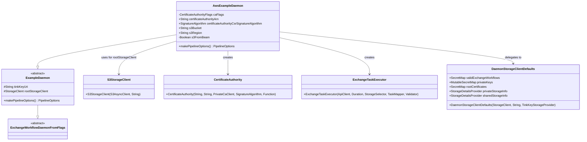

# org.wfanet.panelmatch.client.deploy.example.aws

## Overview
This package provides an AWS-specific implementation of the ExchangeWorkflow daemon for the Panel Match client. It integrates AWS services including S3 for storage, AWS KMS for encryption, and AWS Private Certificate Authority for certificate management. The daemon executes panel matching workflows in AWS infrastructure using Apache Beam with DirectRunner.

## Components

### AwsExampleDaemon
Command-line daemon that extends ExampleDaemon to execute ExchangeWorkflows on AWS infrastructure with S3 storage, AWS KMS encryption, and AWS Private CA for certificate issuance.

| Method | Parameters | Returns | Description |
|--------|------------|---------|-------------|
| makePipelineOptions | - | `PipelineOptions` | Creates Apache Beam pipeline options with optional S3 credentials from AWS SDK |
| main | `args: Array<String>` | `Unit` | Entry point that initializes and runs the daemon with command-line arguments |

#### Configuration Properties

| Property | Type | Description |
|----------|------|-------------|
| certificateAuthorityArn | `String` | AWS Certificate Authority ARN for certificate issuance (required) |
| certificateAuthorityCsrSignatureAlgorithm | `SignatureAlgorithm` | Signature algorithm for CSRs sent to AWS CA (required) |
| s3Bucket | `String` | S3 bucket name for default private storage |
| s3Region | `String` | AWS region where the S3 bucket is located |
| s3FromBeam | `Boolean` | Whether to configure S3 access credentials from Apache Beam (default: false) |
| caFlags | `CertificateAuthorityFlags` | Certificate authority configuration flags |

#### Overridden Properties

| Property | Type | Description |
|----------|------|-------------|
| rootStorageClient | `StorageClient` | S3-backed storage client for accessing bucket data |
| validExchangeWorkflows | `SecretMap` | Map of valid exchange workflows from daemon defaults |
| privateKeys | `MutableSecretMap` | Mutable map of private cryptographic keys |
| rootCertificates | `SecretMap` | Map of root certificates for trust verification |
| privateStorageInfo | `StorageDetailsProvider` | Provider for private storage configuration details |
| sharedStorageInfo | `StorageDetailsProvider` | Provider for shared storage configuration details |
| certificateAuthority | `CertificateAuthority` | AWS Private CA client for certificate operations |
| stepExecutor | `ExchangeTaskExecutor` | Executor for exchange workflow task steps |

## Dependencies

- `com.google.crypto.tink.integration.awskms` - AWS KMS integration for Tink encryption library
- `org.apache.beam.runners.direct` - Apache Beam DirectRunner for local/development pipeline execution
- `org.apache.beam.sdk.options` - Apache Beam pipeline configuration options
- `org.wfanet.measurement.aws.s3` - S3 storage client wrapper for the measurement system
- `org.wfanet.measurement.common.crypto` - Common cryptographic utilities and signature algorithms
- `org.wfanet.measurement.common.crypto.tink` - Tink-based key storage provider
- `org.wfanet.measurement.storage` - Abstract storage client interfaces
- `org.wfanet.panelmatch.client.deploy` - Base daemon and configuration flag classes
- `org.wfanet.panelmatch.client.deploy.example` - ExampleDaemon base class for daemon implementations
- `org.wfanet.panelmatch.client.launcher` - Exchange workflow task execution and validation
- `org.wfanet.panelmatch.client.storage` - Storage details provider interfaces
- `org.wfanet.panelmatch.common.beam` - Beam-specific options and utilities
- `org.wfanet.panelmatch.common.certificates.aws` - AWS Private CA client and certificate authority wrapper
- `org.wfanet.panelmatch.common.secrets` - Secret and key management interfaces
- `picocli` - Command-line interface parsing and option handling
- `software.amazon.awssdk.auth.credentials` - AWS credentials provider and session credentials
- `software.amazon.awssdk.regions` - AWS region configuration
- `software.amazon.awssdk.services.s3` - AWS S3 async client

## Usage Example

```kotlin
// Run the daemon from command line
fun main(args: Array<String>) {
    commandLineMain(AwsExampleDaemon(), args)
}

// Example command-line invocation:
// AwsExampleDaemon \
//   --certificate-authority-arn arn:aws:acm-pca:us-east-1:123456789012:certificate-authority/abc123 \
//   --certificate-authority-csr-signature-algorithm ECDSA_WITH_SHA256 \
//   --s3-storage-bucket my-panelmatch-bucket \
//   --s3-region us-east-1 \
//   --tink-key-uri aws-kms://arn:aws:kms:us-east-1:123456789012:key/xyz789 \
//   --s3-from-beam true
```

## Class Diagram



## Notes

- The daemon uses Apache Beam's DirectRunner, which is suitable for development and testing but should be replaced for production deployments (see TODO comment in code)
- AWS credentials can be configured either through standard AWS SDK credential chain or explicitly through Beam options when `s3FromBeam` is enabled
- The implementation includes a temporary extension property `SignatureAlgorithm.keyAlgorithm` that maps signature algorithms to their underlying key algorithms (EC or RSA) until this becomes a standard property
- All storage, secret, and certificate configurations can be customized per deployment by overriding the respective properties
- The daemon registers AwsKmsClient with Tink before initializing storage to enable KMS-based encryption
