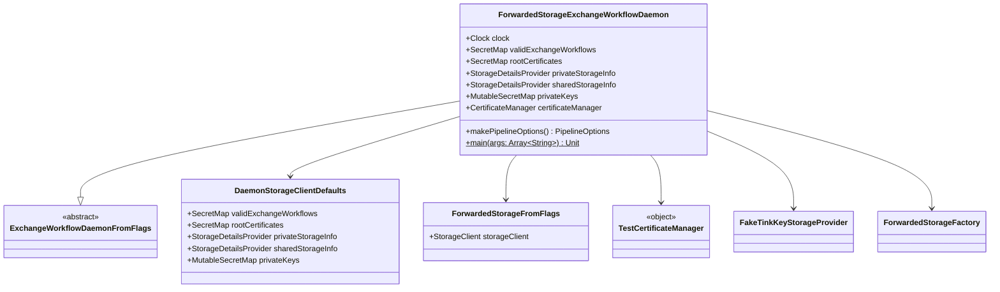

# org.wfanet.panelmatch.client.deploy.example.forwarded

## Overview
This package provides an example implementation of an Exchange Workflow Daemon configured for forwarded storage. The daemon demonstrates how to set up a panel match exchange workflow using forwarded storage clients with test certificate management and fake Tink key storage for development and testing purposes.

## Components

### ForwardedStorageExchangeWorkflowDaemon
Example daemon implementation that orchestrates exchange workflows using forwarded storage backend. Extends `ExchangeWorkflowDaemonFromFlags` to configure all required storage clients, certificate management, and pipeline options for panel match operations.

| Method | Parameters | Returns | Description |
|--------|------------|---------|-------------|
| main | `args: Array<String>` | `Unit` | Entry point to start the daemon from command line |
| makePipelineOptions | - | `PipelineOptions` | Creates default Apache Beam pipeline options |

### Constructor Parameters

| Property | Type | Description |
|----------|------|-------------|
| clock | `Clock` | System clock for time operations (defaults to UTC) |

### Configuration Properties

| Property | Type | Description |
|----------|------|-------------|
| validExchangeWorkflows | `SecretMap` | Valid workflow configurations from storage defaults |
| rootCertificates | `SecretMap` | Root certificates for secure communication |
| privateStorageInfo | `StorageDetailsProvider` | Provider for private storage configuration |
| sharedStorageInfo | `StorageDetailsProvider` | Provider for shared storage configuration |
| privateKeys | `MutableSecretMap` | Private keys for cryptographic operations |
| certificateAuthority | `CertificateAuthority` | Certificate authority (not yet implemented) |
| certificateManager | `CertificateManager` | Test certificate manager for development |
| privateStorageFactories | `Map<PlatformCase, (StorageDetails, ExchangeDateKey) -> StorageFactory>` | Maps CUSTOM platform to ForwardedStorageFactory |
| sharedStorageFactories | `Map<PlatformCase, (StorageDetails, ExchangeDateKey) -> StorageFactory>` | Maps CUSTOM platform to ForwardedStorageFactory |

## Dependencies
- `org.apache.beam.sdk.options` - Apache Beam pipeline configuration
- `org.wfanet.measurement.common` - Command line utilities
- `org.wfanet.measurement.storage.forwarded` - Forwarded storage client implementation
- `org.wfanet.panelmatch.client.deploy` - Base daemon and storage client defaults
- `org.wfanet.panelmatch.client.storage` - Storage abstraction layer
- `org.wfanet.panelmatch.client.storage.forwarded` - Forwarded storage factory
- `org.wfanet.panelmatch.common` - Exchange date key and common utilities
- `org.wfanet.panelmatch.common.certificates` - Certificate management interfaces
- `org.wfanet.panelmatch.common.certificates.testing` - Test certificate implementations
- `org.wfanet.panelmatch.common.secrets` - Secret storage interfaces
- `org.wfanet.panelmatch.common.storage` - Storage factory abstractions
- `org.wfanet.panelmatch.common.storage.testing` - Fake Tink key storage for testing
- `picocli` - Command line parsing framework

## Usage Example
```kotlin
// Run from command line with forwarded storage flags
fun main(args: Array<String>) {
  ForwardedStorageExchangeWorkflowDaemon.main(args)
}

// Programmatic instantiation with custom clock
val daemon = ForwardedStorageExchangeWorkflowDaemon(clock = Clock.systemUTC())
```

## Class Diagram


## Notes
- This is an example implementation intended for development and testing
- Uses `FakeTinkKeyStorageProvider` instead of production key storage
- Uses `TestCertificateManager` for certificate operations
- The `certificateAuthority` property is not yet implemented (returns TODO)
- Configured for forwarded storage using custom platform case mappings
