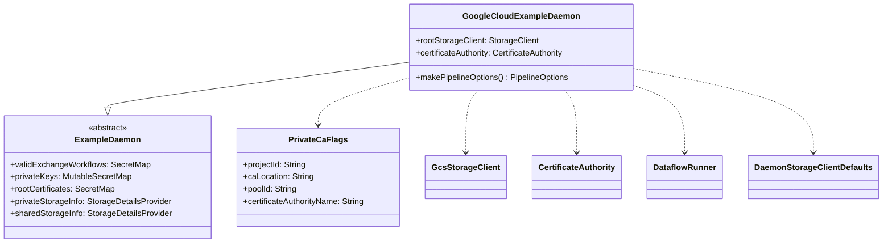

# org.wfanet.panelmatch.client.deploy.example.gcloud

## Overview
Provides Google Cloud Platform deployment implementation for the Panel Match Exchange Workflow daemon. This package configures and executes exchange workflows on GCP using Google Cloud Storage, Dataflow for Apache Beam pipelines, Private Certificate Authority for certificate management, and Cloud KMS for encryption key management.

## Components

### GoogleCloudExampleDaemon
Command-line daemon that executes Panel Match Exchange Workflows on Google Cloud Platform infrastructure.

| Method | Parameters | Returns | Description |
|--------|------------|---------|-------------|
| makePipelineOptions | - | `PipelineOptions` | Configures Apache Beam Dataflow pipeline with GCP settings |
| main | `args: Array<String>` | `Unit` | Entry point to start the daemon with command-line arguments |

**Command-Line Options:**
- `--dataflow-project-id`: GCP project for Dataflow execution
- `--dataflow-region`: GCP region for Dataflow jobs
- `--dataflow-service-account`: Service account for Dataflow workers
- `--dataflow-temp-location`: GCS bucket for temporary Dataflow files
- `--dataflow-worker-machine-type`: Machine type for Dataflow workers (default: n1-standard-1)
- `--dataflow-disk-size`: Worker disk size in GB (default: 30)
- `--dataflow-max-num-workers`: Maximum worker count (default: 100)
- `--s3-from-beam`: Enable S3 access from Beam (default: false)
- `--dataflow-worker-logging-options-level`: Worker log level (default: INFO)
- `--sdk-harness-options-log-level`: SDK harness log level (default: INFO)
- `--privateca-project-id`: PrivateCA project ID
- `--privateca-ca-location`: PrivateCA location
- `--privateca-pool-id`: PrivateCA pool ID
- `--privateca-ca-name`: PrivateCA name

**Inherited Properties:**
- `rootStorageClient`: GCS-based storage client
- `validExchangeWorkflows`: Secret map of valid workflows
- `privateKeys`: Mutable secret map for private keys
- `rootCertificates`: Secret map of root certificates
- `privateStorageInfo`: Private storage details provider
- `sharedStorageInfo`: Shared storage details provider
- `certificateAuthority`: GCP Private CA integration

### PrivateCaFlags
Internal configuration holder for Google Cloud Private Certificate Authority parameters.

| Property | Type | Description |
|----------|------|-------------|
| projectId | `String` | GCP project containing the CA |
| caLocation | `String` | Geographic location of the CA |
| poolId | `String` | CA pool identifier |
| certificateAuthorityName | `String` | Name of the certificate authority |

## Dependencies
- `org.apache.beam.runners.dataflow` - DataflowRunner for executing Beam pipelines on GCP
- `org.apache.beam.sdk.options` - Pipeline configuration options
- `com.google.crypto.tink.integration.gcpkms` - Cloud KMS integration for Tink encryption
- `org.wfanet.measurement.gcloud.gcs` - Google Cloud Storage client implementation
- `org.wfanet.measurement.common.crypto.tink` - Tink key storage provider
- `org.wfanet.panelmatch.client.deploy.example` - Base ExampleDaemon class
- `org.wfanet.panelmatch.common.certificates.gcloud` - GCP Private CA certificate management
- `org.wfanet.panelmatch.common.beam` - Custom Beam options with AWS credential support
- `software.amazon.awssdk.auth.credentials` - AWS credentials (optional, for S3 access from Dataflow)
- `picocli` - Command-line argument parsing

## Usage Example
```kotlin
// Run the daemon from command line
fun main(args: Array<String>) {
  commandLineMain(GoogleCloudExampleDaemon(), args)
}

// Example command-line invocation:
// java -jar daemon.jar \
//   --dataflow-project-id=my-gcp-project \
//   --dataflow-region=us-central1 \
//   --dataflow-service-account=dataflow@my-project.iam.gserviceaccount.com \
//   --dataflow-temp-location=gs://my-bucket/temp \
//   --privateca-project-id=ca-project \
//   --privateca-ca-location=us-central1 \
//   --privateca-pool-id=my-pool \
//   --privateca-ca-name=my-ca \
//   [additional ExampleDaemon flags...]
```

## Class Diagram


## Configuration Notes
- Requires `GOOGLE_APPLICATION_CREDENTIALS` environment variable for GCP authentication
- When `s3FromBeam` is enabled, AWS credentials are loaded via DefaultCredentialsProvider and passed to Dataflow workers
- Storage encryption uses GCP KMS keys via Tink integration
- Certificate management integrates with GCP Private Certificate Authority service
- All Dataflow configuration supports customization via command-line flags
