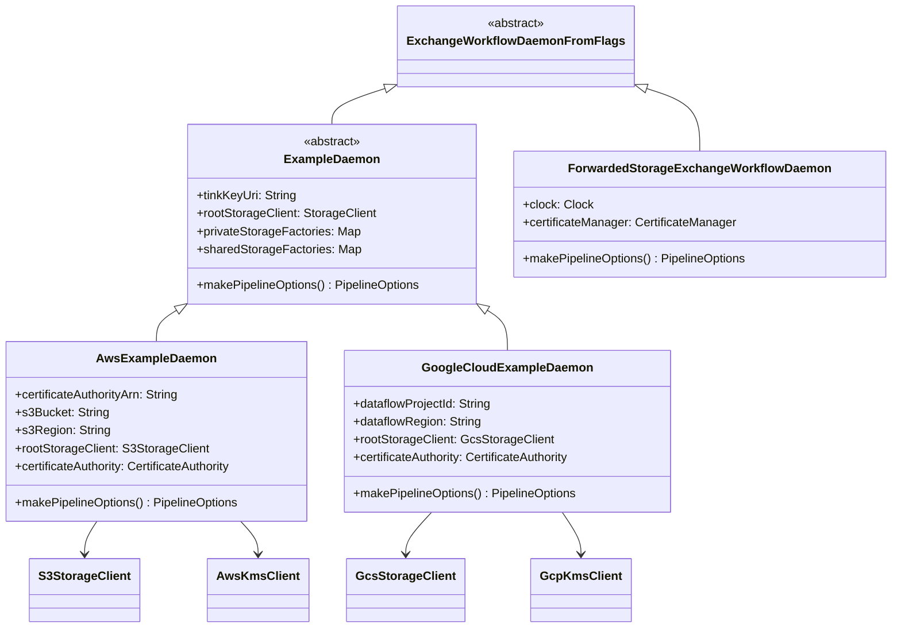

# org.wfanet.panelmatch.client.deploy.example

## Overview
Provides reference implementations of ExchangeWorkflow daemons for multiple cloud platforms (AWS, Google Cloud) and forwarded storage. These example daemons serve as templates for deploying panel match clients across different infrastructure environments with platform-specific storage, cryptography, and certificate authority integrations.

## Components

### ExampleDaemon
Abstract base class for platform-specific ExchangeWorkflowDaemonFromFlags implementations

| Method | Parameters | Returns | Description |
|--------|------------|---------|-------------|
| makePipelineOptions | None | `PipelineOptions` | Creates Apache Beam pipeline configuration |

| Property | Type | Description |
|----------|------|-------------|
| tinkKeyUri | `String` | KMS URI for Tink encryption (@Option) |
| rootStorageClient | `StorageClient` | Platform-specific storage client (abstract) |
| privateStorageFactories | `Map<PlatformCase, StorageFactory>` | Maps platforms to private storage factories |
| sharedStorageFactories | `Map<PlatformCase, StorageFactory>` | Maps platforms to shared storage factories with blob size wrapping |

### AwsExampleDaemon
AWS-specific daemon implementation for executing ExchangeWorkflows

| Method | Parameters | Returns | Description |
|--------|------------|---------|-------------|
| makePipelineOptions | None | `PipelineOptions` | Configures DirectRunner with optional S3 credentials |
| main | `args: Array<String>` | `Unit` | Entry point for AWS daemon execution |

| Property | Type | Description |
|----------|------|-------------|
| certificateAuthorityArn | `String` | AWS Certificate Authority ARN |
| certificateAuthorityCsrSignatureAlgorithm | `SignatureAlgorithm` | Signature algorithm for CSRs to AWS CA |
| s3Bucket | `String` | S3 bucket name for default private storage |
| s3Region | `String` | AWS region for S3 bucket |
| s3FromBeam | `Boolean` | Whether to configure S3 access from Apache Beam |
| rootStorageClient | `S3StorageClient` | S3-backed storage client |
| certificateAuthority | `CertificateAuthority` | AWS PrivateCA certificate authority |
| stepExecutor | `ExchangeTaskExecutor` | Executes exchange tasks with validation |

### GoogleCloudExampleDaemon
Google Cloud-specific daemon implementation for executing ExchangeWorkflows

| Method | Parameters | Returns | Description |
|--------|------------|---------|-------------|
| makePipelineOptions | None | `PipelineOptions` | Configures DataflowRunner with GCP settings |
| main | `args: Array<String>` | `Unit` | Entry point for Google Cloud daemon execution |

| Property | Type | Description |
|----------|------|-------------|
| dataflowProjectId | `String` | GCP project name for Dataflow |
| dataflowRegion | `String` | GCP region for Dataflow |
| dataflowServiceAccount | `String` | Service account for Dataflow |
| dataflowTempLocation | `String` | GCS bucket for Dataflow temp files |
| dataflowWorkerMachineType | `String` | Dataflow worker machine type (default: n1-standard-1) |
| dataflowDiskSize | `Int` | Dataflow disk size in GB (default: 30) |
| dataflowMaxNumWorkers | `Int` | Maximum number of Dataflow workers (default: 100) |
| s3FromBeam | `Boolean` | Whether to configure S3 access from Apache Beam |
| rootStorageClient | `GcsStorageClient` | GCS-backed storage client |
| certificateAuthority | `CertificateAuthority` | Google Cloud PrivateCA certificate authority |

### ForwardedStorageExchangeWorkflowDaemon
Daemon implementation using forwarded storage backend for testing and development

| Method | Parameters | Returns | Description |
|--------|------------|---------|-------------|
| makePipelineOptions | None | `PipelineOptions` | Creates default pipeline options |
| main | `args: Array<String>` | `Unit` | Entry point for forwarded storage daemon |

| Property | Type | Description |
|----------|------|-------------|
| clock | `Clock` | System clock for time-based operations (default: UTC) |
| certificateAuthority | `CertificateAuthority` | Not implemented (throws TODO) |
| certificateManager | `CertificateManager` | TestCertificateManager for development |
| privateStorageFactories | `Map<PlatformCase, StorageFactory>` | Maps CUSTOM platform to ForwardedStorageFactory |
| sharedStorageFactories | `Map<PlatformCase, StorageFactory>` | Maps CUSTOM platform to ForwardedStorageFactory |

## Data Structures

### PrivateCaFlags
Configuration flags for Google Cloud Private Certificate Authority

| Property | Type | Description |
|----------|------|-------------|
| projectId | `String` | Google Cloud PrivateCA project ID |
| caLocation | `String` | Google Cloud PrivateCA location |
| poolId | `String` | Google Cloud PrivateCA pool ID |
| certificateAuthorityName | `String` | Google Cloud PrivateCA CA name |

### exampleStorageFactories
Immutable map binding storage platforms to factory implementations

| Platform | Factory | Description |
|----------|---------|-------------|
| AWS | `S3StorageFactory` | Creates S3-backed storage instances |
| FILE | `FileSystemStorageFactory` | Creates file system-backed storage instances |
| GCS | `GcsStorageFactory` | Creates Google Cloud Storage instances |

## Dependencies
- `org.apache.beam.sdk` - Apache Beam pipeline framework for data processing
- `org.wfanet.measurement.storage` - Storage client abstractions
- `org.wfanet.measurement.aws.s3` - AWS S3 storage implementation
- `org.wfanet.measurement.gcloud.gcs` - Google Cloud Storage implementation
- `org.wfanet.measurement.common.crypto.tink` - Tink cryptography integration
- `org.wfanet.panelmatch.client.deploy` - Core daemon deployment framework
- `org.wfanet.panelmatch.client.storage` - Storage factory abstractions
- `org.wfanet.panelmatch.client.launcher` - Exchange task execution and validation
- `org.wfanet.panelmatch.common.certificates` - Certificate authority abstractions
- `org.wfanet.panelmatch.common.secrets` - Secret management interfaces
- `com.google.crypto.tink.integration.gcpkms` - Google Cloud KMS integration
- `com.google.crypto.tink.integration.awskms` - AWS KMS integration
- `software.amazon.awssdk` - AWS SDK for Java v2
- `picocli` - Command-line argument parsing

## Usage Example
```kotlin
// AWS Daemon deployment
fun main(args: Array<String>) {
    commandLineMain(AwsExampleDaemon(), args)
}

// Google Cloud Daemon deployment
fun main(args: Array<String>) {
    commandLineMain(GoogleCloudExampleDaemon(), args)
}

// Custom daemon extending ExampleDaemon
class CustomDaemon : ExampleDaemon() {
    override val rootStorageClient: StorageClient by lazy {
        createCustomStorageClient()
    }

    override fun makePipelineOptions(): PipelineOptions {
        return PipelineOptionsFactory.create().apply {
            // Custom pipeline configuration
        }
    }
}
```

## Class Diagram

