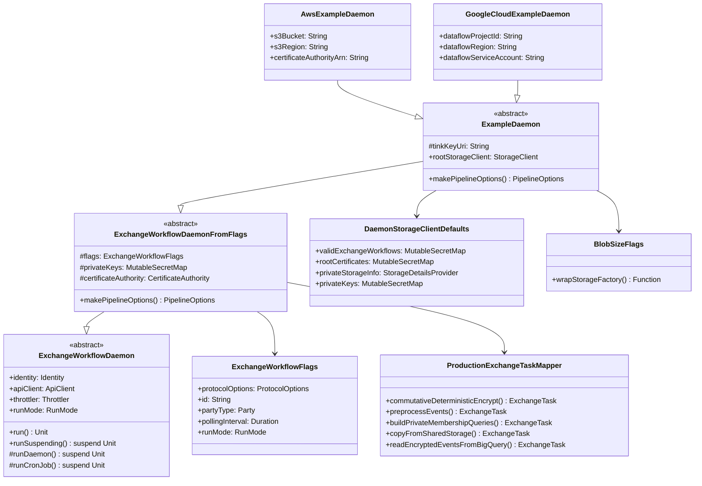

# org.wfanet.panelmatch.client.deploy

## Overview
Deployment infrastructure for the Panel Match Exchange Workflow system. Provides daemon implementations, configuration flags, storage defaults, and task mapping for executing privacy-preserving data exchanges across multiple cloud platforms (AWS, GCP) and storage backends. Supports both Kingdom-based and Kingdomless exchange protocols.

## Components

### ExchangeWorkflowDaemon
Abstract base class for running panel match exchange workflows as a daemon or cron job.

| Method | Parameters | Returns | Description |
|--------|------------|---------|-------------|
| run | - | `Unit` | Executes the daemon main loop |
| runSuspending | - | `Unit` (suspend) | Suspending version of daemon execution |
| runDaemon | - | `Unit` (suspend) | Claims and executes steps in infinite loop |
| runCronJob | - | `Unit` (suspend) | Executes available steps then shuts down |

**Key Properties:**
- `identity: Identity` - Party executing this daemon
- `apiClient: ApiClient` - Kingdom API client
- `rootCertificates: SecretMap` - Partner certificates
- `validExchangeWorkflows: SecretMap` - RecurringExchange ID to ExchangeWorkflow
- `throttler: Throttler` - Limits polling frequency
- `taskTimeout: Timeout` - Task cancellation timeout
- `exchangeTaskMapper: ExchangeTaskMapper` - Creates tasks from steps
- `clock: Clock` - Prevents future exchanges from executing early
- `runMode: RunMode` - DAEMON or CRON_JOB execution mode

### ExchangeWorkflowDaemonFromFlags
Flag-based daemon configuration extending ExchangeWorkflowDaemon.

| Method | Parameters | Returns | Description |
|--------|------------|---------|-------------|
| makePipelineOptions | - | `PipelineOptions` | Creates Apache Beam pipeline options |

**Key Properties:**
- `flags: ExchangeWorkflowFlags` - Command-line configuration
- `privateKeys: MutableSecretMap` - Exchange signing keys by path
- `certificateAuthority: CertificateAuthority` - CA for V2AlphaCertificateManager

### ProductionExchangeTaskMapper
Concrete ExchangeTaskMapper implementation mapping workflow steps to executable tasks.

| Method | Parameters | Returns | Description |
|--------|------------|---------|-------------|
| commutativeDeterministicEncrypt | `ExchangeContext` | `ExchangeTask` | Creates deterministic encryption task |
| commutativeDeterministicDecrypt | `ExchangeContext` | `ExchangeTask` | Creates deterministic decryption task |
| commutativeDeterministicReEncrypt | `ExchangeContext` | `ExchangeTask` | Creates deterministic re-encryption task |
| generateCommutativeDeterministicEncryptionKey | `ExchangeContext` | `ExchangeTask` | Generates symmetric encryption key |
| preprocessEvents | `ExchangeContext` | `ExchangeTask` | Preprocesses events for private membership |
| buildPrivateMembershipQueries | `ExchangeContext` | `ExchangeTask` | Builds encrypted queries for PSI |
| executePrivateMembershipQueries | `ExchangeContext` | `ExchangeTask` | Evaluates membership queries |
| decryptMembershipResults | `ExchangeContext` | `ExchangeTask` | Decrypts query results |
| generateSerializedRlweKeyPair | `ExchangeContext` | `ExchangeTask` | Generates RLWE key pair |
| generateExchangeCertificate | `ExchangeContext` | `ExchangeTask` | Creates exchange certificate |
| generateLookupKeys | `ExchangeContext` | `ExchangeTask` | Hashes join keys for lookup |
| intersectAndValidate | `ExchangeContext` | `ExchangeTask` | Validates intersection size |
| input | `ExchangeContext` | `ExchangeTask` | Reads input from private storage |
| copyFromPreviousExchange | `ExchangeContext` | `ExchangeTask` | Copies data from prior exchange |
| copyFromSharedStorage | `ExchangeContext` | `ExchangeTask` | Copies from shared to private storage |
| copyToSharedStorage | `ExchangeContext` | `ExchangeTask` | Copies from private to shared storage |
| hybridEncrypt | `ExchangeContext` | `ExchangeTask` | Performs hybrid encryption |
| hybridDecrypt | `ExchangeContext` | `ExchangeTask` | Performs hybrid decryption |
| generateHybridEncryptionKeyPair | `ExchangeContext` | `ExchangeTask` | Generates hybrid encryption keys |
| generateRandomBytes | `ExchangeContext` | `ExchangeTask` | Generates cryptographically random bytes |
| assignJoinKeyIds | `ExchangeContext` | `ExchangeTask` | Assigns IDs to join keys |
| readEncryptedEventsFromBigQuery | `ExchangeContext` | `ExchangeTask` | Reads encrypted events from BigQuery |
| writeKeysToBigQuery | `ExchangeContext` | `ExchangeTask` | Writes join keys to BigQuery |
| writeEventsToBigQuery | `ExchangeContext` | `ExchangeTask` | Writes encrypted events to BigQuery |
| decryptAndMatchEvents | `ExchangeContext` | `ExchangeTask` | Decrypts and matches event data |

**Constructor Parameters:**
- `inputTaskThrottler: Throttler` - Throttles input operations
- `privateStorageSelector: PrivateStorageSelector` - Private storage access
- `sharedStorageSelector: SharedStorageSelector` - Shared storage access
- `certificateManager: CertificateManager` - Certificate management
- `makePipelineOptions: () -> PipelineOptions` - Pipeline options factory
- `taskContext: TaskParameters` - Task execution parameters
- `bigQueryServiceFactory: BigQueryServiceFactory?` - Optional BigQuery service

### DaemonStorageClientDefaults
Provides default storage clients and secret maps for daemon deployments.

**Properties:**
| Property | Type | Description |
|----------|------|-------------|
| validExchangeWorkflows | `MutableSecretMap` | Valid workflows by RecurringExchange ID |
| rootCertificates | `MutableSecretMap` | Root X.509 certificates |
| privateStorageInfo | `StorageDetailsProvider` | Private storage configuration |
| sharedStorageInfo | `StorageDetailsProvider` | Shared storage configuration |
| privateKeys | `MutableSecretMap` | KMS-encrypted private signing keys |

**Constructor Parameters:**
- `rootStorageClient: StorageClient` - Base storage client
- `tinkKeyUri: String` - KMS URI for Tink encryption
- `tinkStorageProvider: KeyStorageProvider<TinkKeyId, TinkPrivateKeyHandle>` - Key storage provider

## Data Structures

### ExchangeWorkflowFlags
| Property | Type | Description |
|----------|------|-------------|
| protocolOptions | `ProtocolOptions` | Kingdom-based or Kingdomless protocol configuration |
| id | `String` | Provider identifier |
| partyType | `Party` | DATA_PROVIDER or MODEL_PROVIDER |
| tlsFlags | `TlsFlags` | TLS certificate configuration |
| certAlgorithm | `String` | Signing algorithm for shared storage (default: EC) |
| pollingInterval | `Duration` | Polling sleep duration (default: 1m) |
| taskTimeout | `Duration` | Task timeout duration (default: 24h) |
| preProcessingMaxByteSize | `Long` | Max batch size (default: 1000000) |
| preProcessingFileCount | `Int` | Output file count (default: 1000) |
| maxParallelClaimedExchangeSteps | `Int?` | Max concurrent tasks (null = unlimited) |
| fallbackPrivateKeyBlobKey | `String` | Fallback KMS-encrypted key location |
| runMode | `RunMode` | DAEMON or CRON_JOB execution mode |

### KingdomBasedExchangeFlags
| Property | Type | Description |
|----------|------|-------------|
| channelShutdownTimeout | `Duration` | gRPC channel shutdown timeout (default: 3s) |
| exchangeApiTarget | `String` | API server address and port |
| exchangeApiCertHost | `String` | Expected TLS certificate hostname |
| debugVerboseGrpcClientLogging | `Boolean` | Enable full gRPC logging (default: false) |

### KingdomlessExchangeFlags
| Property | Type | Description |
|----------|------|-------------|
| kingdomlessRecurringExchangeIds | `List<String>` | Recurring exchange IDs to execute |
| checkpointSigningAlgorithm | `String` | Checkpoint signature algorithm (default: SHA256withECDSA) |
| lookbackWindow | `Duration` | Task claiming lookback period (default: 14d) |

### BlobSizeFlags
| Property | Type | Description |
|----------|------|-------------|
| blobSizeLimitBytes | `Long` | Maximum blob size (default: 1 GiB) |

### CertificateAuthorityFlags
| Property | Type | Description |
|----------|------|-------------|
| context | `Context` | X.509 certificate context (CN, O, DNS, validity) |

### ExchangeWorkflowDaemon.RunMode
| Value | Description |
|-------|-------------|
| DAEMON | Infinite polling loop |
| CRON_JOB | Poll until no tasks remain then shutdown |

## Example Implementations

### ExampleDaemon
Abstract base class for example daemon implementations.

**Properties:**
- `tinkKeyUri: String` - KMS URI for Tink
- `rootStorageClient: StorageClient` - Platform-specific storage client
- `privateStorageFactories` - Maps PlatformCase to storage factory
- `sharedStorageFactories` - Storage factories with blob size limits

### AwsExampleDaemon
AWS-specific daemon implementation using S3 storage and AWS Private CA.

**Configuration:**
- S3 bucket and region for storage
- AWS KMS for key encryption (AwsKmsClient)
- AWS Private CA for certificate issuance
- DirectRunner for Apache Beam pipelines
- Optional AWS credentials configuration for Beam workers

### GoogleCloudExampleDaemon
GCP-specific daemon implementation using GCS storage and Google Private CA.

**Configuration:**
- GCS bucket for storage
- GCP KMS for key encryption (GcpKmsClient)
- Google Private CA for certificate issuance
- DataflowRunner for Apache Beam pipelines
- Configurable worker machine types, disk size, and logging

### ForwardedStorageExchangeWorkflowDaemon
Test daemon using forwarded storage and fake certificate manager.

**Configuration:**
- Forwarded storage client from flags
- Fake Tink key storage provider
- TestCertificateManager for testing
- Custom platform storage factories

### TestProductionExchangeTaskMapper
Testing version of ProductionExchangeTaskMapper with simplified configuration.

**Constructor Parameters:**
- `privateStorageSelector: PrivateStorageSelector`
- `sharedStorageSelector: SharedStorageSelector`

**Fixed Configuration:**
- 1 MB max byte size for preprocessing
- 1 file count for preprocessing
- 250ms throttle interval
- TestCertificateManager

## Dependencies
- `org.wfanet.measurement.api.v2alpha` - Kingdom API (ExchangeSteps, Certificates)
- `org.wfanet.measurement.common.crypto` - Cryptographic primitives and Tink integration
- `org.wfanet.measurement.common.grpc` - gRPC channel construction and TLS
- `org.wfanet.measurement.common.throttler` - Request rate limiting
- `org.wfanet.measurement.storage` - Abstract storage client interface
- `org.wfanet.measurement.aws.s3` - S3 storage implementation
- `org.wfanet.measurement.gcloud.gcs` - GCS storage implementation
- `org.wfanet.panelmatch.client.common` - Core client models (Identity, TaskParameters)
- `org.wfanet.panelmatch.client.exchangetasks` - Task implementations
- `org.wfanet.panelmatch.client.launcher` - API clients and execution framework
- `org.wfanet.panelmatch.client.storage` - Storage abstraction layer
- `org.wfanet.panelmatch.client.eventpreprocessing` - Event preprocessing pipeline
- `org.wfanet.panelmatch.client.privatemembership` - Private set intersection cryptography
- `org.wfanet.panelmatch.client.authorizedview` - BigQuery authorized view integration
- `org.wfanet.panelmatch.common.certificates` - Certificate management
- `org.wfanet.panelmatch.common.crypto` - Deterministic commutative cipher
- `org.wfanet.panelmatch.common.secrets` - Secret storage abstraction
- `org.wfanet.panelmatch.common.storage` - Storage factory abstraction
- `org.apache.beam.sdk` - Apache Beam data processing
- `picocli` - Command-line argument parsing
- `com.google.crypto.tink` - Tink cryptography library
- `software.amazon.awssdk` - AWS SDK for S3 and KMS

## Usage Example
```kotlin
// AWS Deployment
val daemon = AwsExampleDaemon().apply {
  s3Bucket = "my-exchange-bucket"
  s3Region = "us-west-2"
  tinkKeyUri = "aws-kms://arn:aws:kms:us-west-2:123456789:key/abc-def"
  certificateAuthorityArn = "arn:aws:acm-pca:us-west-2:123456789:certificate-authority/xyz"
}

// Configure flags programmatically or via command line
daemon.run()

// GCP Deployment
val gcpDaemon = GoogleCloudExampleDaemon().apply {
  dataflowProjectId = "my-gcp-project"
  dataflowRegion = "us-central1"
  dataflowServiceAccount = "exchange-workflow@my-project.iam.gserviceaccount.com"
  tinkKeyUri = "gcp-kms://projects/my-project/locations/global/keyRings/exchange/cryptoKeys/tink"
}

gcpDaemon.run()

// Custom task mapper
val taskMapper = ProductionExchangeTaskMapper(
  inputTaskThrottler = MinimumIntervalThrottler(Clock.systemUTC(), Duration.ofSeconds(1)),
  privateStorageSelector = myPrivateStorageSelector,
  sharedStorageSelector = mySharedStorageSelector,
  certificateManager = myCertificateManager,
  makePipelineOptions = { PipelineOptionsFactory.create() },
  taskContext = TaskParameters(setOf(PreprocessingParameters(1024 * 1024, 100))),
  bigQueryServiceFactory = BigQueryServiceFactory(),
)

val task = with(exchangeContext) {
  taskMapper.preprocessEvents()
}
task.execute()
```

## Class Diagram

