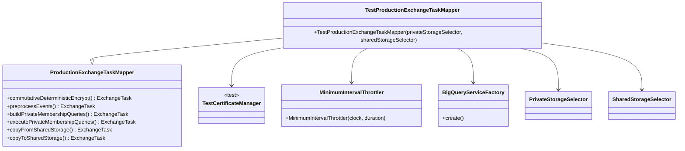

# org.wfanet.panelmatch.client.deploy.testing

## Overview
This package provides testing-specific implementations of production deployment components for the Panel Match client. It contains a test variant of the ProductionExchangeTaskMapper that is configured with testing dependencies, hard-coded parameters, and test certificate management for integration testing scenarios.

## Components

### TestProductionExchangeTaskMapper
Testing version of ProductionExchangeTaskMapper with pre-configured test dependencies and fixed parameters.

**Constructor Parameters:**
| Parameter | Type | Description |
|-----------|------|-------------|
| privateStorageSelector | `PrivateStorageSelector` | Selects private storage implementation for exchange data |
| sharedStorageSelector | `SharedStorageSelector` | Selects shared storage implementation for cross-party data exchange |

**Key Characteristics:**
- Extends `ProductionExchangeTaskMapper` with test-specific configuration
- Uses `TestCertificateManager` for certificate operations
- Configures `MinimumIntervalThrottler` with 250ms intervals for input task throttling
- Sets preprocessing parameters with 1MB max byte size and single file output
- Utilizes default `PipelineOptionsFactory` for Apache Beam pipeline creation
- Includes `BigQueryServiceFactory` for BigQuery task execution

## Data Structures

### Preprocessing Configuration
| Property | Type | Value | Description |
|----------|------|-------|-------------|
| maxByteSize | `Int` | 1048576 | Maximum byte size per preprocessed file (1MB) |
| fileCount | `Int` | 1 | Number of output files for preprocessed data |

### Task Context
| Property | Type | Description |
|----------|------|-------------|
| preprocessingParameters | `PreprocessingParameters` | Contains configuration for event preprocessing operations |

## Dependencies
- `org.wfanet.panelmatch.client.deploy.ProductionExchangeTaskMapper` - Parent class providing production task mapping logic
- `org.wfanet.measurement.common.throttler.MinimumIntervalThrottler` - Throttles input task execution
- `org.wfanet.panelmatch.common.certificates.testing.TestCertificateManager` - Manages test certificates for exchange workflows
- `org.apache.beam.sdk.options.PipelineOptionsFactory` - Creates Apache Beam pipeline options
- `org.wfanet.panelmatch.client.authorizedview.BigQueryServiceFactory` - Provides BigQuery service instances
- `org.wfanet.panelmatch.client.eventpreprocessing.PreprocessingParameters` - Defines event preprocessing configuration
- `org.wfanet.panelmatch.client.storage.PrivateStorageSelector` - Abstracts private storage selection
- `org.wfanet.panelmatch.client.storage.SharedStorageSelector` - Abstracts shared storage selection
- `org.wfanet.panelmatch.client.common.TaskParameters` - Container for task-level configuration parameters
- `java.time.Clock` - Provides time source for throttler
- `java.time.Duration` - Represents time duration for throttling intervals

## Usage Example
```kotlin
val testMapper = TestProductionExchangeTaskMapper(
  privateStorageSelector = myPrivateStorageSelector,
  sharedStorageSelector = mySharedStorageSelector
)

// TestProductionExchangeTaskMapper inherits all task mapping methods from ProductionExchangeTaskMapper
// and can be used in test scenarios requiring exchange workflow execution
```

## Class Diagram


## Notes
- This implementation is specifically designed for testing environments and should not be used in production deployments
- The hard-coded preprocessing parameters (1MB max size, 1 file count) are suitable for small test datasets
- The 250ms throttle interval provides reasonable pacing for test execution without excessive delays
- TestCertificateManager bypasses production certificate validation, making it suitable only for testing scenarios
