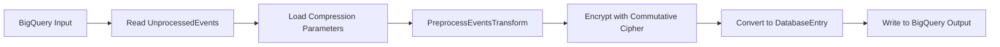

# org.wfanet.panelmatch.client.eventpreprocessing.deploy.gcloud

## Overview
This package provides the Apache Beam pipeline deployment entrypoint for preprocessing events on Google Cloud Platform using Dataflow. It orchestrates reading raw events from BigQuery, encrypting and preprocessing them using commutative cipher operations, and writing the results back to BigQuery for private membership operations.

## Components

### Options
Pipeline configuration interface extending DataflowPipelineOptions for event preprocessing parameters.

| Property | Type | Description |
|----------|------|-------------|
| batchSize | `Long` | Number of events to process in a single batch |
| cryptokey | `String` | Deterministic commutative cipher key for encryption |
| identifierHashPepper | `String` | Pepper value for hashing user identifiers |
| hkdfPepper | `String` | Pepper value for HKDF key derivation |
| bigQueryInputTable | `String` | Source BigQuery table in format `<project_id>:<dataset_id>.<table_id>` |
| bigQueryOutputTable | `String` | Destination BigQuery table in format `<project_id>:<dataset_id>.<table_id>` |
| compressionParametersUri | `String` | Optional GCS URI for compression parameters file |

### PreprocessEventsMain

Main entrypoint function for the event preprocessing pipeline.

| Function | Parameters | Returns | Description |
|----------|------------|---------|-------------|
| main | `args: Array<String>` | `Unit` | Executes the complete preprocessing pipeline on Dataflow |
| readFromBigQuery | `inputTable: String`, `pipeline: Pipeline` | `PCollection<UnprocessedEvent>` | Reads raw events from BigQuery source table |
| writeToBigQuery | `encryptedEvents: PCollection<DatabaseEntry>`, `outputTable: String` | `Unit` | Writes encrypted events to BigQuery destination |
| makeOptions | `args: Array<String>` | `Options` | Parses and validates command-line arguments into pipeline options |
| logMetrics | `pipelineResult: PipelineResult` | `Unit` | Logs pipeline execution metrics including distributions, counters, and gauges |

## Data Structures

### Input Schema (BigQuery)
| Field | Type | Description |
|-------|------|-------------|
| UserId | `String` | User identifier to be encrypted |
| UserEvent | `String` | Event data to be encrypted |

### Output Schema (BigQuery)
| Field | Type | Description |
|-------|------|-------------|
| EncryptedId | `INT64` | Encrypted lookup key for the user |
| EncryptedData | `BYTES` | Base64-encoded encrypted event data |

## Dependencies
- `org.apache.beam.runners.dataflow` - Dataflow runner for executing pipeline on GCP
- `org.apache.beam.sdk.io.gcp.bigquery` - BigQuery I/O connectors for reading/writing data
- `org.wfanet.panelmatch.client.eventpreprocessing` - Core preprocessing transforms and encryption providers
- `org.wfanet.panelmatch.client.common.compression` - Compression parameter handling
- `org.wfanet.panelmatch.client.privatemembership` - DatabaseEntry output format
- `org.wfanet.panelmatch.common.beam` - Beam utility extensions

## Usage Example
```kotlin
// Build the pipeline
// ../cross-media-measurement/tools/bazel-container build //src/main/kotlin/org/wfanet/panelmatch/client/eventpreprocessing/deploy/gcloud:process_events

// Run the pipeline on Dataflow
val args = arrayOf(
  "--batchSize=1000",
  "--cryptokey=YOUR_CRYPTO_KEY",
  "--hkdfPepper=YOUR_HKDF_PEPPER",
  "--identifierHashPepper=YOUR_ID_PEPPER",
  "--bigQueryInputTable=project:dataset.input_table",
  "--bigQueryOutputTable=project:dataset.output_table",
  "--project=YOUR_PROJECT",
  "--runner=dataflow",
  "--region=us-central1",
  "--tempLocation=gs://bucket/temp",
  "--defaultWorkerLogLevel=DEBUG"
)
main(args)
```

## Pipeline Flow


## Class Diagram
```mermaid
classDiagram
    class Options {
        +batchSize: Long
        +cryptokey: String
        +identifierHashPepper: String
        +hkdfPepper: String
        +bigQueryInputTable: String
        +bigQueryOutputTable: String
        +compressionParametersUri: String
    }

    class PreprocessEventsMain {
        +main(args: Array~String~)
        -readFromBigQuery(inputTable: String, pipeline: Pipeline) PCollection~UnprocessedEvent~
        -writeToBigQuery(encryptedEvents: PCollection~DatabaseEntry~, outputTable: String)
        -makeOptions(args: Array~String~) Options
        -logMetrics(pipelineResult: PipelineResult)
    }

    Options --|> DataflowPipelineOptions
    PreprocessEventsMain ..> Options
    PreprocessEventsMain ..> PreprocessEventsTransform
    PreprocessEventsMain ..> JniEventPreprocessor
