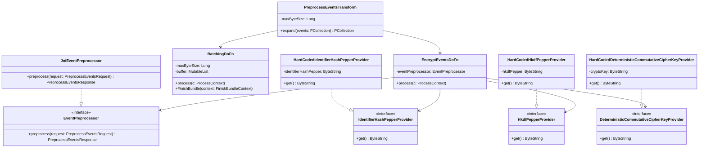

# org.wfanet.panelmatch.client.eventpreprocessing

## Overview
This package provides event preprocessing functionality for the Private Membership protocol, implementing encryption, compression, and batching of event data. It uses deterministic commutative cipher encryption for identifiers and AES encryption for event data, with HKDF-based key derivation and batching to optimize JNI call overhead in Apache Beam pipelines.

## Components

### EventPreprocessor
Interface defining encryption schemes for event data and identifiers using deterministic commutative cipher and AES encryption.

| Method | Parameters | Returns | Description |
|--------|------------|---------|-------------|
| preprocess | `request: PreprocessEventsRequest` | `PreprocessEventsResponse` | Encrypts events with SHA256 hashed identifiers and AES-encrypted data |

### JniEventPreprocessor
JNI-based implementation of EventPreprocessor using native C++ libraries.

| Method | Parameters | Returns | Description |
|--------|------------|---------|-------------|
| preprocess | `request: PreprocessEventsRequest` | `PreprocessEventsResponse` | Calls native preprocessing via SWIG wrapper |

**Companion Object:**
- Loads native library `preprocess_events` from resources on initialization

### PreprocessEventsTransform
Apache Beam PTransform that preprocesses events for Private Membership protocol.

| Method | Parameters | Returns | Description |
|--------|------------|---------|-------------|
| expand | `events: PCollection<UnprocessedEvent>` | `PCollection<DatabaseEntry>` | Groups events by key, batches them, encrypts, and creates database entries |

**Processing Pipeline:**
1. Maps events to key-value pairs
2. Groups events by key and combines into CombinedEvents proto
3. Batches events to minimize JNI overhead
4. Encrypts and compresses each batch
5. Outputs DatabaseEntry objects

### preprocessEvents
Top-level function that creates and applies PreprocessEventsTransform.

| Parameter | Type | Description |
|-----------|------|-------------|
| unprocessedEvents | `PCollection<UnprocessedEvent>` | Input events to preprocess |
| maxByteSize | `Long` | Maximum batch size in bytes |
| identifierHashPepperProvider | `IdentifierHashPepperProvider` | Provider for identifier hashing pepper |
| hkdfPepperProvider | `HkdfPepperProvider` | Provider for HKDF pepper |
| cryptoKeyProvider | `DeterministicCommutativeCipherKeyProvider` | Provider for encryption key |
| eventPreprocessor | `EventPreprocessor` | Preprocessor implementation |
| compressionParametersView | `PCollectionView<CompressionParameters>` | Side input for compression parameters |

### BatchingDoFn
Apache Beam DoFn that batches elements into MutableLists based on byte size constraints.

| Method | Parameters | Returns | Description |
|--------|------------|---------|-------------|
| process | `c: ProcessContext` | `Unit` | Accumulates elements into batches up to maxByteSize |
| FinishBundle | `context: FinishBundleContext` | `Unit` | Flushes remaining buffered elements |

**Metrics:**
- `batch-sizes`: Distribution of batch sizes in bytes

### EncryptEventsDoFn
Apache Beam DoFn that encrypts batches of event key-value pairs.

| Method | Parameters | Returns | Description |
|--------|------------|---------|-------------|
| process | `c: ProcessContext` | `Unit` | Encrypts batched events using EventPreprocessor |

**Input:** `MutableList<KV<ByteString, ByteString>>`
**Output:** `KV<Long, ByteString>` (encrypted identifier and data)

**Metrics:**
- `jni-call-time-micros`: Distribution of JNI call times in microseconds

### EventSize
SerializableFunction that calculates the byte size of event key-value pairs.

| Method | Parameters | Returns | Description |
|--------|------------|---------|-------------|
| apply | `p: KV<ByteString, ByteString>` | `Int` | Returns sum of key and value sizes |

## Provider Interfaces

### DeterministicCommutativeCipherKeyProvider
Type-safe provider interface for deterministic commutative cipher keys.

| Method | Parameters | Returns | Description |
|--------|------------|---------|-------------|
| get | - | `ByteString` | Returns the encryption key |

### IdentifierHashPepperProvider
Type-safe provider interface for identifier hash pepper values.

| Method | Parameters | Returns | Description |
|--------|------------|---------|-------------|
| get | - | `ByteString` | Returns the identifier hash pepper |

### HkdfPepperProvider
Type-safe provider interface for HKDF pepper values.

| Method | Parameters | Returns | Description |
|--------|------------|---------|-------------|
| get | - | `ByteString` | Returns the HKDF pepper |

## Hard-Coded Provider Implementations

### HardCodedDeterministicCommutativeCipherKeyProvider
Implementation that returns a hard-coded cipher key.

**Security Concerns:**
- Key may be logged
- Key resides in memory longer
- Key is serialized between Apache Beam workers
- Vulnerable to insider risk and network/temporary file compromise

### HardCodedIdentifierHashPepperProvider
Implementation that returns a hard-coded identifier hash pepper.

**Security Concerns:**
- Pepper may be logged
- Pepper resides in memory longer
- Pepper is serialized between Apache Beam workers
- Vulnerable to insider risk and network/temporary file compromise

### HardCodedHkdfPepperProvider
Implementation that returns a hard-coded HKDF pepper.

**Security Concerns:**
- Pepper may be logged
- Pepper resides in memory longer
- Pepper is serialized between Apache Beam workers
- Vulnerable to insider risk and network/temporary file compromise

## Data Structures

### PreprocessingParameters
| Property | Type | Description |
|----------|------|-------------|
| maxByteSize | `Long` | Maximum batch size in bytes |
| fileCount | `Int` | Number of files to process |

## Dependencies
- `org.apache.beam.sdk` - Apache Beam SDK for distributed data processing
- `com.google.protobuf` - Protocol Buffers for serialization
- `org.wfanet.panelmatch.common.beam` - Beam utility extensions
- `org.wfanet.panelmatch.common.compression` - Compression parameters
- `org.wfanet.panelmatch.client.privatemembership` - Private Membership protocol types
- `org.wfanet.panelmatch.protocol.eventpreprocessing` - Native preprocessing via SWIG

## Usage Example
```kotlin
val pipeline = Pipeline.create(options)
val compressionParams = pipeline.apply(CreateDefaultCompressionParameters())

val preprocessedEvents = preprocessEvents(
  unprocessedEvents = rawEvents,
  maxByteSize = 1_000_000L,
  identifierHashPepperProvider = HardCodedIdentifierHashPepperProvider(pepper),
  hkdfPepperProvider = HardCodedHkdfPepperProvider(hkdfPepper),
  cryptoKeyProvider = HardCodedDeterministicCommutativeCipherKeyProvider(key),
  eventPreprocessor = JniEventPreprocessor(),
  compressionParametersView = compressionParams.toSingletonView()
)
```

## Class Diagram

