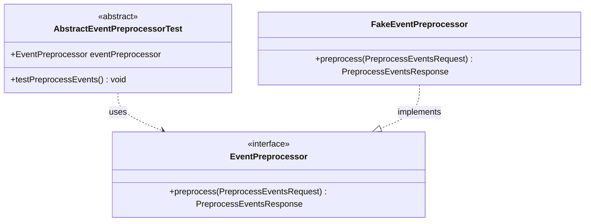

# org.wfanet.panelmatch.client.eventpreprocessing.testing

## Overview
This package provides testing utilities and test doubles for the event preprocessing functionality in the panel match client. It includes an abstract base test class for validating EventPreprocessor implementations and a fake implementation suitable for testing scenarios without real cryptographic operations.

## Components

### AbstractEventPreprocessorTest
Abstract base class for testing implementations of EventPreprocessor. Provides standardized test coverage to validate preprocessing functionality with cryptographic keys, identifier hashing, HKDF peppers, and Brotli compression parameters.

| Method | Parameters | Returns | Description |
|--------|------------|---------|-------------|
| testPreprocessEvents | None | `void` | Validates preprocessing with sample events and crypto parameters |

**Abstract Properties:**
- `eventPreprocessor: EventPreprocessor` - The implementation to test (must be provided by subclasses)

### FakeEventPreprocessor
Fake implementation of EventPreprocessor for testing purposes. Applies deterministic transformations to event IDs and data without performing actual cryptographic operations.

| Method | Parameters | Returns | Description |
|--------|------------|---------|-------------|
| preprocess | `request: PreprocessEventsRequest` | `PreprocessEventsResponse` | Transforms events by incrementing IDs and concatenating crypto parameters to data |

**Implementation Details:**
- Converts event ID strings to Long and increments by 1
- Concatenates identifierHashPepper, hkdfPepper, and cryptoKey to event data
- Returns deterministic output suitable for unit testing

## Dependencies
- `org.wfanet.panelmatch.client.eventpreprocessing` - Core EventPreprocessor interface and request/response types
- `org.wfanet.panelmatch.common.compression` - Compression parameter types for Brotli configuration
- `com.google.common.truth` - Assertion library for test validation
- `com.google.protobuf.kotlin` - Protobuf Kotlin extensions for ByteString conversion
- `org.junit` - JUnit testing framework

## Usage Example
```kotlin
// Using the abstract test base class
class MyEventPreprocessorTest : AbstractEventPreprocessorTest() {
  override val eventPreprocessor = MyEventPreprocessor()
}

// Using the fake preprocessor in tests
val fakePreprocessor = FakeEventPreprocessor()
val request = preprocessEventsRequest {
  cryptoKey = "test-key".toByteStringUtf8()
  identifierHashPepper = "pepper".toByteStringUtf8()
  hkdfPepper = "hkdf".toByteStringUtf8()
  compressionParameters = compressionParameters {
    brotli = brotliCompressionParameters {
      dictionary = "dict".toByteStringUtf8()
    }
  }
  unprocessedEvents += unprocessedEvent {
    id = "1".toByteStringUtf8()
    data = "event-data".toByteStringUtf8()
  }
}
val response = fakePreprocessor.preprocess(request)
```

## Class Diagram

