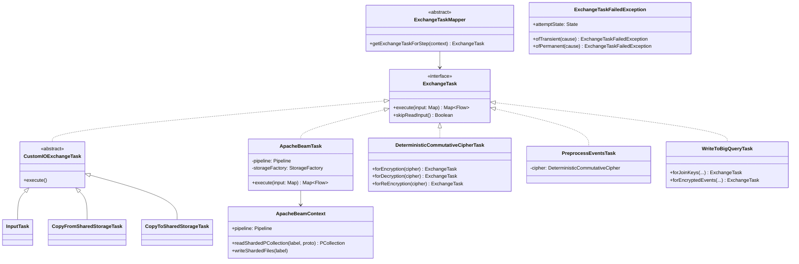

# org.wfanet.panelmatch.client.exchangetasks

## Overview
Provides task implementations for executing data exchange workflow steps in the Panel Match system. Tasks handle cryptographic operations, data transformation, storage transfers, private membership queries, and BigQuery integration through both streaming and Apache Beam-based processing.

## Components

### ExchangeTask
Core interface defining executable workflow steps.

| Method | Parameters | Returns | Description |
|--------|------------|---------|-------------|
| execute | `input: Map<String, StorageClient.Blob>` | `Map<String, Flow<ByteString>>` | Executes task logic on input blobs and returns labeled output flows |
| skipReadInput | - | `Boolean` | Indicates whether executor should skip reading inputs before execution |

### CustomIOExchangeTask
Abstract base class for tasks managing their own input/output operations.

| Method | Parameters | Returns | Description |
|--------|------------|---------|-------------|
| execute | - | `Unit` | Implements task-specific logic without framework-managed I/O |

### ApacheBeamTask
Executes exchange steps using Apache Beam pipelines.

| Method | Parameters | Returns | Description |
|--------|------------|---------|-------------|
| execute | `input: Map<String, Blob>` | `Map<String, Flow<ByteString>>` | Runs Beam pipeline and returns manifest specifications |

### ApacheBeamContext
Execution context providing utilities for Apache Beam tasks.

| Method | Parameters | Returns | Description |
|--------|------------|---------|-------------|
| readShardedPCollection | `manifestLabel: String, prototype: T` | `PCollection<T>` | Reads sharded data as PCollection from manifest |
| readBlobAsPCollection | `label: String` | `PCollection<ByteString>` | Reads single blob as PCollection |
| readBlobAsView | `label: String` | `PCollectionView<ByteString>` | Reads blob as singleton view for side input |
| readBlob | `label: String` | `ByteString` | Reads blob directly as ByteString |
| writeShardedFiles | `manifestLabel: String` | `Unit` | Writes PCollection as sharded files with manifest |
| writeSingleBlob | `label: String` | `Unit` | Writes PCollection as single blob |

### ProducerTask
Wraps zero-input data generation into an ExchangeTask.

| Method | Parameters | Returns | Description |
|--------|------------|---------|-------------|
| execute | `input: Map<String, Blob>` | `Map<String, Flow<ByteString>>` | Produces output from provided generator function |

### InputTask
Waits for specified blob to become available in storage.

| Method | Parameters | Returns | Description |
|--------|------------|---------|-------------|
| execute | - | `Unit` | Polls storage with throttling until blob exists |

### DeterministicCommutativeCipherTask
Performs commutative encryption/decryption on JoinKeyAndIdCollections.

| Method | Parameters | Returns | Description |
|--------|------------|---------|-------------|
| execute | `input: Map<String, Blob>` | `Map<String, Flow<ByteString>>` | Applies cipher operation to join keys while preserving IDs |
| forDecryption | `cipher: DeterministicCommutativeCipher` | `ExchangeTask` | Creates task for removing encryption layer |
| forEncryption | `cipher: DeterministicCommutativeCipher` | `ExchangeTask` | Creates task for adding initial encryption |
| forReEncryption | `cipher: DeterministicCommutativeCipher` | `ExchangeTask` | Creates task for adding additional encryption layer |

### JoinKeyHashingExchangeTask
Hashes JoinKeyAndId collections using HKDF-based peppered hashing.

| Method | Parameters | Returns | Description |
|--------|------------|---------|-------------|
| execute | `input: Map<String, Blob>` | `Map<String, Flow<ByteString>>` | Transforms join keys to lookup keys with pepper |
| forHashing | `queryPreparer: QueryPreparer` | `ExchangeTask` | Creates task for preparing lookup keys |

### GenerateAsymmetricKeyPairTask
Generates asymmetric key pairs for cryptographic protocols.

| Method | Parameters | Returns | Description |
|--------|------------|---------|-------------|
| execute | `input: Map<String, Blob>` | `Map<String, Flow<ByteString>>` | Generates and outputs serialized public/private key pair |

### GenerateHybridEncryptionKeyPairTask
Generates Tink hybrid encryption key pairs using ECIES.

| Method | Parameters | Returns | Description |
|--------|------------|---------|-------------|
| execute | `input: Map<String, Blob>` | `Map<String, Flow<ByteString>>` | Generates ECIES P256 key pair for hybrid encryption |

### HybridEncryptTask
Encrypts data using Tink hybrid encryption with public key.

| Method | Parameters | Returns | Description |
|--------|------------|---------|-------------|
| execute | `input: Map<String, Blob>` | `Map<String, Flow<ByteString>>` | Encrypts plaintext data with public key handle |

### HybridDecryptTask
Decrypts data using Tink hybrid decryption with private key.

| Method | Parameters | Returns | Description |
|--------|------------|---------|-------------|
| execute | `input: Map<String, Blob>` | `Map<String, Flow<ByteString>>` | Decrypts encrypted data with private key handle |

### AssignJoinKeyIdsTask
Shuffles join keys and assigns unique identifiers.

| Method | Parameters | Returns | Description |
|--------|------------|---------|-------------|
| execute | `input: Map<String, Blob>` | `Map<String, Flow<ByteString>>` | Randomly shuffles keys and assigns sequential IDs |

### IntersectValidateTask
Validates data size and membership overlap between exchanges.

| Method | Parameters | Returns | Description |
|--------|------------|---------|-------------|
| execute | `input: Map<String, Blob>` | `Map<String, Flow<ByteString>>` | Validates size limits and intersection requirements |

### CopyFromPreviousExchangeTask
Copies blobs from previous exchange in recurring workflow.

| Method | Parameters | Returns | Description |
|--------|------------|---------|-------------|
| execute | `input: Map<String, Blob>` | `Map<String, Flow<ByteString>>` | Retrieves blob from previous exchange date |

### CopyFromSharedStorageTask
Copies verified blobs from shared storage to private storage.

| Method | Parameters | Returns | Description |
|--------|------------|---------|-------------|
| execute | - | `Unit` | Verifies signatures and copies blobs/manifests internally |

### CopyToSharedStorageTask
Copies blobs from private storage to shared storage with signing.

| Method | Parameters | Returns | Description |
|--------|------------|---------|-------------|
| execute | - | `Unit` | Signs and copies blobs/manifests to shared storage |

### PreprocessEventsTask
Preprocesses events for BigQuery authorized view workflow with streaming output.

| Method | Parameters | Returns | Description |
|--------|------------|---------|-------------|
| execute | `input: Map<String, Blob>` | `Map<String, Flow<ByteString>>` | Groups events by key, encrypts with AES-GCM and outputs EncryptedMatchedEvents |

### DecryptAndMatchEventsTask
Decrypts and matches encrypted events from BigQuery authorized view.

| Method | Parameters | Returns | Description |
|--------|------------|---------|-------------|
| execute | `input: Map<String, Blob>` | `Map<String, Flow<ByteString>>` | Decrypts AES-GCM encrypted events and outputs KeyedDecryptedEventDataSets |

### ReadEncryptedEventsFromBigQueryTask
Reads encrypted events from BigQuery authorized view.

| Method | Parameters | Returns | Description |
|--------|------------|---------|-------------|
| execute | `input: Map<String, Blob>` | `Map<String, Flow<ByteString>>` | Queries BigQuery and streams EncryptedMatchedEvents |

### WriteToBigQueryTask
Writes data to BigQuery using streaming API.

| Method | Parameters | Returns | Description |
|--------|------------|---------|-------------|
| execute | `input: Map<String, Blob>` | `Map<String, Flow<ByteString>>` | Deletes existing rows and streams new data in batches |
| forJoinKeys | `projectId: String, datasetId: String, tableId: String, exchangeDate: LocalDate, bigQueryServiceFactory: BigQueryServiceFactory` | `ExchangeTask` | Creates task for writing hashed join keys |
| forEncryptedEvents | `projectId: String, datasetId: String, tableId: String, exchangeDate: LocalDate, bigQueryServiceFactory: BigQueryServiceFactory` | `ExchangeTask` | Creates task for writing encrypted events |

### ExchangeTaskMapper
Abstract factory mapping workflow step types to concrete ExchangeTask implementations.

| Method | Parameters | Returns | Description |
|--------|------------|---------|-------------|
| getExchangeTaskForStep | `context: ExchangeContext` | `ExchangeTask` | Routes step type to appropriate task implementation |
| commutativeDeterministicEncrypt | `context: ExchangeContext` | `ExchangeTask` | Returns task for commutative encryption |
| preprocessEvents | `context: ExchangeContext` | `ExchangeTask` | Returns task for event preprocessing |
| buildPrivateMembershipQueries | `context: ExchangeContext` | `ExchangeTask` | Returns task for building queries |
| executePrivateMembershipQueries | `context: ExchangeContext` | `ExchangeTask` | Returns task for executing queries |
| decryptMembershipResults | `context: ExchangeContext` | `ExchangeTask` | Returns task for decrypting results |

## Extensions

### buildPrivateMembershipQueries
Builds encrypted queries for private membership protocol.

| Function | Parameters | Returns | Description |
|----------|------------|---------|-------------|
| ApacheBeamContext.buildPrivateMembershipQueries | `parameters: CreateQueriesParameters, privateMembershipCryptor: PrivateMembershipCryptor` | `Unit` | Encrypts lookup keys as RLWE queries and writes bundles |

### executePrivateMembershipQueries
Evaluates private membership queries against encrypted database.

| Function | Parameters | Returns | Description |
|----------|------------|---------|-------------|
| ApacheBeamContext.executePrivateMembershipQueries | `evaluateQueriesParameters: EvaluateQueriesParameters, queryEvaluator: QueryEvaluator` | `Unit` | Executes queries with padding nonces and outputs encrypted results |

### decryptPrivateMembershipResults
Decrypts private membership query results.

| Function | Parameters | Returns | Description |
|----------|------------|---------|-------------|
| ApacheBeamContext.decryptPrivateMembershipResults | `parameters: Any, queryResultsDecryptor: QueryResultsDecryptor` | `Unit` | Decrypts query results and outputs keyed event data |

### preprocessEvents
Preprocesses event database for private membership queries.

| Function | Parameters | Returns | Description |
|----------|------------|---------|-------------|
| ApacheBeamContext.preprocessEvents | `eventPreprocessor: EventPreprocessor, deterministicCommutativeCipherKeyProvider: (ByteString) -> DeterministicCommutativeCipherKeyProvider, hkdfPepperProvider: (ByteString) -> HkdfPepperProvider, identifierPepperProvider: (ByteString) -> IdentifierHashPepperProvider, maxByteSize: Long` | `Unit` | Processes unprocessed events into encrypted database entries |

### copyFromSharedStorage
Copies manifest and shards from verified shared storage using Beam.

| Function | Parameters | Returns | Description |
|----------|------------|---------|-------------|
| ApacheBeamContext.copyFromSharedStorage | `source: VerifyingStorageClient, destinationFactory: StorageFactory, copyOptions: CopyOptions, sourceManifestBlobKey: String, destinationManifestBlobKey: String` | `Unit` | Verifies and copies sharded data in parallel |

### copyToSharedStorage
Copies manifest and shards to signed shared storage using Beam.

| Function | Parameters | Returns | Description |
|----------|------------|---------|-------------|
| ApacheBeamContext.copyToSharedStorage | `sourceFactory: StorageFactory, destination: SigningStorageClient, copyOptions: CopyOptions, sourceManifestLabel: String, destinationManifestBlobKey: String` | `Unit` | Signs and copies sharded data in parallel |

## Data Structures

### ExchangeTaskFailedException
| Property | Type | Description |
|----------|------|-------------|
| attemptState | `State` | Attempt state indicating transient or permanent failure |

| Method | Parameters | Returns | Description |
|--------|------------|---------|-------------|
| ofTransient | `cause: Throwable` | `ExchangeTaskFailedException` | Creates exception allowing retry |
| ofPermanent | `cause: Throwable` | `ExchangeTaskFailedException` | Creates exception marking entire exchange as failed |

## Dependencies
- `org.wfanet.measurement.storage` - Storage abstraction for blob operations
- `org.wfanet.panelmatch.common.storage` - Storage factory and utilities
- `org.wfanet.panelmatch.common.crypto` - Cryptographic primitives and key management
- `org.wfanet.panelmatch.client.privatemembership` - Private membership protocol implementation
- `org.wfanet.panelmatch.client.eventpreprocessing` - Event preprocessing utilities
- `org.wfanet.panelmatch.client.authorizedview` - BigQuery authorized view integration
- `org.wfanet.panelmatch.common.beam` - Apache Beam utilities and transforms
- `org.apache.beam.sdk` - Apache Beam pipeline framework
- `com.google.crypto.tink` - Tink cryptographic library
- `com.google.cloud.bigquery` - BigQuery client library
- `com.google.protobuf` - Protocol buffer serialization
- `kotlinx.coroutines` - Kotlin coroutines for asynchronous operations

## Usage Example
```kotlin
// Create a deterministic commutative cipher task
val cipher: DeterministicCommutativeCipher = // ... initialize
val encryptTask = DeterministicCommutativeCipherTask.forEncryption(cipher)

// Execute with input blobs
val inputBlobs = mapOf(
    "encryption-key" to keyBlob,
    "unencrypted-data" to dataBlob
)
val outputs = encryptTask.execute(inputBlobs)

// Use Apache Beam context for batch processing
val beamTask = ApacheBeamTask(
    pipeline = pipeline,
    storageFactory = storageFactory,
    inputLabels = mapOf("input" to "blob-key"),
    outputLabels = mapOf("output" to "output-key"),
    outputManifests = mapOf("manifest" to shardedFileName),
    skipReadInput = false
) {
    // Access context methods
    val data = readShardedPCollection("input", protoInstance)
    data.writeShardedFiles("manifest")
}
```

## Class Diagram

