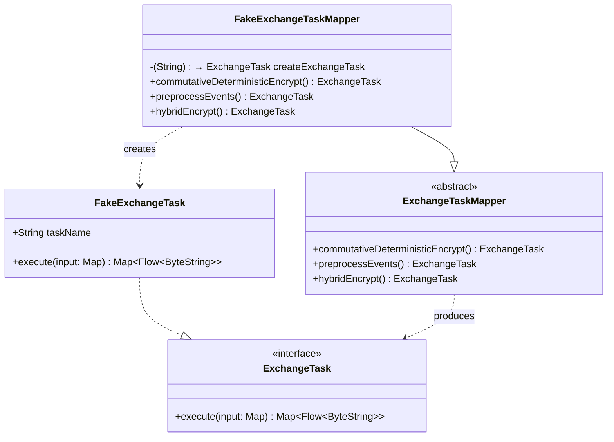

# org.wfanet.panelmatch.client.exchangetasks.testing

## Overview
This package provides testing utilities for the Panel Match client exchange tasks framework. It includes a fake implementation of ExchangeTask for unit testing, a fake mapper that generates test tasks for all exchange operations, and a helper function for executing tasks with in-memory storage.

## Components

### FakeExchangeTask
Test double implementation of ExchangeTask that prefixes outputs with task names for verification in tests.

| Method | Parameters | Returns | Description |
|--------|------------|---------|-------------|
| execute | `input: Map<String, StorageClient.Blob>` | `Map<String, Flow<ByteString>>` | Transforms input blobs by prefixing keys and values with task identifier |

**Constructor Parameters:**
| Parameter | Type | Description |
|-----------|------|-------------|
| taskName | `String` | Identifier used to prefix output keys and values |

### FakeExchangeTaskMapper
Test implementation of ExchangeTaskMapper that creates fake tasks for all exchange operations using configurable factory.

| Method | Parameters | Returns | Description |
|--------|------------|---------|-------------|
| commutativeDeterministicEncrypt | `ExchangeContext` | `ExchangeTask` | Creates fake commutative deterministic encryption task |
| commutativeDeterministicDecrypt | `ExchangeContext` | `ExchangeTask` | Creates fake commutative deterministic decryption task |
| commutativeDeterministicReEncrypt | `ExchangeContext` | `ExchangeTask` | Creates fake commutative deterministic re-encryption task |
| generateCommutativeDeterministicEncryptionKey | `ExchangeContext` | `ExchangeTask` | Creates fake encryption key generation task |
| preprocessEvents | `ExchangeContext` | `ExchangeTask` | Creates fake event preprocessing task |
| buildPrivateMembershipQueries | `ExchangeContext` | `ExchangeTask` | Creates fake private membership query builder task |
| executePrivateMembershipQueries | `ExchangeContext` | `ExchangeTask` | Creates fake private membership query executor task |
| decryptMembershipResults | `ExchangeContext` | `ExchangeTask` | Creates fake membership result decryption task |
| generateSerializedRlweKeyPair | `ExchangeContext` | `ExchangeTask` | Creates fake RLWE key pair generation task |
| generateExchangeCertificate | `ExchangeContext` | `ExchangeTask` | Creates fake certificate generation task |
| generateLookupKeys | `ExchangeContext` | `ExchangeTask` | Creates fake lookup key generation task |
| intersectAndValidate | `ExchangeContext` | `ExchangeTask` | Creates fake intersection and validation task |
| input | `ExchangeContext` | `ExchangeTask` | Creates fake input task |
| copyFromPreviousExchange | `ExchangeContext` | `ExchangeTask` | Creates fake previous exchange copy task |
| copyFromSharedStorage | `ExchangeContext` | `ExchangeTask` | Creates fake shared storage read task |
| copyToSharedStorage | `ExchangeContext` | `ExchangeTask` | Creates fake shared storage write task |
| hybridEncrypt | `ExchangeContext` | `ExchangeTask` | Creates fake hybrid encryption task |
| hybridDecrypt | `ExchangeContext` | `ExchangeTask` | Creates fake hybrid decryption task |
| generateHybridEncryptionKeyPair | `ExchangeContext` | `ExchangeTask` | Creates fake hybrid encryption key pair generation task |
| generateRandomBytes | `ExchangeContext` | `ExchangeTask` | Creates fake random byte generation task |
| assignJoinKeyIds | `ExchangeContext` | `ExchangeTask` | Creates fake join key ID assignment task |
| readEncryptedEventsFromBigQuery | `ExchangeContext` | `ExchangeTask` | Creates fake BigQuery encrypted event reader task |
| writeKeysToBigQuery | `ExchangeContext` | `ExchangeTask` | Creates fake BigQuery key writer task |
| writeEventsToBigQuery | `ExchangeContext` | `ExchangeTask` | Creates fake BigQuery event writer task |
| decryptAndMatchEvents | `ExchangeContext` | `ExchangeTask` | Creates fake event decryption and matching task |

**Constructor Parameters:**
| Parameter | Type | Description |
|-----------|------|-------------|
| createExchangeTask | `(String) -> ExchangeTask` | Factory function for creating tasks, defaults to FakeExchangeTask constructor |

## Extensions

### executeToByteStrings
Helper extension function on ExchangeTask that executes the task with in-memory storage and returns materialized ByteString outputs.

| Function | Receiver | Parameters | Returns | Description |
|----------|----------|------------|---------|-------------|
| executeToByteStrings | `ExchangeTask` | `vararg inputs: Pair<String, ByteString>` | `Map<String, ByteString>` | Executes task using InMemoryStorageClient and flattens output flows to ByteStrings |

## Dependencies
- `com.google.protobuf` - ByteString data type for binary content
- `kotlinx.coroutines` - Coroutine support for asynchronous execution
- `org.wfanet.measurement.common` - Utilities including flow flattening
- `org.wfanet.measurement.storage` - StorageClient abstraction
- `org.wfanet.measurement.storage.testing` - InMemoryStorageClient for testing
- `org.wfanet.panelmatch.client.common` - ExchangeContext type
- `org.wfanet.panelmatch.client.exchangetasks` - ExchangeTask and ExchangeTaskMapper interfaces
- `org.wfanet.panelmatch.client.logger` - TaskLog for coroutine context
- `org.wfanet.panelmatch.common.storage` - Storage utility extensions

## Usage Example
```kotlin
// Create a fake task
val task = FakeExchangeTask("test-task")

// Execute with test inputs using helper
val outputs = task.executeToByteStrings(
  "input1" to "data1".toByteStringUtf8(),
  "input2" to "data2".toByteStringUtf8()
)

// Verify output keys and values are prefixed
assert(outputs.containsKey("Out:input1"))
assert(outputs["Out:input1"]?.toStringUtf8() == "Out:test-task-data1")

// Use fake mapper in tests
val mapper = FakeExchangeTaskMapper()
val encryptTask = with(mapper) {
  ExchangeContext(...).commutativeDeterministicEncrypt()
}
```

## Class Diagram

