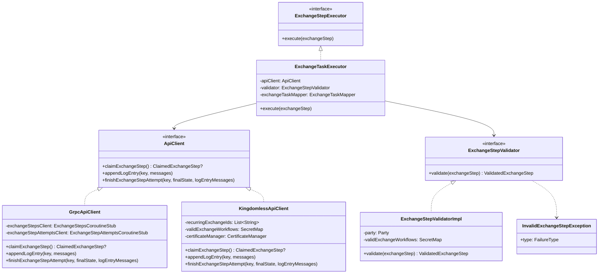

# org.wfanet.panelmatch.client.launcher

## Overview
The launcher package orchestrates the execution of Panel Match exchange workflows by claiming exchange steps from centralized APIs, validating them, executing associated tasks, and managing execution state. It provides both Kingdom-based and Kingdomless implementations for distributed panel matching operations.

## Components

### ApiClient
Interface abstracting interactions with centralized Panel Match APIs for claiming, logging, and completing exchange steps.

| Method | Parameters | Returns | Description |
|--------|------------|---------|-------------|
| claimExchangeStep | none | `ClaimedExchangeStep?` | Attempts to fetch an unvalidated exchange step to work on |
| appendLogEntry | `key: ExchangeStepAttemptKey`, `messages: Iterable<String>` | `Unit` | Attaches debug log entries to an exchange step attempt |
| finishExchangeStepAttempt | `key: ExchangeStepAttemptKey`, `finalState: ExchangeStepAttempt.State`, `logEntryMessages: Iterable<String>` | `Unit` | Marks an exchange step attempt as complete with final state |

### GrpcApiClient
Concrete implementation of ApiClient using gRPC to communicate with Kingdom services.

| Method | Parameters | Returns | Description |
|--------|------------|---------|-------------|
| claimExchangeStep | none | `ClaimedExchangeStep?` | Claims ready exchange steps via gRPC ExchangeSteps service |
| appendLogEntry | `key: ExchangeStepAttemptKey`, `messages: Iterable<String>` | `Unit` | Appends log entries via gRPC ExchangeStepAttempts service |
| finishExchangeStepAttempt | `key: ExchangeStepAttemptKey`, `finalState: ExchangeStepAttempt.State`, `logEntryMessages: Iterable<String>` | `Unit` | Finishes attempt and sends final state to Kingdom |

**Constructor Parameters:**
- `identity: Identity` - Identity of the party running the client
- `exchangeStepsClient: ExchangeStepsCoroutineStub` - gRPC stub for ExchangeSteps service
- `exchangeStepAttemptsClient: ExchangeStepAttemptsCoroutineStub` - gRPC stub for ExchangeStepAttempts service
- `clock: Clock` - Clock for timestamping log entries (defaults to system UTC)

### KingdomlessApiClient
Implementation of ApiClient for running panel match without a Kingdom, using shared storage for coordination.

| Method | Parameters | Returns | Description |
|--------|------------|---------|-------------|
| claimExchangeStep | none | `ClaimedExchangeStep?` | Claims steps by managing checkpoints in shared storage |
| appendLogEntry | `key: ExchangeStepAttemptKey`, `messages: Iterable<String>` | `Unit` | Appends log entries to checkpoint in shared storage |
| finishExchangeStepAttempt | `key: ExchangeStepAttemptKey`, `finalState: ExchangeStepAttempt.State`, `logEntryMessages: Iterable<String>` | `Unit` | Updates checkpoint with final attempt state |

**Constructor Parameters:**
- `identity: Identity` - Identity of the party running the daemon
- `recurringExchangeIds: List<String>` - Recurring exchange IDs to search for steps
- `validExchangeWorkflows: SecretMap` - Pre-shared serialized workflows
- `certificateManager: CertificateManager` - Manages certificates for verifying signed checkpoints
- `algorithm: SignatureAlgorithm` - Algorithm for signing checkpoints
- `lookbackWindow: Duration` - How far in the past to search for steps
- `stepTimeout: Duration` - Timeout duration for in-progress steps
- `clock: Clock` - Clock for accessing current time
- `getSharedStorage: suspend (ExchangeDateKey) -> StorageClient` - Function to build shared storage client

### ExchangeStepExecutor
Interface defining execution contract for claimed exchange steps.

| Method | Parameters | Returns | Description |
|--------|------------|---------|-------------|
| execute | `exchangeStep: ApiClient.ClaimedExchangeStep` | `Unit` | Executes the given claimed exchange step |

### ExchangeTaskExecutor
Validates and executes the work required for claimed exchange steps by mapping steps to tasks, managing I/O, and handling execution lifecycle.

| Method | Parameters | Returns | Description |
|--------|------------|---------|-------------|
| execute | `exchangeStep: ApiClient.ClaimedExchangeStep` | `Unit` | Validates step, runs associated task, and manages state transitions |

**Constructor Parameters:**
- `apiClient: ApiClient` - API client for communicating with Kingdom or shared storage
- `timeout: Timeout` - Timeout for task execution
- `privateStorageSelector: PrivateStorageSelector` - Selects private storage for exchange data
- `exchangeTaskMapper: ExchangeTaskMapper` - Maps workflow steps to executable tasks
- `validator: ExchangeStepValidator` - Validates claimed steps before execution

### ExchangeStepValidator
Interface for determining whether a claimed exchange step is valid and can be safely executed.

| Method | Parameters | Returns | Description |
|--------|------------|---------|-------------|
| validate | `exchangeStep: ApiClient.ClaimedExchangeStep` | `ValidatedExchangeStep` | Validates exchange step or throws InvalidExchangeStepException |

### ExchangeStepValidatorImpl
Real implementation of ExchangeStepValidator that validates workflow fingerprints, step indices, party assignments, and exchange dates.

| Method | Parameters | Returns | Description |
|--------|------------|---------|-------------|
| validate | `exchangeStep: ApiClient.ClaimedExchangeStep` | `ValidatedExchangeStep` | Performs comprehensive validation of claimed exchange step |

**Constructor Parameters:**
- `party: ExchangeWorkflow.Party` - The party executing this validator
- `validExchangeWorkflows: SecretMap` - Map of valid pre-shared workflows
- `clock: Clock` - Clock for validating exchange dates

### InvalidExchangeStepException
Exception indicating that an exchange step is not valid to execute.

**Constructor Parameters:**
- `type: FailureType` - Classification of failure (PERMANENT or TRANSIENT)
- `message: String` - Exception message

## Extensions

### ApiClient.withMaxParallelClaimedExchangeSteps
Extension function that decorates an ApiClient to enforce a maximum number of parallel claimed exchange steps.

| Function | Parameters | Returns | Description |
|----------|------------|---------|-------------|
| withMaxParallelClaimedExchangeSteps | `maxParallelClaimedExchangeSteps: Int` | `ApiClient` | Returns decorated client enforcing concurrency limit |

## Data Structures

### ApiClient.ClaimedExchangeStep
| Property | Type | Description |
|----------|------|-------------|
| attemptKey | `ExchangeStepAttemptKey` | Unique identifier for the attempt |
| exchangeDate | `LocalDate` | Date of the exchange |
| stepIndex | `Int` | Index of the step in the workflow |
| workflow | `ExchangeWorkflow` | Complete workflow definition |
| workflowFingerprint | `ByteString` | SHA-256 fingerprint of serialized workflow |

### ExchangeStepValidator.ValidatedExchangeStep
| Property | Type | Description |
|----------|------|-------------|
| workflow | `ExchangeWorkflow` | Validated workflow definition |
| step | `ExchangeWorkflow.Step` | Specific step to execute |
| date | `LocalDate` | Exchange date |

### InvalidExchangeStepException.FailureType
| Value | Description |
|-------|-------------|
| PERMANENT | Step is fundamentally invalid and should not be retried |
| TRANSIENT | Step is temporarily invalid and may succeed on retry |

## Dependencies
- `org.wfanet.measurement.api.v2alpha` - gRPC service stubs for Kingdom communication
- `org.wfanet.measurement.storage` - Storage abstraction for blob management
- `org.wfanet.panelmatch.client.common` - Common types (ExchangeStepAttemptKey, Identity, ExchangeContext)
- `org.wfanet.panelmatch.client.internal` - Internal protobuf definitions (ExchangeWorkflow, ExchangeStepAttempt, ExchangeCheckpoint)
- `org.wfanet.panelmatch.client.exchangetasks` - Task execution framework (ExchangeTask, ExchangeTaskMapper)
- `org.wfanet.panelmatch.client.logger` - Logging utilities for task execution
- `org.wfanet.panelmatch.client.storage` - Private storage selection
- `org.wfanet.panelmatch.common` - Common utilities (Timeout, Fingerprinters, SecretMap)
- `org.wfanet.panelmatch.common.certificates` - Certificate management for Kingdomless mode
- `com.google.protobuf` - Protocol buffer serialization
- `kotlinx.coroutines` - Coroutine support for async operations

## Usage Example
```kotlin
// Kingdom-based execution
val identity = Identity(party = Party.DATA_PROVIDER, id = "data-provider-1")
val apiClient = GrpcApiClient(
    identity = identity,
    exchangeStepsClient = exchangeStepsStub,
    exchangeStepAttemptsClient = exchangeStepAttemptsStub
)

val validator = ExchangeStepValidatorImpl(
    party = Party.DATA_PROVIDER,
    validExchangeWorkflows = secretMap,
    clock = Clock.systemUTC()
)

val executor = ExchangeTaskExecutor(
    apiClient = apiClient,
    timeout = timeout,
    privateStorageSelector = storageSelector,
    exchangeTaskMapper = taskMapper,
    validator = validator
)

// Claim and execute steps
val claimedStep = apiClient.claimExchangeStep()
if (claimedStep != null) {
    executor.execute(claimedStep)
}
```

## Class Diagram

