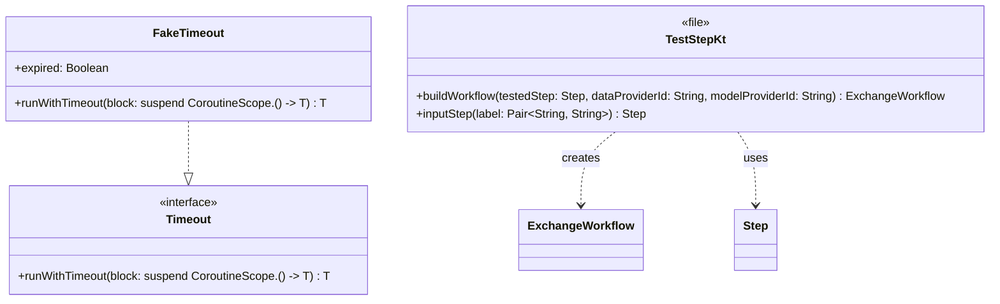

# org.wfanet.panelmatch.client.launcher.testing

## Overview
Provides testing utilities for the panel match client launcher framework. This package contains test doubles and helper functions for testing exchange workflow steps and timeout behavior in unit tests. It enables isolated testing of workflow components without requiring full integration setup.

## Components

### FakeTimeout
Test double implementation of the `Timeout` interface for controlled timeout testing.

| Method | Parameters | Returns | Description |
|--------|------------|---------|-------------|
| runWithTimeout | `block: suspend CoroutineScope.() -> T` | `T` | Executes block or throws CancellationException if expired |

| Property | Type | Description |
|----------|------|-------------|
| expired | `Boolean` | Controls whether timeout cancellation is triggered |

### TestStep.kt (Top-level Functions)
Workflow builder utilities for constructing test exchange workflows.

| Function | Parameters | Returns | Description |
|----------|------------|---------|-------------|
| buildWorkflow | `testedStep: Step, dataProviderId: String, modelProviderId: String` | `ExchangeWorkflow` | Constructs minimal workflow containing specified step and identifiers |
| inputStep | `label: Pair<String, String>` | `Step` | Creates input step with single output label mapping |

## Data Structures

### FakeTimeout
| Property | Type | Description |
|----------|------|-------------|
| expired | `Boolean` | Mutable flag controlling cancellation behavior; defaults to false |

## Dependencies
- `org.wfanet.panelmatch.common.Timeout` - Interface for timeout mechanism being faked
- `org.wfanet.panelmatch.client.internal.ExchangeWorkflow` - Workflow types used in test construction
- `kotlinx.coroutines` - Coroutine support for timeout simulation

## Usage Example
```kotlin
// Testing timeout behavior
val timeout = FakeTimeout()
timeout.expired = false
val result = timeout.runWithTimeout {
    performOperation()
} // succeeds

timeout.expired = true
timeout.runWithTimeout {
    performOperation()
} // throws CancellationException

// Building test workflows
val testStep = step { /* ... */ }
val workflow = buildWorkflow(
    testedStep = testStep,
    dataProviderId = "data-provider-1",
    modelProviderId = "model-provider-1"
)

val inputStepWithLabel = inputStep("key" to "value")
```

## Class Diagram

