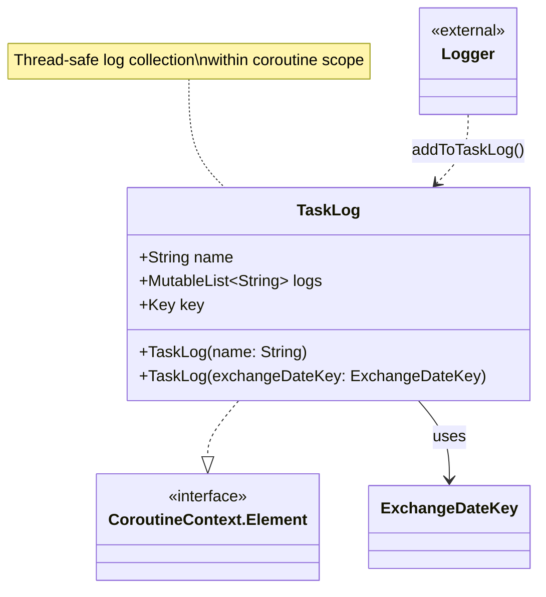

# org.wfanet.panelmatch.client.logger

## Overview
This package provides coroutine-based task logging infrastructure for the panel match client. It enables thread-safe log aggregation within specific coroutine contexts, allowing tasks to collect and retrieve logs scoped to their execution lifecycle.

## Components

### TaskLog
A coroutine context element that maintains a synchronized list of log messages for a specific task execution.

| Method | Parameters | Returns | Description |
|--------|------------|---------|-------------|
| TaskLog (primary constructor) | `name: String` | `TaskLog` | Creates a task log with a specified name |
| TaskLog (secondary constructor) | `exchangeDateKey: ExchangeDateKey` | `TaskLog` | Creates a task log using the path from an ExchangeDateKey |

**Properties:**

| Property | Type | Description |
|----------|------|-------------|
| name | `String` | Identifier for the task being logged |
| logs | `MutableList<String>` | Thread-safe list of accumulated log messages |
| key | `CoroutineContext.Key<TaskLog>` | Context key for retrieving TaskLog from coroutine context |

**Companion Object:**

- `Key` - Coroutine context key object for TaskLog lookup

## Extension Functions

### Logger.addToTaskLog (String variant)
Adds a string message to the current task log and logs it using Java's Logger.

| Parameter | Type | Description |
|-----------|------|-------------|
| logMessage | `String` | Message to log |
| level | `Level` | Logging level (defaults to INFO) |

**Returns:** `Unit`

**Behavior:**
- Retrieves current TaskLog from coroutine context
- Prefixes message with task name in brackets
- Adds message to TaskLog's synchronized list
- Logs message at specified level

### Logger.addToTaskLog (Throwable variant)
Adds an exception message to the current task log and logs the throwable.

| Parameter | Type | Description |
|-----------|------|-------------|
| throwable | `Throwable` | Exception to log |
| level | `Level` | Logging level (defaults to INFO) |

**Returns:** `Unit`

**Behavior:**
- Retrieves current TaskLog from coroutine context
- Formats exception message with task name prefix
- Adds formatted message to TaskLog
- Logs throwable with task name as context

## Utility Functions

### currentTaskLog
Retrieves the TaskLog from the current coroutine context.

| Returns | Description |
|---------|-------------|
| `TaskLog?` | The TaskLog associated with the current coroutine, or null if none exists |

**Usage:** Call from within a coroutine that has TaskLog in its context.

### getAndClearTaskLog
Atomically retrieves and clears all accumulated logs from the current task.

| Returns | Description |
|---------|-------------|
| `List<String>` | Immutable copy of all log messages |

**Behavior:**
- Synchronizes on the logs list
- Creates a defensive copy of all messages
- Clears the original list
- Returns the copy

## Dependencies

- `java.util.Collections` - Provides thread-safe list wrapper
- `java.util.logging` - Standard Java logging infrastructure (Level, Logger)
- `kotlin.coroutines` - Coroutine context management
- `org.wfanet.panelmatch.common.ExchangeDateKey` - Domain model for exchange identification

## Usage Example

```kotlin
import java.util.logging.Logger
import org.wfanet.panelmatch.client.logger.TaskLog
import org.wfanet.panelmatch.client.logger.addToTaskLog
import org.wfanet.panelmatch.client.logger.getAndClearTaskLog
import org.wfanet.panelmatch.common.ExchangeDateKey
import java.time.LocalDate

suspend fun executeTask() {
  val logger = Logger.getLogger("MyTask")

  // Add logs within a coroutine context containing TaskLog
  logger.addToTaskLog("Task started successfully")
  logger.addToTaskLog("Processing data...")

  try {
    // ... task execution
    logger.addToTaskLog("Task completed")
  } catch (e: Exception) {
    logger.addToTaskLog(e, java.util.logging.Level.SEVERE)
  }

  // Retrieve all logs and clear
  val taskLogs = getAndClearTaskLog()
  println("Collected ${taskLogs.size} log entries")
}

// Setting up coroutine context with TaskLog
withContext(TaskLog(ExchangeDateKey("exchange-123", LocalDate.now()))) {
  executeTask()
}
```

## Class Diagram



## Thread Safety

All log operations are thread-safe:
- `TaskLog.logs` is backed by `Collections.synchronizedList()`
- `getAndClearTaskLog()` explicitly synchronizes during copy and clear operations
- Multiple coroutines can safely add logs to the same TaskLog instance

## Error Handling

Both `addToTaskLog()` variants and `getAndClearTaskLog()` use `requireNotNull()` on the TaskLog retrieved from the coroutine context. If no TaskLog is present, these functions will throw `IllegalArgumentException`. Ensure TaskLog is present in the coroutine context before calling these functions.
