# org.wfanet.panelmatch.client.privatemembership

## Overview
This package implements a privacy-preserving Private Information Retrieval (PIR) system using homomorphic encryption and oblivious query expansion. It enables secure database queries where the querier can retrieve data without revealing which records were queried, while the database owner learns nothing about the query contents. The implementation uses Apache Beam for distributed processing and integrates with C++ cryptographic libraries via JNI.

## Components

### Bucketing
Distributes keys across shards and buckets for partitioned query processing.

| Method | Parameters | Returns | Description |
|--------|------------|---------|-------------|
| apply | `value: Long` | `Pair<ShardId, BucketId>` | Computes shard and bucket for a key |
| shard | `value: Long` | `ShardId` | Determines shard using modulo division |
| bucket | `value: Long` | `BucketId` | Determines bucket within shard |

### CreateQueries
Apache Beam transform that encrypts queries for oblivious expansion.

| Method | Parameters | Returns | Description |
|--------|------------|---------|-------------|
| createQueries | `lookupKeyAndIds: PCollection<LookupKeyAndId>`, `privateMembershipKeys: PCollectionView<AsymmetricKeyPair>`, `parameters: CreateQueriesParameters`, `privateMembershipCryptor: PrivateMembershipCryptor` | `CreateQueriesOutputs` | Encrypts lookup keys into query bundles |
| expand | `input: PCollection<LookupKeyAndId>` | `PCollectionTuple` | Internal pipeline orchestration method |
| shardLookupKeys | `lookupKeys: PCollection<LookupKeyAndId>` | `PCollection<KV<ShardId, Iterable<BucketQuery>>>` | Groups keys by shard |
| addPaddedQueries | `queries: PCollection<KV<ShardId, Iterable<BucketQuery>>>` | `PCollectionTuple` | Adds padding to obfuscate query count |
| buildUnencryptedQueries | `queries: PCollection<KV<ShardId, Iterable<BucketQuery>>>` | `PCollection<KV<ShardId, List<FullUnencryptedQuery>>>` | Assigns unique query IDs |
| encryptQueries | `unencryptedQueries: PCollection<KV<ShardId, List<FullUnencryptedQuery>>>`, `privateMembershipKeys: PCollectionView<AsymmetricKeyPair>` | `PCollection<EncryptedQueryBundle>` | Encrypts queries per shard |

### EvaluateQueries
Apache Beam transform that executes encrypted queries on database shards using homomorphic encryption.

| Method | Parameters | Returns | Description |
|--------|------------|---------|-------------|
| evaluateQueries | `database: PCollection<DatabaseEntry>`, `queryBundles: PCollection<EncryptedQueryBundle>`, `serializedPublicKey: PCollectionView<ByteString>`, `paddingNonces: PCollectionView<Map<QueryId, PaddingNonce>>`, `parameters: EvaluateQueriesParameters`, `queryEvaluator: QueryEvaluator` | `PCollection<EncryptedQueryResult>` | Executes encrypted queries on database |
| expand | `input: PCollectionTuple` | `PCollection<EncryptedQueryResult>` | Joins database and queries by shard |

### DecryptQueryResults
Apache Beam transform that decrypts and decompresses query results.

| Method | Parameters | Returns | Description |
|--------|------------|---------|-------------|
| decryptQueryResults | `encryptedQueryResults: PCollection<EncryptedQueryResult>`, `plaintextJoinKeyAndIds: PCollection<JoinKeyAndId>`, `decryptedJoinKeyAndIds: PCollection<JoinKeyAndId>`, `queryIdAndIds: PCollection<QueryIdAndId>`, `compressionParameters: PCollectionView<CompressionParameters>`, `privateMembershipKeys: PCollectionView<AsymmetricKeyPair>`, `parameters: Any`, `queryResultsDecryptor: QueryResultsDecryptor`, `hkdfPepper: ByteString` | `PCollection<KeyedDecryptedEventDataSet>` | Decrypts encrypted query results |
| removeDiscardedJoinKeys | `discardedJoinKeys: List<JoinKeyIdentifier>` | `List<JoinKeyAndId>` | Filters out discarded join keys |

### PrivateMembershipCryptor
Interface for oblivious query encryption and key generation.

| Method | Parameters | Returns | Description |
|--------|------------|---------|-------------|
| generateKeys | - | `AsymmetricKeyPair` | Generates public and private keypair |
| encryptQueries | `unencryptedQueries: Iterable<UnencryptedQuery>`, `keys: AsymmetricKeyPair` | `ByteString` | Encrypts queries using public key |

### JniPrivateMembershipCryptor
JNI-based implementation of PrivateMembershipCryptor using C++ cryptographic libraries.

| Method | Parameters | Returns | Description |
|--------|------------|---------|-------------|
| generateKeys | - | `AsymmetricKeyPair` | Calls C++ key generation via JNI |
| encryptQueries | `unencryptedQueries: Iterable<UnencryptedQuery>`, `keys: AsymmetricKeyPair` | `ByteString` | Encrypts queries via C++ wrapper |

### QueryEvaluator
Interface for executing encrypted queries on database shards.

| Method | Parameters | Returns | Description |
|--------|------------|---------|-------------|
| executeQueries | `shards: List<DatabaseShard>`, `queryBundles: List<EncryptedQueryBundle>`, `paddingNonces: Map<QueryId, PaddingNonce>`, `serializedPublicKey: ByteString` | `List<EncryptedQueryResult>` | Executes encrypted queries homomorphically |

### JniQueryEvaluator
JNI-based QueryEvaluator implementation calling C++ private membership library.

| Method | Parameters | Returns | Description |
|--------|------------|---------|-------------|
| executeQueries | `shards: List<DatabaseShard>`, `queryBundles: List<EncryptedQueryBundle>`, `paddingNonces: Map<QueryId, PaddingNonce>`, `serializedPublicKey: ByteString` | `List<EncryptedQueryResult>` | Validates shard consistency and executes |

### QueryPreparer
Interface for preparing join keys for querying by hashing to lookup keys.

| Method | Parameters | Returns | Description |
|--------|------------|---------|-------------|
| prepareLookupKeys | `identifierHashPepper: ByteString`, `decryptedJoinKeyAndIds: List<JoinKeyAndId>` | `List<LookupKeyAndId>` | Hashes join keys to uint64 lookup keys |

### JniQueryPreparer
JNI-based QueryPreparer implementation.

| Method | Parameters | Returns | Description |
|--------|------------|---------|-------------|
| prepareLookupKeys | `identifierHashPepper: ByteString`, `decryptedJoinKeyAndIds: List<JoinKeyAndId>` | `List<LookupKeyAndId>` | Calls C++ hasher via JNI wrapper |

### QueryResultsDecryptor
Interface for decrypting computationally symmetric PIR query results.

| Method | Parameters | Returns | Description |
|--------|------------|---------|-------------|
| decryptQueryResults | `parameters: DecryptQueryResultsParameters` | `DecryptQueryResultsResponse` | Decrypts and decompresses query results |

### JniQueryResultsDecryptor
JNI-based implementation of QueryResultsDecryptor.

| Method | Parameters | Returns | Description |
|--------|------------|---------|-------------|
| decryptQueryResults | `parameters: DecryptQueryResultsParameters` | `DecryptQueryResultsResponse` | Decrypts via C++ decryption library |

### JniPrivateMembership
Type-safe wrapper over the PrivateMembershipSwig JNI interface.

| Method | Parameters | Returns | Description |
|--------|------------|---------|-------------|
| applyQueries | `request: ApplyQueriesRequest` | `ApplyQueriesResponse` | Executes queries on database |
| decryptQueries | `request: DecryptQueriesRequest` | `DecryptQueriesResponse` | Decrypts encrypted queries |
| encryptQueries | `request: EncryptQueriesRequest` | `EncryptQueriesResponse` | Encrypts plaintext queries |
| generateKeys | `request: GenerateKeysRequest` | `GenerateKeysResponse` | Generates cryptographic keypair |

### PaddingQueries
Utilities for identifying and creating padding queries to obfuscate true query count.

| Function | Parameters | Returns | Description |
|----------|------------|---------|-------------|
| makePaddingQueryJoinKeyIdentifier | - | `JoinKeyIdentifier` | Creates random padding query identifier |
| isPaddingQuery | `this: JoinKeyIdentifier` | `Boolean` | Checks if identifier is padding query |

### QueryIdGenerator
Generates unique random query IDs within a bounded range.

| Function | Parameters | Returns | Description |
|----------|------------|---------|-------------|
| generateQueryIds | `upperBound: Int` | `Iterator<Int>` | Yields random IDs in range [0, upperBound) |

### Coders
Apache Beam coder definitions for custom types.

| Property | Type | Description |
|----------|------|-------------|
| paddingNonceMapCoder | `Coder<Map<QueryId, PaddingNonce>>` | Coder for padding nonce maps |

## Data Structures

### CreateQueriesParameters
| Property | Type | Description |
|----------|------|-------------|
| numShards | `Int` | Number of database shards |
| numBucketsPerShard | `Int` | Buckets per shard for partitioning |
| maxQueriesPerShard | `Int` | Maximum queries per shard |
| padQueries | `Boolean` | Whether to add padding queries |

### EvaluateQueriesParameters
| Property | Type | Description |
|----------|------|-------------|
| numShards | `Int` | Number of database shards |
| numBucketsPerShard | `Int` | Buckets per shard |
| maxQueriesPerShard | `Int` | Maximum queries allowed per shard |

### DecryptQueryResultsParameters
| Property | Type | Description |
|----------|------|-------------|
| parameters | `Any` | Serialized cryptographic parameters |
| hkdfPepper | `ByteString` | Pepper for HKDF key derivation |
| serializedPublicKey | `ByteString` | Serialized public key |
| serializedPrivateKey | `ByteString` | Serialized private key |
| compressionParameters | `CompressionParameters` | Decompression configuration |
| decryptedJoinKey | `JoinKey` | Join key for AES decryption |
| encryptedQueryResults | `Iterable<EncryptedQueryResult>` | Results to decrypt |

### CreateQueriesOutputs
| Property | Type | Description |
|----------|------|-------------|
| queryIdMap | `PCollection<QueryIdAndId>` | Maps query IDs to join key identifiers |
| encryptedQueryBundles | `PCollection<EncryptedQueryBundle>` | Encrypted query bundles per shard |
| discardedJoinKeyCollection | `PCollection<JoinKeyIdentifierCollection>` | Join keys exceeding shard capacity |

### Protobuf Messages
| Message | Fields | Description |
|---------|--------|-------------|
| ShardId | `id: Int` | Shard identifier |
| BucketId | `id: Int` | Bucket identifier within shard |
| QueryId | `id: Int` | Unique query identifier |
| EncryptedQueryBundle | `shard_id: ShardId`, `query_ids: [QueryId]`, `serialized_encrypted_queries: bytes` | Encrypted queries for a shard |
| QueryIdAndId | `query_id: QueryId`, `join_key_identifier: JoinKeyIdentifier` | Links query to join key |
| EncryptedQueryResult | `query_id: QueryId`, `serialized_encrypted_query_result: bytes` | Encrypted result for a query |
| Plaintext | `payload: bytes` | Decrypted query result payload |
| BucketContents | `items: [bytes]` | Items in a database bucket |

## Dependencies
- `org.apache.beam` - Distributed data processing framework for pipeline orchestration
- `com.google.privatemembership.batch` - C++ private membership protocol via protobuf
- `org.wfanet.panelmatch.client.exchangetasks` - Join key types and data exchange definitions
- `org.wfanet.panelmatch.client.common` - Common utilities for bucketing and identifiers
- `org.wfanet.panelmatch.common.crypto` - Asymmetric cryptography key pair definitions
- `org.wfanet.panelmatch.common.compression` - Compression parameters for result data
- `org.wfanet.panelmatch.common.beam` - Beam utility extensions and operators
- `org.wfanet.panelmatch.protocol.privatemembership` - JNI SWIG wrapper for C++ libraries
- `org.wfanet.panelmatch.protocol.querypreparer` - JNI wrapper for query preparation
- `org.wfanet.panelmatch.protocol.decryptqueryresults` - JNI wrapper for result decryption

## Usage Example
```kotlin
// 1. Generate cryptographic keys
val cryptor = JniPrivateMembershipCryptor(parameters)
val keys = cryptor.generateKeys()

// 2. Create encrypted queries from lookup keys
val queryOutputs = createQueries(
  lookupKeyAndIds = lookupKeys,
  privateMembershipKeys = keysView,
  parameters = CreateQueriesParameters(
    numShards = 10,
    numBucketsPerShard = 100,
    maxQueriesPerShard = 5000,
    padQueries = true
  ),
  privateMembershipCryptor = cryptor
)

// 3. Evaluate queries on database
val evaluator = JniQueryEvaluator(parameters)
val encryptedResults = evaluateQueries(
  database = databaseEntries,
  queryBundles = queryOutputs.encryptedQueryBundles,
  serializedPublicKey = publicKeyView,
  paddingNonces = paddingNoncesView,
  parameters = EvaluateQueriesParameters(
    numShards = 10,
    numBucketsPerShard = 100,
    maxQueriesPerShard = 5000
  ),
  queryEvaluator = evaluator
)

// 4. Decrypt results
val decryptor = JniQueryResultsDecryptor()
val decryptedResults = decryptQueryResults(
  encryptedQueryResults = encryptedResults,
  plaintextJoinKeyAndIds = plaintextKeys,
  decryptedJoinKeyAndIds = decryptedKeys,
  queryIdAndIds = queryOutputs.queryIdMap,
  compressionParameters = compressionParamsView,
  privateMembershipKeys = keysView,
  parameters = parameters,
  queryResultsDecryptor = decryptor,
  hkdfPepper = pepper
)
```

## Class Diagram

```mermaid
classDiagram
    class PrivateMembershipCryptor {
        <<interface>>
        +generateKeys() AsymmetricKeyPair
        +encryptQueries(queries, keys) ByteString
    }

    class JniPrivateMembershipCryptor {
        -parameters: Any
        +generateKeys() AsymmetricKeyPair
        +encryptQueries(queries, keys) ByteString
    }

    class QueryEvaluator {
        <<interface>>
        +executeQueries(shards, bundles, nonces, key) List~EncryptedQueryResult~
    }

    class JniQueryEvaluator {
        -privateMembershipParameters: Parameters
        +executeQueries(shards, bundles, nonces, key) List~EncryptedQueryResult~
    }

    class QueryPreparer {
        <<interface>>
        +prepareLookupKeys(pepper, joinKeys) List~LookupKeyAndId~
    }

    class JniQueryPreparer {
        +prepareLookupKeys(pepper, joinKeys) List~LookupKeyAndId~
    }

    class QueryResultsDecryptor {
        <<interface>>
        +decryptQueryResults(parameters) DecryptQueryResultsResponse
    }

    class JniQueryResultsDecryptor {
        +decryptQueryResults(parameters) DecryptQueryResultsResponse
    }

    class JniPrivateMembership {
        <<object>>
        +applyQueries(request) ApplyQueriesResponse
        +decryptQueries(request) DecryptQueriesResponse
        +encryptQueries(request) EncryptQueriesResponse
        +generateKeys(request) GenerateKeysResponse
    }

    class CreateQueries {
        -privateMembershipKeys: PCollectionView
        -parameters: CreateQueriesParameters
        -privateMembershipCryptor: PrivateMembershipCryptor
        +expand(input) PCollectionTuple
    }

    class EvaluateQueries {
        -parameters: EvaluateQueriesParameters
        -queryEvaluator: QueryEvaluator
        +expand(input) PCollection
    }

    class DecryptQueryResults {
        -queryResultsDecryptor: QueryResultsDecryptor
        +expand(input) PCollection
    }

    class Bucketing {
        -numShards: Int
        -numBucketsPerShard: Int
        +apply(value) Pair~ShardId, BucketId~
    }

    JniPrivateMembershipCryptor --|> PrivateMembershipCryptor
    JniQueryEvaluator --|> QueryEvaluator
    JniQueryPreparer --|> QueryPreparer
    JniQueryResultsDecryptor --|> QueryResultsDecryptor

    JniPrivateMembershipCryptor --> JniPrivateMembership
    JniQueryEvaluator --> JniPrivateMembership
    JniQueryPreparer --> JniPrivateMembership
    JniQueryResultsDecryptor --> JniPrivateMembership

    CreateQueries --> PrivateMembershipCryptor
    CreateQueries --> Bucketing
    EvaluateQueries --> QueryEvaluator
    EvaluateQueries --> Bucketing
    DecryptQueryResults --> QueryResultsDecryptor
```

