# org.wfanet.panelmatch.client.privatemembership.testing

## Overview
Testing framework for private membership query operations in panel matching workflows. Provides abstract test base classes, plaintext and JNI-based test implementations, and helper utilities for validating query creation, evaluation, and decryption across sharded database architectures.

## Components

### AbstractCreateQueriesTest
Abstract base class for testing query creation workflows with sharding and padding.

| Method | Parameters | Returns | Description |
|--------|------------|---------|-------------|
| `Two Shards with no padding` | - | `Unit` | Validates query creation without padding across shards |
| `Two Shards with extra padding` | - | `Unit` | Validates padding queries fill to maxQueriesPerShard |
| addsPaddingQueriesToMissingShards | - | `Unit` | Ensures empty shards receive padding queries |
| `Two Shards with removed queries` | - | `Unit` | Tests query discarding when exceeding shard limits |

**Abstract Properties:**
- `privateMembershipSerializedParameters: ByteString` - Serialized crypto parameters
- `privateMembershipCryptor: PrivateMembershipCryptor` - Cryptor implementation under test
- `privateMembershipCryptorHelper: PrivateMembershipCryptorHelper` - Helper for decoding operations

### AbstractEvaluateQueriesEndToEndTest
End-to-end test base for query evaluation across database shards.

| Method | Parameters | Returns | Description |
|--------|------------|---------|-------------|
| endToEnd | - | `Unit` | Tests query evaluation with varying shard and bucket counts |
| makeQueryEvaluator | `parameters: EvaluateQueriesParameters` | `QueryEvaluator` | Factory method for test subject |
| makeHelper | `parameters: EvaluateQueriesParameters` | `QueryEvaluatorTestHelper` | Factory method for test helper |

### AbstractQueryEvaluatorTest
Unit test base for QueryEvaluator implementations.

| Method | Parameters | Returns | Description |
|--------|------------|---------|-------------|
| `executeQueries on multiple shards with multiple QueryBundles` | - | `Unit` | Tests query execution across multiple shards |
| `executeQueries same bucket with multiple shards` | - | `Unit` | Validates same bucket queries on different shards |

**Abstract Properties:**
- `evaluator: QueryEvaluator` - QueryEvaluator under test
- `helper: QueryEvaluatorTestHelper` - Test helper for encoding/decoding

### AbstractQueryPreparerTest
Base class for testing QueryPreparer implementations.

| Method | Parameters | Returns | Description |
|--------|------------|---------|-------------|
| testCryptor | - | `Unit` | Verifies prepareLookupKeys produces correct count |
| hashesAreEqual | - | `Unit` | Validates deterministic hashing with same pepper |
| hashesAreNotEqual | - | `Unit` | Validates different peppers produce different hashes |
| joinKeyIdentifiersAreEqual | - | `Unit` | Verifies join key identifiers preserved |

**Abstract Properties:**
- `queryPreparer: QueryPreparer` - QueryPreparer under test
- `identifierHashPepper: ByteString` - Pepper for identifier hashing

### JniQueryEvaluatorContext
Context holder for JNI-based Private Membership operations.

| Method | Parameters | Returns | Description |
|--------|------------|---------|-------------|
| JniQueryEvaluatorContext | `shardCount: Int, bucketsPerShardCount: Int` | Constructor | Initializes crypto parameters and key pair |

**Properties:**
- `privateMembershipParameters: Shared.Parameters` - Private membership protocol parameters
- `privateMembershipPublicKey: PublicKey` - Generated public key
- `privateMembershipPrivateKey: PrivateKey` - Generated private key

### JniQueryEvaluatorTestHelper
Test helper for JNI-based QueryEvaluator implementations.

| Method | Parameters | Returns | Description |
|--------|------------|---------|-------------|
| decodeResultData | `result: EncryptedQueryResult` | `BucketContents` | Decrypts query result using private key |
| makeQueryBundle | `shard: ShardId, queries: List<Pair<QueryId, BucketId>>` | `EncryptedQueryBundle` | Creates encrypted query bundle for shard |
| makeResult | `query: QueryId, rawPayload: ByteString` | `EncryptedQueryResult` | Constructs encrypted result from payload |
| makeEmptyResult | `query: QueryId` | `EncryptedQueryResult` | Creates empty encrypted result |

**Properties:**
- `serializedPublicKey: ByteString` - Serialized public key for verification

### PlaintextPrivateMembershipCryptor
Fake PrivateMembershipCryptor for testing without real encryption.

| Method | Parameters | Returns | Description |
|--------|------------|---------|-------------|
| generateKeys | - | `AsymmetricKeyPair` | Returns fake key pair with static strings |
| encryptQueries | `unencryptedQueries: Iterable<UnencryptedQuery>, keys: AsymmetricKeyPair` | `ByteString` | Serializes queries as plaintext bundle |

### PlaintextPrivateMembershipCryptorHelper
Helper for plaintext private membership operations.

| Method | Parameters | Returns | Description |
|--------|------------|---------|-------------|
| makeEncryptedQueryBundle | `shard: ShardId, queries: List<Pair<QueryId, BucketId>>` | `EncryptedQueryBundle` | Encodes bucket IDs as ListValue |
| decodeEncryptedQueryBundle | `queryBundle: EncryptedQueryBundle` | `List<ShardedQuery>` | Decodes bucket IDs from ListValue |
| makeEncryptedQueryResult | `keys: AsymmetricKeyPair, encryptedEventDataSet: EncryptedEventDataSet` | `EncryptedQueryResult` | Wraps encrypted event data as result |
| decodeEncryptedQueryResult | `result: EncryptedQueryResult` | `DecryptedQueryResult` | Parses encrypted result to bucket contents |
| makeEncryptedEventDataSet | `plaintext: DecryptedEventDataSet, joinkey: Pair<QueryId, JoinKey>` | `EncryptedEventDataSet` | Encrypts event data with join key |

### PlaintextQueryEvaluator
Fake QueryEvaluator using plaintext bucket selection via ListValue encoding.

| Method | Parameters | Returns | Description |
|--------|------------|---------|-------------|
| executeQueries | `shards: List<DatabaseShard>, queryBundles: List<EncryptedQueryBundle>, paddingNonces: Map<QueryId, PaddingNonce>, serializedPublicKey: ByteString` | `List<EncryptedQueryResult>` | Evaluates plaintext queries against database shards |

**Constructor Parameters:**
- `bucketsPerShard: Int` - Number of buckets per shard, padding queries use bucketId equal to this value

### PlaintextQueryEvaluatorTestHelper
Test helper singleton for PlaintextQueryEvaluator.

| Method | Parameters | Returns | Description |
|--------|------------|---------|-------------|
| decodeResultData | `result: EncryptedQueryResult` | `BucketContents` | Parses result as BucketContents directly |
| makeQueryBundle | `shard: ShardId, queries: List<Pair<QueryId, BucketId>>` | `EncryptedQueryBundle` | Encodes queries as ListValue of bucket IDs |
| makeResult | `query: QueryId, rawPayload: ByteString` | `EncryptedQueryResult` | Wraps payload directly as encrypted result |
| makeEmptyResult | `query: QueryId` | `EncryptedQueryResult` | Creates result with empty ByteString |

### PlaintextQueryPreparer
Plaintext QueryPreparer for testing without real cryptographic hashing.

| Method | Parameters | Returns | Description |
|--------|------------|---------|-------------|
| prepareLookupKeys | `identifierHashPepper: ByteString, decryptedJoinKeyAndIds: List<JoinKeyAndId>` | `List<LookupKeyAndId>` | Creates lookup keys using sum of sizes as hash |

### PlaintextQueryResultsDecryptor
Fake QueryResultsDecryptor for testing without real decryption.

| Method | Parameters | Returns | Description |
|--------|------------|---------|-------------|
| decryptQueryResults | `parameters: DecryptQueryResultsParameters` | `DecryptQueryResultsResponse` | Decrypts query results using fake symmetric cryptor |

**Constructor Parameters:**
- `privateMembershipCryptorHelper: PrivateMembershipCryptorHelper` - Helper for result decoding
- `symmetricCryptor: SymmetricCryptor` - Symmetric cryptor for event data

### PrivateMembershipCryptorHelper
Interface for testing Private Membership cryptographic operations.

| Method | Parameters | Returns | Description |
|--------|------------|---------|-------------|
| makeEncryptedQueryBundle | `shard: ShardId, queries: List<Pair<QueryId, BucketId>>` | `EncryptedQueryBundle` | Constructs encrypted query bundle for shard |
| decodeEncryptedQueryBundle | `queryBundle: EncryptedQueryBundle` | `List<ShardedQuery>` | Decodes query bundle to sharded queries |
| makeEncryptedQueryResult | `keys: AsymmetricKeyPair, encryptedEventDataSet: EncryptedEventDataSet` | `EncryptedQueryResult` | Creates encrypted result from event data |
| decodeEncryptedQueryResult | `result: EncryptedQueryResult` | `DecryptedQueryResult` | Decodes encrypted result to plaintext |
| makeEncryptedEventDataSet | `plaintext: DecryptedEventDataSet, joinkey: Pair<QueryId, JoinKey>` | `EncryptedEventDataSet` | Encrypts event data with join key |

### QueryEvaluatorTestHelper
Interface for test helpers supporting QueryEvaluator testing.

| Method | Parameters | Returns | Description |
|--------|------------|---------|-------------|
| decodeResult | `result: EncryptedQueryResult` | `DecodedResult` | Decodes result with query ID and data |
| decodeResultData | `result: EncryptedQueryResult` | `BucketContents` | Extracts bucket contents from result |
| makeQueryBundle | `shard: ShardId, queries: List<Pair<QueryId, BucketId>>` | `EncryptedQueryBundle` | Creates encrypted query bundle |
| makeResult | `query: QueryId, rawPayload: ByteString` | `EncryptedQueryResult` | Constructs encrypted result from payload |
| makeEmptyResult | `query: QueryId` | `EncryptedQueryResult` | Creates empty encrypted result |

**Properties:**
- `serializedPublicKey: ByteString` - Public key for verification

## Data Structures

### ShardedQuery
| Property | Type | Description |
|----------|------|-------------|
| shardId | `ShardId` | Shard identifier |
| queryId | `QueryId` | Query identifier |
| bucketId | `BucketId` | Bucket identifier within shard |

### DecodedResult
| Property | Type | Description |
|----------|------|-------------|
| queryId | `Int` | Query identifier as integer |
| data | `BucketContents` | Decoded bucket contents |

### EncryptedQuery
| Property | Type | Description |
|----------|------|-------------|
| shard | `ShardId` | Shard identifier |
| query | `QueryId` | Query identifier |

## Constants

**PRIVATE_MEMBERSHIP_CRYPTO_PARAMETERS**
Example cryptographic parameters for Private Membership protocol using lattice-based encryption. Includes request/response moduli, log degree, variance, recursion levels, and compression parameters.

## Dependencies
- `com.google.privatemembership.batch` - Private membership protocol implementation
- `org.wfanet.panelmatch.client.privatemembership` - Core private membership types
- `org.wfanet.panelmatch.client.exchangetasks` - Join key exchange types
- `org.wfanet.panelmatch.common.beam` - Apache Beam utilities
- `org.wfanet.panelmatch.common.crypto` - Cryptographic primitives
- `org.apache.beam.sdk` - Apache Beam framework
- `org.junit` - JUnit testing framework
- `com.google.common.truth` - Google Truth assertions

## Usage Example
```kotlin
// Plaintext testing scenario
class MyQueryEvaluatorTest : AbstractQueryEvaluatorTest() {
  override val evaluator = PlaintextQueryEvaluator(bucketsPerShard = 16)
  override val helper = PlaintextQueryEvaluatorTestHelper
  override val shardCount = 128
  override val bucketsPerShardCount = 16
}

// JNI-based testing scenario
class MyJniQueryEvaluatorTest : AbstractQueryEvaluatorTest() {
  private val context = JniQueryEvaluatorContext(
    shardCount = 128,
    bucketsPerShardCount = 16
  )
  override val evaluator = JniQueryEvaluator(context.privateMembershipParameters)
  override val helper = JniQueryEvaluatorTestHelper(context)
}
```

## Class Diagram

```mermaid
classDiagram
    class AbstractCreateQueriesTest {
        <<abstract>>
        +privateMembershipCryptor PrivateMembershipCryptor
        +privateMembershipCryptorHelper PrivateMembershipCryptorHelper
    }
    class AbstractEvaluateQueriesEndToEndTest {
        <<abstract>>
        +makeQueryEvaluator(params) QueryEvaluator
        +makeHelper(params) QueryEvaluatorTestHelper
    }
    class AbstractQueryEvaluatorTest {
        <<abstract>>
        +evaluator QueryEvaluator
        +helper QueryEvaluatorTestHelper
    }
    class AbstractQueryPreparerTest {
        <<abstract>>
        +queryPreparer QueryPreparer
        +identifierHashPepper ByteString
    }
    class PrivateMembershipCryptorHelper {
        <<interface>>
        +makeEncryptedQueryBundle() EncryptedQueryBundle
        +decodeEncryptedQueryBundle() List~ShardedQuery~
    }
    class QueryEvaluatorTestHelper {
        <<interface>>
        +decodeResultData() BucketContents
        +makeQueryBundle() EncryptedQueryBundle
    }
    class PlaintextPrivateMembershipCryptor {
        +generateKeys() AsymmetricKeyPair
        +encryptQueries() ByteString
    }
    class PlaintextPrivateMembershipCryptorHelper {
        +makeEncryptedQueryBundle() EncryptedQueryBundle
        +decodeEncryptedQueryBundle() List~ShardedQuery~
    }
    class PlaintextQueryEvaluator {
        -bucketsPerShard Int
        +executeQueries() List~EncryptedQueryResult~
    }
    class PlaintextQueryEvaluatorTestHelper {
        +decodeResultData() BucketContents
        +makeQueryBundle() EncryptedQueryBundle
    }
    class JniQueryEvaluatorContext {
        +privateMembershipParameters Parameters
        +privateMembershipPublicKey PublicKey
        +privateMembershipPrivateKey PrivateKey
    }
    class JniQueryEvaluatorTestHelper {
        -context JniQueryEvaluatorContext
        +decodeResultData() BucketContents
        +makeQueryBundle() EncryptedQueryBundle
    }
    class PlaintextQueryPreparer {
        +prepareLookupKeys() List~LookupKeyAndId~
    }
    class PlaintextQueryResultsDecryptor {
        -privateMembershipCryptorHelper PrivateMembershipCryptorHelper
        +decryptQueryResults() DecryptQueryResultsResponse
    }

    AbstractCreateQueriesTest --> PrivateMembershipCryptorHelper
    AbstractEvaluateQueriesEndToEndTest --> QueryEvaluatorTestHelper
    AbstractQueryEvaluatorTest --> QueryEvaluatorTestHelper
    PlaintextPrivateMembershipCryptorHelper ..|> PrivateMembershipCryptorHelper
    PlaintextQueryEvaluatorTestHelper ..|> QueryEvaluatorTestHelper
    JniQueryEvaluatorTestHelper ..|> QueryEvaluatorTestHelper
    JniQueryEvaluatorTestHelper --> JniQueryEvaluatorContext
    PlaintextQueryResultsDecryptor --> PrivateMembershipCryptorHelper
```

