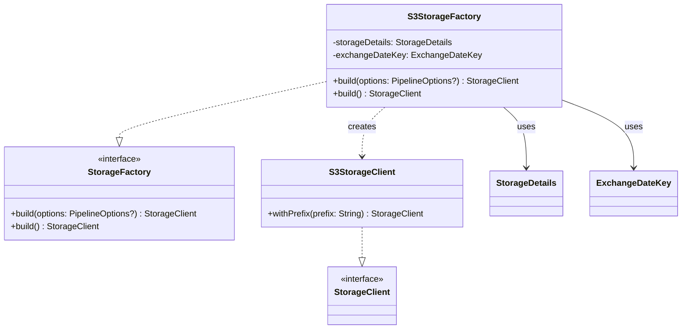

# org.wfanet.panelmatch.client.storage.aws.s3

## Overview
Provides AWS S3 storage implementation for the Panel Match client. This package contains a factory class that creates and configures S3StorageClient instances with appropriate AWS credentials and region settings for data exchange operations.

## Components

### S3StorageFactory
Factory implementation for creating S3StorageClient instances with AWS credential management and role assumption support.

| Method | Parameters | Returns | Description |
|--------|------------|---------|-------------|
| build | `options: PipelineOptions?` | `StorageClient` | Creates S3StorageClient with credentials from BeamOptions if provided |
| build | - | `StorageClient` | Creates S3StorageClient with default credentials or assumed role |

#### Constructor Parameters
| Parameter | Type | Description |
|-----------|------|-------------|
| storageDetails | `StorageDetails` | AWS configuration including bucket, region, and role information |
| exchangeDateKey | `ExchangeDateKey` | Key used to prefix storage paths for data exchange |

## Data Structures

### S3StorageFactory
| Property | Type | Description |
|----------|------|-------------|
| storageDetails | `StorageDetails` | Contains AWS bucket, region, and IAM role configuration |
| exchangeDateKey | `ExchangeDateKey` | Provides path prefix for storage operations |

## Dependencies
- `org.apache.beam.sdk.options` - Pipeline options for Beam integration
- `org.wfanet.measurement.aws.s3` - S3StorageClient implementation
- `org.wfanet.measurement.storage` - StorageClient interface
- `org.wfanet.panelmatch.client.storage` - StorageDetails configuration
- `org.wfanet.panelmatch.common` - ExchangeDateKey and BeamOptions
- `org.wfanet.panelmatch.common.storage` - StorageFactory interface and extensions
- `software.amazon.awssdk.auth.credentials` - AWS credential providers
- `software.amazon.awssdk.regions` - AWS region configuration
- `software.amazon.awssdk.services.s3` - S3 async client
- `software.amazon.awssdk.services.sts` - AWS STS for role assumption

## Usage Example
```kotlin
// Create factory with storage configuration
val storageDetails = StorageDetails.newBuilder()
  .setAws(
    AwsStorageDetails.newBuilder()
      .setBucket("my-bucket")
      .setRegion("us-east-1")
      .build()
  )
  .build()
val exchangeDateKey = ExchangeDateKey("2024-01-15")
val factory = S3StorageFactory(storageDetails, exchangeDateKey)

// Create storage client with default credentials
val storageClient = factory.build()

// Or create with Beam pipeline options
val options = PipelineOptionsFactory.create().as(BeamOptions::class.java)
options.awsAccessKey = "AKIA..."
options.awsSecretAccessKey = "secret..."
options.awsSessionToken = "token..."
val storageClientWithOptions = factory.build(options)
```

## Class Diagram


## Authentication Modes

### 1. Session Credentials (via BeamOptions)
When PipelineOptions are provided with AWS credentials:
- Uses `awsAccessKey`, `awsSecretAccessKey`, and `awsSessionToken` from BeamOptions
- Creates StaticCredentialsProvider with AwsSessionCredentials
- Suitable for temporary credentials in distributed pipeline execution

### 2. Role Assumption (via STS)
When StorageDetails contains a role ARN:
- Uses AWS STS to assume the specified IAM role
- Supports optional external ID for enhanced security
- Creates StsAssumeRoleCredentialsProvider with automatic credential refresh
- Suitable for cross-account access patterns

### 3. Default Credentials
When neither credentials nor role ARN are provided:
- Uses AWS SDK default credential provider chain
- Checks environment variables, system properties, and instance metadata
- Suitable for local development and EC2/ECS environments
