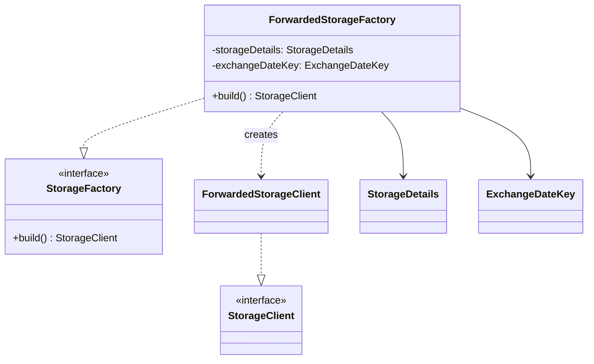

# org.wfanet.panelmatch.client.storage.forwarded

## Overview
This package provides a factory implementation for creating forwarded storage clients. It enables remote storage access through gRPC by constructing TLS-secured storage clients that forward operations to remote storage services, used primarily in panel match exchange workflows.

## Components

### ForwardedStorageFactory
Factory class that builds ForwardedStorageClient instances with TLS channel configuration based on storage details and exchange workflow identifiers.

| Method | Parameters | Returns | Description |
|--------|------------|---------|-------------|
| build | None | `StorageClient` | Constructs a ForwardedStorageClient with TLS channel from storage configuration |

**Constructor Parameters:**
| Parameter | Type | Description |
|-----------|------|-------------|
| storageDetails | `StorageDetails` | Proto message containing ForwardedStorageClient configuration |
| exchangeDateKey | `ExchangeDateKey` | Exchange workflow identifier for storage path disambiguation |

## Data Structures

This package contains no public data classes. It relies on external proto message types for configuration.

## Dependencies
- `org.wfanet.measurement.common.crypto` - Certificate collection reading utilities
- `org.wfanet.measurement.common.grpc` - TLS channel construction
- `org.wfanet.measurement.internal.testing` - ForwardedStorage gRPC stub
- `org.wfanet.measurement.storage` - StorageClient interface
- `org.wfanet.measurement.storage.forwarded` - ForwardedStorageClient implementation
- `org.wfanet.panelmatch.client.loadtest` - ForwardedStorageConfig proto
- `org.wfanet.panelmatch.client.storage` - StorageDetails proto
- `org.wfanet.panelmatch.common` - ExchangeDateKey type
- `org.wfanet.panelmatch.common.storage` - StorageFactory interface

## Usage Example
```kotlin
val storageDetails = StorageDetails.newBuilder()
  .setCustom(/* ForwardedStorageConfig */)
  .build()

val exchangeDateKey = ExchangeDateKey(/* workflow identifier */)

val factory = ForwardedStorageFactory(storageDetails, exchangeDateKey)
val storageClient: StorageClient = factory.build()
```

## Class Diagram

